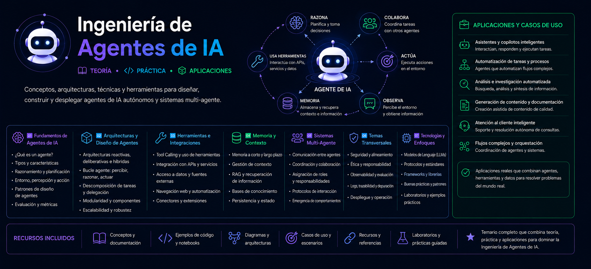

# 📚 Ingeniería de Agentes de IA

## 🚀 Primeros Pasos

### 📦 [Instalación del Proyecto](./info/install/README.md)

Guía para crear el entorno local, instalar dependencias y ejecutar el proyecto por primera vez.

## [Fundamentos](./info/fundamentos/README.md)

## OpenAI Agent SDK

- [Comprende los conceptos del SDK de Agentes de OpenAI](./info/openai-agent-sdk/README.md)
- [Herramientas vs Agentes Guardrails](./info/openai-agent-sdk/README.md)
- [Proyecto 2: Un SDR](./info/openai-agent-sdk/README.md)
- [Proyecto 3: Deep Research](./info/openai-agent-sdk/README.md)
- [Proyecto 3: Aplicación de Deep Research](./info/openai-agent-sdk/README.md)

---

## Crew AI

- [Comprendiendo los conceptos de Crew AI](./info/crew-ai/README.md)
- [Construyendo un agente de Crew AI](./info/crew-ai/README.md)
- [Proyecto 4: Precios de Acciones](./info/crew-ai/README.md)
- [Proyecto 5: Agente desarrollador](./info/crew-ai/README.md)
- [Proyecto 5: Equipo de ingeniería](./info/crew-ai/README.md)

---

## LangGraph

- [Comprendiendo los conceptos de LangGraph](./info/langgraph/README.md)
- [Construyendo un agente LangGraph](./info/langgraph/README.md)
- [Herramientas, memoria y búsquedas web](./info/langgraph/README.md)
- [Proyecto 6: Ayudante](./info/langgraph/README.md)
- [Proyecto 6: Mejoras en el ayudante](./info/langgraph/README.md)

---

## AutoGen

- [Comprende los conceptos de AutoGen](./info/autogen/README.md)
- [Agente de Chat AutoGen](./info/autogen/README.md)
- [El core del AutoGen](./info/autogen/README.md)
- [El core del AutoGen distribuido](./info/autogen/README.md)
- [Proyecto 7: Agente Creador](./info/autogen/README.md)

---

## MCP

- [Arquitectura agéntica y MCP](./info/mcp/README.md)
- [Construcción de un servidor y cliente MCP](./info/mcp/README.md)
- [Múltiples servidores MCP locales y remotos](./info/mcp/README.md)
- [Proyecto 8: Traders de Acciones de IA](./info/mcp/README.md)
- [Proyecto 8: Traders de acciones en IA](./info/mcp/README.md)
