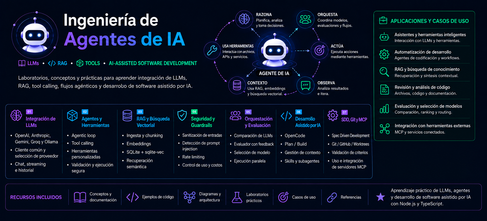

# 📚 Ingeniería de Agentes de IA

Repositorio de aprendizaje y experimentación práctica enfocado en fundamentos de IA generativa, integración de LLMs, RAG, herramientas, flujos agénticos y arquitecturas para agentes de IA.

El aprendizaje se complementa con prácticas de **AI-Assisted Software Engineering**, aplicando agentes de programación dentro de flujos de desarrollo estructurados, con planificación, especificaciones, validación humana, Git/GitHub y herramientas externas mediante MCP.

## 🚀 Primeros Pasos

### 📦 [Instalación del Proyecto](./info/install/README.md)

Guía para crear el entorno local, instalar dependencias y ejecutar el proyecto por primera vez.

---

## 🧠 [Fundamentos](./info/fundamentos/README.md)

Conceptos y laboratorios prácticos relacionados con:

- Integración con diferentes proveedores de LLM.
- System prompts.
- Conversaciones e historial.
- Streaming de respuestas.
- Tool calling.
- Flujos de ejecución agénticos.
- RAG.
- Embeddings y búsqueda vectorial.
- Guardrails.
- Selección, comparación y evaluación de modelos.
- Patrones y fundamentos de orquestación de LLMs.

---

## 🛠️ AI-Assisted Software Engineering

Como complemento al desarrollo de agentes de IA, también se explora el uso de agentes de programación dentro del ciclo de desarrollo de software.

Los temas incluyen:

- Planificación e implementación asistida por IA.
- Human-in-the-loop para revisión y validación.
- Spec Driven Development (SDD).
- Gestión del contexto de agentes de programación.
- Skills e instrucciones reutilizables.
- Subagentes especializados.
- Integración y uso de servidores MCP.
- Flujos de trabajo con Git y GitHub.
- Branches, Pull Requests y Git Worktrees.
- Validación de criterios de aceptación.
- Revisión, pruebas y verificación del código generado por IA.

Repositorio relacionado:

- [opencode-info](https://github.com/MLahuasi/opencode-info) — Notas, conceptos y laboratorios prácticos sobre OpenCode y desarrollo de software asistido por IA.

<!--

---

## OpenAI Agent SDK

- [Comprende los conceptos del SDK de Agentes de OpenAI](./info/openai-agent-sdk/README.md)
- [Herramientas vs Agentes Guardrails](./info/openai-agent-sdk/README.md)
- [Proyecto 2: Un SDR](./info/openai-agent-sdk/README.md)
- [Proyecto 3: Deep Research](./info/openai-agent-sdk/README.md)
- [Proyecto 3: Aplicación de Deep Research](./info/openai-agent-sdk/README.md)

---

## Crew AI

- [Comprendiendo los conceptos de Crew AI](./info/crew-ai/README.md)
- [Construyendo un agente de Crew AI](./info/crew-ai/README.md)
- [Proyecto 4: Precios de Acciones](./info/crew-ai/README.md)
- [Proyecto 5: Agente desarrollador](./info/crew-ai/README.md)
- [Proyecto 5: Equipo de ingeniería](./info/crew-ai/README.md)

---

## LangGraph

- [Comprendiendo los conceptos de LangGraph](./info/langgraph/README.md)
- [Construyendo un agente LangGraph](./info/langgraph/README.md)
- [Herramientas, memoria y búsquedas web](./info/langgraph/README.md)
- [Proyecto 6: Ayudante](./info/langgraph/README.md)
- [Proyecto 6: Mejoras en el ayudante](./info/langgraph/README.md)

---

## AutoGen

- [Comprende los conceptos de AutoGen](./info/autogen/README.md)
- [Agente de Chat AutoGen](./info/autogen/README.md)
- [El core del AutoGen](./info/autogen/README.md)
- [El core del AutoGen distribuido](./info/autogen/README.md)
- [Proyecto 7: Agente Creador](./info/autogen/README.md)

---

## MCP

- [Arquitectura agéntica y MCP](./info/mcp/README.md)
- [Construcción de un servidor y cliente MCP](./info/mcp/README.md)
- [Múltiples servidores MCP locales y remotos](./info/mcp/README.md)
- [Proyecto 8: Traders de Acciones de IA](./info/mcp/README.md)
- [Proyecto 8: Traders de acciones en IA](./info/mcp/README.md)

-->
