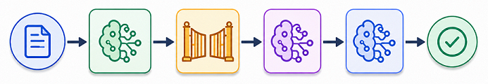
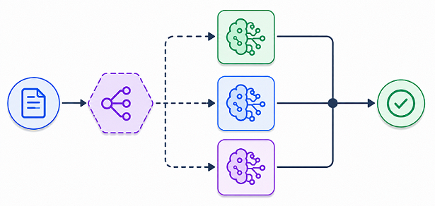
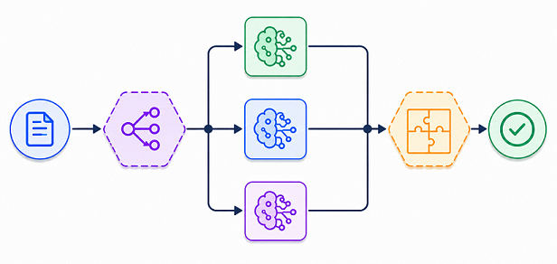
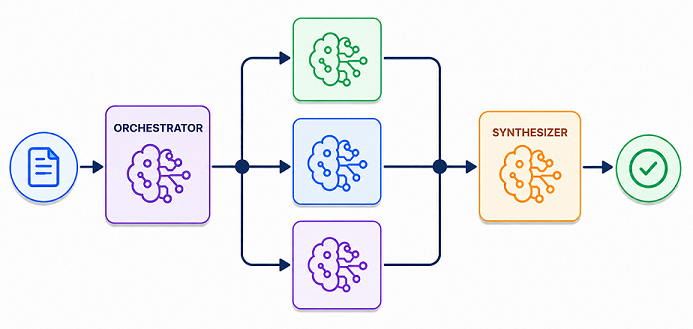
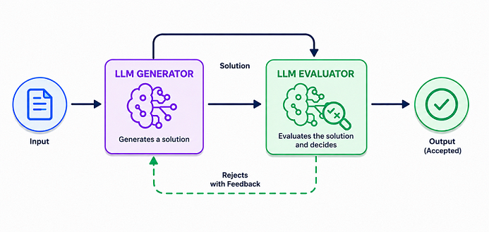
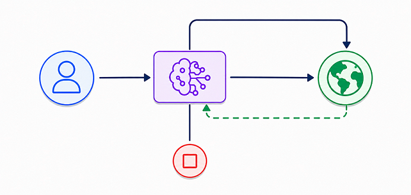

# Sistemas Agénticos

## Que es un agente de IA?

Los `agentes de IA` son programas donde los resultados de `LLM` controlan el flujo de trabajo.

**NOTA**:

- **LLM**: Un `LLM` (`Large Language Model`) o `Modelo de Lenguaje Grande` es un sistema de inteligencia artificial entrenado con enormes cantidades de texto para comprender y generar lenguaje natural. Ejemplos:

| Modelo                 | Empresa / Organización                                             |
| ---------------------- | ------------------------------------------------------------------ |
| OpenAI GPT-5.5         | [OpenAI](https://openai.com?utm_source=chatgpt.com)                |
| Anthropic Claude       | [Anthropic](https://www.anthropic.com?utm_source=chatgpt.com)      |
| Google DeepMind Gemini | [Google Gemini](https://gemini.google.com?utm_source=chatgpt.com)  |
| Meta Llama             | [Meta AI](https://ai.meta.com?utm_source=chatgpt.com)              |
| Mistral AI Mistral     | [Mistral AI](https://mistral.ai?utm_source=chatgpt.com)            |
| Google Gemma           | [Google Gemma](https://ai.google.dev/gemma?utm_source=chatgpt.com) |
| Alibaba Cloud Qwen     | [Qwen](https://qwenlm.github.io?utm_source=chatgpt.com)            |

---

## Características de un Agente de IA

- Múltiples llamadas a `LLMs`.
- `LLMs` con habilidad de usar herramientas (ejemplo: `n8n`).
- Entorno en donde los `LLMs` interactuan (`orquestación`).
- Un planificador que coordina actividades.
- Autonomía

`Anthropic` distingue dos tipos de `Sistemas Agénticos`:

- `Flujos de trabajo` (`Workflows`): Son sistemas donde se orquestan los `LLMs` y las herramientas a través de rutas de código predefinidas.

- `Agentes`: Son sistemas donde los `LLMs` dirigen dinámicamente sus propios procesos y el uso de herramientas, manteniendo el control sobre como lo logran las tareas.

---

## Patrones de diseño de Flujos de Trabajo

### 1. 🔗 Encadenamiento de Prompts (Prompt Chaining)

#### Objetivo

Dividir una tarea compleja en múltiples etapas secuenciales donde cada modelo o componente procesa la salida del paso anterior y la utiliza como entrada para el siguiente.

#### Funcionamiento

En este patrón, los modelos se ejecutan uno después de otro formando una cadena de procesamiento.

#### Componentes

- **LLM1** procesa la entrada inicial.
- **Puerta (Gate)** aplica lógica programable para validar, transformar o decidir cómo continúa el flujo.
- **LLM2** recibe el resultado procesado por las etapas anteriores y realiza una nueva tarea.
- **LLM3** genera el resultado final.
- **Salida** contiene la respuesta obtenida después de todas las transformaciones.

---

### 2. 🧭 Enrutamiento (Routing)

#### Objetivo

Seleccionar dinámicamente el modelo más adecuado para resolver una tarea específica.

#### Funcionamiento

Un componente especializado analiza la entrada y decide qué modelo debe ejecutarse.

#### Componentes

- **Entrada**: solicitud original.
- **Router**: componente programable encargado de clasificar la tarea.
- **LLM1, LLM2, LLM3**: modelos especializados en diferentes tipos de problemas.
- **Salida**: respuesta generada por el modelo seleccionado.

---

### 3. ⚡ Paralelización (Parallelization)

#### Objetivo

Dividir una tarea en múltiples subproblemas que pueden resolverse simultáneamente para reducir el tiempo de procesamiento o aumentar la cobertura del análisis.

#### Funcionamiento

Un coordinador divide la tarea y distribuye el trabajo entre varios modelos que se ejecutan en paralelo.

#### Componentes

- **Entrada**: solicitud original.
- **Coordinador**: componente programable que descompone la tarea en fragmentos independientes.
- **LLM1, LLM2, LLM3**: ejecutan tareas simultáneamente.
- **Agregador**: componente programable que recopila y combina las respuestas.
- **Salida**: resultado consolidado.

---

### 4. 🎼 Orquestador - Trabajador (Orchestrator - Workers)

#### Objetivo

Resolver tareas complejas mediante la colaboración de múltiples modelos especializados coordinados por un modelo principal denominado **Orquestador**.

#### Funcionamiento

En este patrón existe un modelo responsable de analizar la tarea completa, dividirla dinámicamente en subtareas y asignarlas a otros modelos para su ejecución.

#### Componentes

- **Orquestador**: Es un LLM especializado que actúa como coordinador del flujo. Sus responsabilidades incluyen:
  - Analizar la solicitud original.
  - Determinar cómo dividir el problema.
  - Decidir cuántas subtareas son necesarias.
  - Asignar dinámicamente las subtareas.
  - Coordinar la ejecución de los trabajadores.

A diferencia del patrón de Paralelización, el Orquestador no sigue reglas programadas previamente, sino que toma decisiones utilizando sus propias capacidades de razonamiento.

- **Trabajadores**: Son LLMs encargados de resolver las subtareas asignadas. Cada trabajador:
  - Recibe una parte específica del problema.
  - Ejecuta una tarea especializada.
  - Devuelve un resultado parcial.

- **Sintetizador**: Es otro LLM responsable de combinar los resultados generados por los trabajadores. Sus funciones incluyen:
  - Analizar las respuestas parciales.
  - Resolver inconsistencias.
  - Integrar los resultados.
  - Construir una respuesta coherente y unificada.

---

### 5. 🔍 Evaluador - Optimizador (Evaluator - Optimizer)

#### Objetivo

Mejorar progresivamente la calidad de una respuesta mediante ciclos de evaluación y retroalimentación entre dos modelos.

#### Funcionamiento

Un modelo genera una solución y otro modelo la evalúa. Si la respuesta no cumple los criterios esperados, el evaluador proporciona retroalimentación para que la solución sea revisada y mejorada.

#### Componentes

- **Generador**: Es un LLM encargado de producir una solución inicial. Sus responsabilidades incluyen:
  - Interpretar la solicitud.
  - Elaborar una respuesta.
  - Aplicar las correcciones sugeridas por el evaluador.
  - Refinar iterativamente el resultado.

- **Evaluador**: Es un LLM encargado de analizar la calidad de la respuesta generada. Sus responsabilidades incluyen:
  - Revisar la solución propuesta.
  - Detectar errores.
  - Identificar omisiones.
  - Verificar cumplimiento de criterios.
  - Aceptar o rechazar el resultado.
  - Proporcionar retroalimentación cuando sea necesario.

#### Ciclo de trabajo

1. **Generación**: El Generador produce una solución inicial.
2. **Evaluación**: El Evaluador analiza la solución.
3. **Decisión**: El Evaluador puede:
   - Aceptar la respuesta.
   - Rechazar la respuesta.
4. **Retroalimentación**: Si la respuesta es rechazada:
   - Se generan observaciones.
   - Se indican aspectos a mejorar.
   - El Generador revisa su trabajo.
5. **Optimización**:
   - El Generador ajusta la solución y vuelve a enviarla para evaluación.
   - El proceso puede repetirse varias veces hasta obtener un resultado satisfactorio.

---

# 🤖 Patrones de Agentes (Agent Design Patterns)

### Objetivo

Permitir que un LLM interactúe con un entorno, tome decisiones, ejecute acciones y utilice retroalimentación para alcanzar un objetivo.

### Funcionamiento

A diferencia de los **Patrones de Diseño de Flujos de Trabajo**, los **Patrones de Agentes** son mucho más abiertos y flexibles.

El agente puede:

- Tomar decisiones dinámicamente.
- Ejecutar múltiples acciones.
- Recibir feedback del entorno.
- Cambiar de estrategia.
- Repetir ciclos de razonamiento.

No existe un camino fijo de ejecución.

### Características

1. **Abiertos y sin límites**: El flujo puede evolucionar durante la ejecución.

2. **Bucles de Feedback**: El agente utiliza la información recibida para decidir qué hacer a continuación.

3. **Sin camino fijo**: Cada ejecución puede seguir un recorrido diferente.

---

### ⚠️ Riesgos del Uso de Frameworks de Agentes

- **Camino impredecible**: No siempre es posible anticipar qué acciones ejecutará el agente.

- **Salida impredecible**: Dos ejecuciones similares pueden generar resultados distintos.

- **Costes impredecibles**: La cantidad de iteraciones, llamadas a modelos y consumo de tokens puede variar significativamente.

- **Riesgos de Seguridad**: Se requieren controles adicionales ya que un agente puede:
  - Acceder a herramientas externas.
  - Invocar APIs.
  - Consultar sistemas internos.
  - Ejecutar acciones no previstas.

---

### 🛡️ Mitigaciones

- **Monitorización**: Permite detectar comportamientos inesperados y facilitar auditorías. Además proporciona visibilidad sobre:
  - Qué decisiones toma el agente.
  - Qué herramientas utiliza.
  - Qué modelos intervienen.
  - Cuánto cuesta cada ejecución.

- **Guardarraíles (Guardrails)**: Mecanismos que garantizan que los agentes operen dentro de límites definidos. Su objetivo es mantener un comportamiento seguro, consistente y predecible. Ejemplos:
  - Restricciones de herramientas.
  - Validación de entradas y salidas.
  - Límites de iteraciones.
  - Reglas de seguridad.
  - Controles de acceso.

---

[REGRESAR](./README.md)
