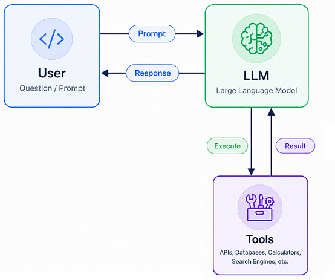
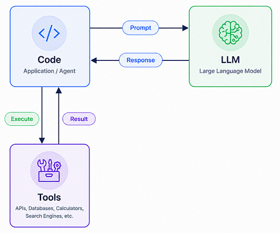

# FRAMEWORKS DE IA AGÉNTICA

> **Nota:** La siguiente clasificación se basa en una progresión de aprendizaje y nivel de complejidad para fines educativos. No representa una clasificación oficial de los frameworks mencionados.

## NIVELES

### NIVEL 1

#### SIN FRAMEWORKS

Usando directamente APIs:

1. **Clientes LLM Configurados**

Algunos ejemplos:

| Proveedor | API / Registro                                           | Instalación y Configuración                                        | Cliente                                               |
| --------- | -------------------------------------------------------- | ------------------------------------------------------------------ | ----------------------------------------------------- |
| OpenAI    | [OpenAI Platform](https://platform.openai.com/home)      | [Instalación y Configuración](../labs/config/openia-api-config.md) | [Ver Cliente](../labs/config/openia/openai_client.py) |
| Gemini    | [Google AI Studio](https://aistudio.google.com/api-keys) | [Instalación y Configuración](../labs/config/gemini-api-config.md) | [Ver Cliente](../labs/config/gemini/gemini_client.py) |
| Groq      | [Groq Console](https://console.groq.com/keys)            | —                                                                  | [Ver Cliente](../labs/config/groq/groq_client.py)     |
| Ollama    | [Descargar Ollama](https://ollama.com/download/windows)  | [Instalación y Configuración](../labs/config/ollama-api-config.md) | [Ver Cliente](../labs/config/ollama/ollama_client.py) |

---

2. **Protocolos de Integración**

##### MCP (Model Context Protocol)

Protocolo abierto que permite exponer herramientas, recursos y fuentes de datos a modelos de IA mediante una interfaz estándar.

---

### NIVEL 2

#### FRAMEWORKS DE AGENTES

Frameworks orientados a la construcción de agentes y sistemas multiagente con una curva de aprendizaje relativamente baja. Son una buena opción para comenzar a trabajar con IA Agéntica.

| Framework         | Tipo                  | Enfoque                                           |
| ----------------- | --------------------- | ------------------------------------------------- |
| OpenAI Agents SDK | Framework de agentes  | Agentes con herramientas, handoffs y trazabilidad |
| CrewAI            | Framework multiagente | Equipos de agentes con roles y colaboración       |

---

### NIVEL 3

#### ECOSISTEMAS

Herramientas más avanzadas para construir sistemas agénticos complejos. Generalmente ofrecen mayor flexibilidad y capacidad de personalización, pero requieren una comprensión más profunda de flujos, estados y coordinación entre agentes.

| Framework | Tipo                  | Enfoque                      |
| --------- | --------------------- | ---------------------------- |
| LangGraph | Framework de agentes  | Flujos y grafos de estados   |
| AutoGen   | Framework multiagente | Conversaciones entre agentes |

---

## RECURSOS VS. HERRAMIENTAS

### [RECURSOS](./ia-agentes-recursos.md)

Podemos proporcionar a un LLM recursos para `mejorar su experiencia`, proporcionando mas contexto.
Esto imploca simplemente `insertar datos` relevantes a la pregunta en el prompt.
Existen técnicas como `RAG` (`Generación Aumentada por Recuperación`) para volverse muy hábil en seleccionar `contenido relevante`.

### HERRAMIENTAS

Las `Herramientas` otorgan autonomía a los LLM.
Otorgan a un LLM la capacidad de ejecutar acciones como consultar `bases de datos` o `enviar mensajes` a otros LLM.

En teoría se aplicaría así:

En la práctica:

[REGRESAR](./README.md)
