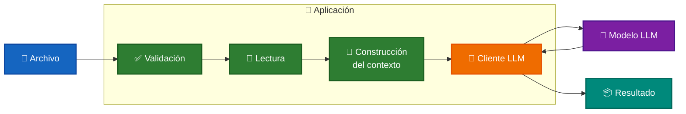
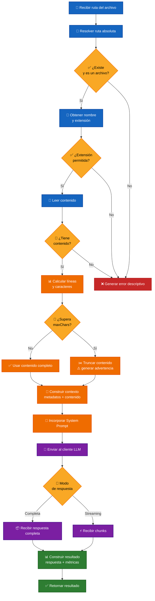
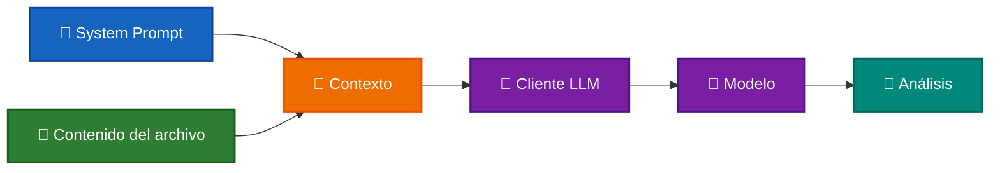

# 🔍 Análisis de Archivos con un LLM

El análisis de archivos con un **LLM (Large Language Model)** consiste en leer contenido externo, validarlo, incorporarlo al contexto del modelo y ejecutar una tarea definida mediante un `System Prompt`.

El modelo actúa como **revisor de código**. Sin embargo, el mismo flujo puede utilizarse para:

- 🔍 Analizar contenido.
- 📝 Generar documentación.
- 📚 Explicar código.
- ✂️ Resumir archivos.
- 🐛 Detectar posibles problemas.
- 🔐 Identificar riesgos de seguridad.

La idea principal es:

```text
📄 Archivo
    ↓
✅ Validación
    ↓
📖 Lectura
    ↓
📏 Control de tamaño
    ↓
🧩 Construcción del contexto
    ↓
🤖 LLM
    ↓
💬 Resultado
```

Este patrón es especialmente importante porque representa una primera forma de **incorporar conocimiento externo al contexto del modelo**, concepto que posteriormente será extendido mediante `RAG`.

---

# 🎯 Objetivo

El flujo debe ser capaz de:

- 📂 Recibir un archivo.
- ✅ Validar que pueda ser procesado.
- 📖 Leer su contenido.
- 📏 Controlar cuánto contenido se envía al modelo.
- 🧠 Aplicar instrucciones mediante un `System Prompt`.
- 🧩 Construir el contexto para el LLM.
- 📊 Registrar métricas de uso.
- ⚠️ Informar advertencias cuando el contenido sea truncado.

---

# 🏗️ Arquitectura

La solución puede dividirse en cuatro responsabilidades:



Esta separación permite mantener desacopladas:

- la gestión del archivo;
- la construcción del contexto;
- la comunicación con el proveedor LLM.

Esto será especialmente útil al incorporar posteriormente mecanismos de recuperación como `RAG`.

---

# 🔄 Flujo del proceso



🔵 **Azul** → Validación y lectura. <br />
🟠 **Naranja** → Preparación del contexto. <br />
🟣 **Morado** → Comunicación con el LLM. <br />
🟢 **Verde** → Construcción del resultado. <br />
🟡 **Amarillo** → Decisiones del flujo. <br />
🔴 **Rojo** → Errores que detienen el procesamiento. <br />

---

# ✅ Validación del archivo

Antes de consumir recursos del LLM, la aplicación valida el archivo.

Se comprueba:

- 📂 Que la ruta exista.
- 📄 Que corresponda a un archivo.
- ✅ Que la extensión esté permitida.
- 📝 Que contenga texto.
- 📏 Que el límite máximo de caracteres sea válido.

```text
Archivo
   ↓
Validaciones
   ↓
¿Válido?
 ↙     ↘
No      Sí
↓        ↓
Error   Continuar
```

Una validación fallida detiene el flujo antes de realizar una solicitud al modelo.

Esto evita procesamiento innecesario y consumo de tokens.

---

# 📖 Lectura del contenido

Una vez validado, el archivo se lee como texto.

La aplicación obtiene también metadatos que posteriormente pueden incorporarse al contexto:

```text
📄 Nombre
🔤 Extensión
📏 Caracteres
📑 Número de líneas
📝 Contenido
```

Por ejemplo:

```text
Archivo: rest-api.service.cs
Extensión: .cs
Líneas: 354
Caracteres: 9699
```

Estos datos ayudan al modelo a interpretar correctamente el contenido recibido.

---

# 📏 Control del tamaño del contenido

Los modelos tienen una cantidad limitada de contexto que pueden procesar.

La propiedad:

```text
maxChars
```

establece la cantidad máxima de caracteres que la implementación enviará al modelo.

## ✅ Archivo dentro del límite

```text
Archivo
   ↓
9699 caracteres
   ↓
maxChars = 15000
   ↓
✅ Contenido completo
```

Todo el contenido se incorpora al contexto.

---

## ✂️ Archivo superior al límite

Cuando el contenido excede `maxChars`:

- se utiliza únicamente la primera parte;
- se registra que el archivo fue truncado;
- se genera una advertencia;
- se conserva el tamaño original en los metadatos.

```text
Archivo grande
     ↓
¿Supera maxChars?
     ↓
    Sí
     ↓
✂️ Truncamiento
     ↓
Contenido parcial
```

Este mecanismo reduce el riesgo de utilizar excesivamente la ventana de contexto del modelo.

> ⚠️ El truncamiento es una estrategia simple. Posteriormente, RAG permitirá seleccionar fragmentos relevantes en lugar de limitarse a enviar la primera parte del archivo.

---

# 🧠 Construcción del contexto

Una vez obtenido el contenido, la aplicación debe preparar la información que recibirá el modelo.

La solicitud combina principalmente:

```text
🧠 System Prompt
        +
📄 Metadatos del archivo
        +
📝 Contenido
        ↓
   🧩 Contexto
        ↓
      🤖 LLM
```

---

## 🧠 System Prompt

El `System Prompt` define **qué debe hacer el modelo con el contenido**.

Por ejemplo:

- revisar calidad de código;
- buscar errores;
- identificar problemas de seguridad;
- proponer refactorizaciones;
- explicar el archivo;
- generar documentación;
- resumir su contenido.

Por tanto:

```text
Archivo = información
System Prompt = instrucciones
```

El comportamiento del análisis depende principalmente del `System Prompt`, no del nombre de la clase ni de la extensión del archivo.

---

## 📄 Prompt del archivo

El prompt incorpora los metadatos y el contenido procesado.

Ejemplo:

````text
Revisa el siguiente archivo de código.

Archivo: rest-api.service.cs
Extensión: .cs
Líneas del archivo original: 354

```cs
[Contenido del archivo]
```
````

Conceptualmente:

```text
Metadatos
    +
Contenido
    ↓
Contexto del archivo
```

---

# 🔌 Procesamiento con el LLM

Después de construir el contexto, la aplicación lo envía al cliente LLM.



El cliente LLM se encarga de adaptar la solicitud al proveedor configurado y normalizar posteriormente la respuesta.

---

# 📡 Modos de respuesta

La implementación permite recibir la generación de dos formas.

## 📦 Respuesta completa

La aplicación espera hasta que el modelo finalice la generación.

```text
Solicitud
    ↓
   LLM
    ↓
Respuesta completa
    ↓
 Resultado
```

---

## ⚡ Streaming

El modelo envía fragmentos mientras genera el contenido.

```text
Solicitud
    ↓
   LLM
    ↓
 chunk
    ↓
 chunk
    ↓
 chunk
    ↓
Respuesta completa
```

Conceptualmente:

```text
chunk + chunk + chunk
         ↓
Respuesta acumulada
```

El laboratorio utiliza el modo `stream`.

---

# 📦 Resultado

El método `reviewFile()` retorna un objeto `CodeReviewResult`.

| Propiedad            | Descripción                          |
| -------------------- | ------------------------------------ |
| `fileName`           | Nombre del archivo                   |
| `filePath`           | Ruta absoluta                        |
| `extension`          | Extensión detectada                  |
| `totalLines`         | Total de líneas                      |
| `totalCharacters`    | Caracteres del archivo original      |
| `truncated`          | Indica si el contenido fue recortado |
| `reviewedCharacters` | Caracteres enviados al modelo        |
| `warnings`           | Advertencias generadas               |
| `review`             | Texto producido por el LLM           |
| `totalInputTokens`   | Tokens de entrada                    |
| `totalOutputTokens`  | Tokens de salida                     |

El resultado mantiene separados:

```text
📄 Metadatos
⚠️ Advertencias
💬 Respuesta del modelo
📊 Métricas
```

---

# [🧪 Laboratorio](../../sources/src/labs/04-read-file-streamin-response.ts)

El laboratorio analiza un archivo C# preparado con problemas intencionales:

```text
./src/labs/assets/rest-api.service.cs
```

El análisis utiliza:

```text
📄 Archivo C#
      +
🧠 System Prompt de Code Review
      +
📡 Streaming
      ↓
🤖 LLM
```

Después de finalizar la generación se muestran los metadatos y las métricas.

---

## 📋 Resultado de la ejecución

<details>

<summary>▶️ Ver ejecución completa</summary>

````text
╔══════════════════════════╗
║      Code Reviewer       ║
╚══════════════════════════╝

Archivo: ./src/labs/assets/rest-api.service.cs

✅ Demo 1: Revisando código CON streaming

Respuesta:

Resumen:
El código presenta problemas significativos en la consistencia del manejo de errores, la gestión de la autenticación y la serialización JSON. Necesita una refactorización para mejorar su mantenibilidad y fiabilidad.

✅ Bien hecho
- Uso consistente de `CancellationToken` en todas las operaciones asíncronas.
- Validación inicial de `baseUrl` en el constructor para evitar configuraciones incorrectas.

⚠️ Sugerencias
- [Alta] Unificar el manejo de errores.
- [Media] Eliminar la configuración duplicada de autorización.
- [Media] Normalizar la serialización y deserialización JSON.
- [Baja] Eliminar variables sin utilizar y mejorar sus nombres.

🐛 Bugs
- El método `BuildUrl` utiliza concatenación manual y no valida adecuadamente el endpoint.

💡 Código sugerido

```csharp
private string BuildUrl(string endpoint)
{
    if (string.IsNullOrWhiteSpace(endpoint))
    {
        throw new ArgumentException(
            "El endpoint no puede ser nulo o vacío.",
            nameof(endpoint)
        );
    }

    var baseUri = new Uri(_url.TrimEnd('/') + "/", UriKind.Absolute);
    var finalUri = new Uri(baseUri, endpoint.TrimStart('/'));

    return finalUri.ToString();
}
```

⭐ Puntuación
5/10

🚀 Comentario
Un buen punto de partida para aprender, ¡ahora a refactorizar para mejorar la calidad y la robustez!

---

Archivo revisado: rest-api.service.cs
Ruta: C:\Fuentes\IA-Agents\ai-agent-labs\sources\src\labs\assets\rest-api.service.cs
Líneas: 354
Caracteres: 9699
Caracteres revisados: 9699
Contenido truncado: No

Tokens Entrada: 2626
Tokens Salida: 563
````

</details>

---

# 🔍 Análisis del resultado

El modelo identificó problemas intencionales relacionados con:

- ⚠️ Manejo inconsistente de errores.
- ♻️ Código duplicado.
- 🏷️ Variables mal nombradas.
- 🗑️ Código sin utilizar.
- 📦 Serialización JSON inconsistente.
- 🌐 Construcción poco robusta de URLs.

El archivo contenía:

```text
9699 caracteres
```

por lo que fue enviado completamente al modelo al no superar el límite configurado.

Las secciones, prioridades y recomendaciones generadas muestran que el `System Prompt` condicionó correctamente el tipo de análisis realizado.

---

# 🎯 Conclusión

El análisis de archivos introduce un concepto fundamental para aplicaciones basadas en LLMs:

> **El modelo puede recibir información externa como parte de su contexto y utilizarla para realizar una tarea específica.**

El flujo actual es:

```text
📄 Archivo
    ↓
✅ Validación
    ↓
📖 Lectura
    ↓
📏 Control de tamaño
    ↓
🧩 Construcción del contexto
    ↓
🧠 System Prompt
    ↓
🤖 LLM
    ↓
💬 Resultado
```

Este enfoque funciona correctamente para documentos pequeños o medianos.

Cuando aumenta la cantidad o el tamaño de los documentos, enviar todo el contenido deja de ser una estrategia eficiente.

Ese problema conduce directamente a `RAG`, donde los documentos serán:

```text
📄 Documentos
      ↓
✂️ Fragmentados
      ↓
🔢 Vectorizados
      ↓
🗃️ Indexados
      ↓
🔎 Recuperados según relevancia
      ↓
🤖 Utilizados por el LLM
```

Por tanto, la lectura y análisis directo de archivos constituye una base natural para comprender posteriormente **chunking, embeddings, búsqueda vectorial y Retrieval-Augmented Generation**.

---

# 📖 Resumen

**El análisis de archivos valida y lee contenido externo, controla cuánto texto se incorpora al contexto y lo envía a un LLM junto con las instrucciones definidas en el `System Prompt`.**

**La implementación actual utiliza el archivo completo o una versión truncada. RAG evolucionará este mecanismo permitiendo dividir, indexar y recuperar únicamente los fragmentos relevantes antes de construir el contexto del modelo.**

---

[REGRESAR](./README.md)
