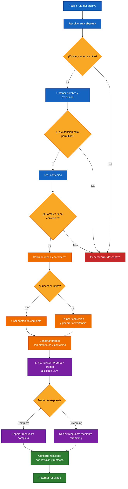

# 🔍 ANÁLISIS DE ARCHIVOS CON UN LLM

El análisis de Archivos con un **LLM (Large Language Model)** consiste en leer su contenido, preparar una solicitud con información relevante y enviarla al modelo para realizar una tarea definida mediante un `System Prompt`.

En este laboratorio, el modelo actúa como revisor de código. Sin embargo, la misma funcionalidad puede utilizarse para explicar, documentar, resumir o analizar un archivo cambiando las instrucciones del sistema.

---

## 🧩 Funcionalidad principal

La clase `CodeReviewer` administra el proceso completo:

1. Recibe la ruta del archivo.
2. Verifica que exista y corresponda a un archivo.
3. Valida su extensión.
4. Lee el contenido como texto.
5. Comprueba que no esté vacío.
6. Limita el contenido cuando supera el tamaño configurado.
7. Construye el prompt con los metadatos y el contenido.
8. Envía la solicitud al cliente LLM.
9. Retorna la respuesta, las advertencias y las métricas.

---

## 🔄 Flujo del proceso



🔵 **Azul** → Validación y lectura del archivo.</br>
🟠 **Naranja** → Preparación del contenido.</br>
🟣 **Morado** → Comunicación con el LLM.</br>
🟢 **Verde** → Construcción del resultado.</br>
🟡 **Amarillo** → Decisiones del flujo.</br>
🔴 **Rojo** → Errores que detienen el proceso.</br>

---

## ✅ Validaciones

Antes de llamar al LLM, la clase verifica:

- Que la ruta exista.
- Que la ruta corresponda a un archivo.
- Que la extensión esté permitida.
- Que el archivo contenga texto.
- Que el límite máximo de caracteres sea válido.

Una validación fallida detiene el flujo antes de enviar contenido al modelo, evitando solicitudes innecesarias y consumo de tokens.

---

## 📏 Control del contenido

La propiedad `maxChars` establece la cantidad máxima de caracteres que pueden enviarse al modelo.

Cuando el archivo supera este límite:

- Se utiliza únicamente la primera parte del contenido.
- Se registra que el archivo fue truncado.
- Se agrega una advertencia al resultado.
- Se conserva el tamaño original para mostrarlo en los metadatos.

Este mecanismo reduce el riesgo de superar la ventana de contexto del modelo.

---

## 🧠 Construcción de la solicitud

La solicitud combina dos elementos.

### System Prompt

Define la tarea que debe realizar el modelo:

- Revisar calidad de código.
- Buscar errores.
- Identificar riesgos de seguridad.
- Proponer refactorizaciones.
- Explicar el contenido.
- Generar documentación.

### Prompt del archivo

Contiene:

- Nombre del archivo.
- Extensión.
- Número de líneas.
- Aviso de truncamiento, cuando aplica.
- Contenido dentro de un bloque Markdown.

Ejemplo:

````text
Revisa el siguiente archivo de código.

Archivo: rest-api.service.cs
Extensión: .cs
Líneas del archivo original: 354

```cs
[Contenido del archivo]
```
````

El tipo de análisis depende del `System Prompt`, no del nombre de la clase ni de la extensión del archivo.

---

## 📡 Modos de respuesta

La clase permite dos modos de generación:

### Respuesta completa

El cliente espera hasta recibir todo el texto generado.

```text
Solicitud → Respuesta completa → Resultado
```

### Streaming

El cliente muestra los fragmentos a medida que el modelo genera la respuesta.

```text
Solicitud → Fragmentos → Respuesta acumulada → Resultado
```

El laboratorio utiliza el modo `stream`.

---

## 📦 Resultado

El método `reviewFile()` retorna un objeto `CodeReviewResult` con:

| Propiedad            | Descripción                          |
| -------------------- | ------------------------------------ |
| `fileName`           | Nombre del archivo                   |
| `filePath`           | Ruta absoluta                        |
| `extension`          | Extensión detectada                  |
| `totalLines`         | Total de líneas                      |
| `totalCharacters`    | Caracteres del archivo original      |
| `truncated`          | Indica si el contenido fue recortado |
| `reviewedCharacters` | Caracteres enviados al modelo        |
| `warnings`           | Advertencias generadas               |
| `review`             | Texto producido por el LLM           |
| `totalInputTokens`   | Tokens de entrada                    |
| `totalOutputTokens`  | Tokens de salida                     |

---

## ⚠️ Limitaciones

La implementación está diseñada para un laboratorio sencillo:

- Analiza un archivo por solicitud.
- No incorpora el contexto de otros archivos.
- Trunca por caracteres y no por estructuras de código.
- No reemplaza compiladores, linters ni analizadores estáticos.
- No modifica automáticamente el archivo.
- La calidad del resultado depende del modelo y del `System Prompt`.

---

## 🧪 Laboratorio

El laboratorio revisa un archivo C# preparado con problemas intencionales:

```text
./src/labs/assets/rest-api.service.cs
```

La respuesta se genera mediante streaming y después se muestran los metadatos y las métricas.

### 📋 Resultado de la ejecución

````text
╔══════════════════════════╗
║      Code Reviewer       ║
╚══════════════════════════╝
 Archivo: ./src/labs/assets/rest-api.service.cs

✅ Demo 1: Revisando código CON streaming

 Respuesta:
Resumen:
El código presenta problemas significativos en la consistencia del manejo de errores, la gestión de la autenticación y la serialización JSON. Necesita una refactorización para mejorar su mantenibilidad y fiabilidad.

✅ Bien hecho
- Uso consistente de `CancellationToken` en todas las operaciones asíncronas.
- Validación inicial de `baseUrl` en el constructor para evitar configuraciones incorrectas.

⚠️ Sugerencias
- [Alta] Unificar el manejo de errores.
- [Media] Eliminar la configuración duplicada de autorización.
- [Media] Normalizar la serialización y deserialización JSON.
- [Baja] Eliminar variables sin utilizar y mejorar sus nombres.

🐛 Bugs
- El método `BuildUrl` utiliza concatenación manual y no valida adecuadamente el endpoint.

💡 Código sugerido

```csharp
private string BuildUrl(string endpoint)
{
    if (string.IsNullOrWhiteSpace(endpoint))
    {
        throw new ArgumentException(
            "El endpoint no puede ser nulo o vacío.",
            nameof(endpoint)
        );
    }

    var baseUri = new Uri(_url.TrimEnd('/') + "/", UriKind.Absolute);
    var finalUri = new Uri(baseUri, endpoint.TrimStart('/'));

    return finalUri.ToString();
}
```

⭐ Puntuación
5/10

🚀 Comentario
Un buen punto de partida para aprender, ¡ahora a refactorizar para mejorar la calidad y la robustez!

---

Archivo revisado: rest-api.service.cs
Ruta: C:\Fuentes\IA-Agents\ai-agent-labs\sources\src\labs\assets\rest-api.service.cs
Líneas: 354
Caracteres: 9699
Caracteres revisados: 9699
Contenido truncado: No

Tokens Entrada: 2626
Tokens Salida: 563

---
````

---

## 🔍 Análisis del resultado

El modelo identificó los problemas intencionales del archivo:

- Manejo inconsistente de errores.
- Código duplicado.
- Variables mal nombradas.
- Código sin utilizar.
- Serialización JSON inconsistente.
- Construcción poco robusta de URLs.

El archivo completo fue enviado al modelo porque sus `9699` caracteres no superaron el límite configurado.

Las secciones, prioridades y recomendaciones de la respuesta confirman que el `System Prompt` definió correctamente el comportamiento del modelo.

---

## 📖 Resumen

**La clase valida y lee un archivo, controla la cantidad de contenido, construye una solicitud con sus metadatos y la envía a un LLM. El `System Prompt` define la tarea, mientras la aplicación administra el archivo, el streaming, las advertencias y las métricas.**

---

[REGRESAR](./README.md)
