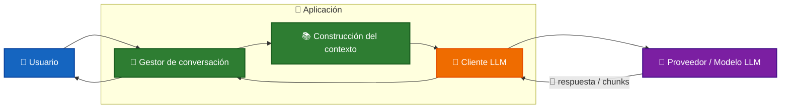
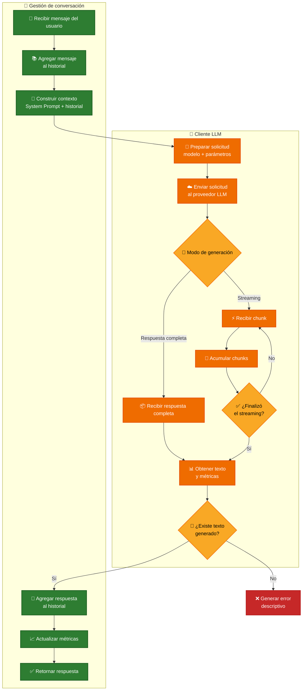
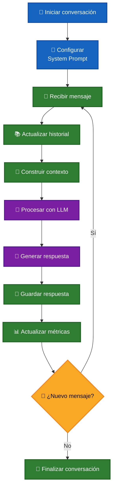
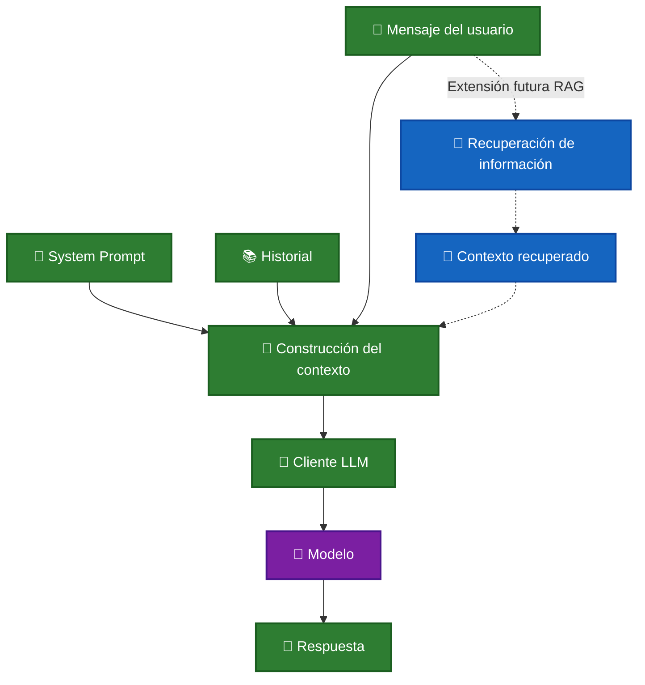

# 🤖 Chat con un LLM

Un chat con un **LLM (Large Language Model)** mantiene una conversación de varios turnos mediante un historial de mensajes.

En cada interacción, la aplicación combina:

- 🧠 El `System Prompt`.
- 📚 El historial de la conversación.
- 💬 El mensaje actual del usuario.
- 📡 La respuesta generada por el modelo.
- 📊 Las métricas de tokens.

El historial permite conservar el contexto entre interacciones, mientras que el `System Prompt` define el comportamiento general del asistente.

---

## 🧩 Arquitectura

Se identifican dos responsabilidades principales:



### 💬 Gestor de conversación

Administra el estado del chat:

- Guarda los mensajes del usuario y del asistente.
- Conserva el `System Prompt`.
- Construye el contexto de cada interacción.
- Envía la solicitud al cliente LLM.
- Registra las métricas de tokens.
- Permite reiniciar la conversación.

### 🔌 Cliente LLM

Se encarga de comunicarse con el proveedor configurado:

- Adapta los mensajes al formato esperado.
- Configura el modelo y los parámetros de generación.
- Envía la solicitud.
- Recibe respuestas completas o mediante streaming.
- Normaliza el texto generado.
- Obtiene las métricas reportadas por el proveedor.

Esta separación evita que la lógica de conversación dependa directamente de un proveedor específico.

---

# 📨 Construcción del contexto

Antes de enviar una solicitud al modelo, la aplicación construye el contexto de la conversación.

Cada interacción utiliza principalmente:

```text
🧠 System Prompt
       +
📚 Historial anterior
       +
💬 Mensaje actual
       ↓
🤖 LLM
```

## 🧠 System Prompt

Define las instrucciones generales del asistente:

- Rol.
- Tono.
- Dominio permitido.
- Restricciones.
- Formato de respuesta.

Ejemplo:

```text
Eres un asistente especializado en documentación técnica.

Responde únicamente preguntas relacionadas con programación,
documentación y análisis de código.
```

El `System Prompt` se conserva durante toda la conversación.

---

## 💬 Mensaje actual

Es la nueva pregunta o instrucción enviada por el usuario.

```text
¿Qué significa async/await en Node.js?
```

Antes de comunicarse con el modelo, el mensaje se incorpora al historial de la conversación.

---

## 📚 Historial

El historial contiene los mensajes anteriores intercambiados entre el usuario y el asistente.

```text
user: ¿Qué significa async/await en Node.js?

assistant: async/await facilita el trabajo con promesas.

user: ¿Cómo se manejan los errores?
```

La aplicación administra este historial y lo vuelve a enviar en las siguientes interacciones para conservar el contexto.

Por esta razón, el consumo de tokens de entrada aumenta a medida que la conversación crece.

---

## 🗂️ Mensajes y turnos

Cada mensaje contiene al menos un rol y un contenido.

```text
[
  {
    role: "user",
    content: "¿Qué significa async/await en Node.js?"
  },
  {
    role: "assistant",
    content: "async/await facilita el manejo de promesas."
  }
]
```

Los roles utilizados son:

- 👤 `user`
- 🤖 `assistant`
- ⚙️ `system`

Un **turno** representa un intercambio completo:

```text
👤 user
   ↓
🤖 assistant
```

Por ejemplo:

```text
4 mensajes = 2 turnos
```

---

# 🔌 Procesamiento de una solicitud

Una vez construido el contexto, el cliente LLM prepara y envía la solicitud al proveedor.

El flujo general es:



🟢 **Verde** → Gestión del estado de la conversación. <br />
🟠 **Naranja** → Comunicación y procesamiento del cliente LLM. <br />
🟡 **Amarillo** → Decisiones dentro del flujo. <br />
🔴 **Rojo** → Respuestas inválidas o errores. <br />

---

# 📡 Modos de generación

El cliente puede recibir la respuesta del modelo de dos formas.

## 📦 Respuesta completa

La aplicación espera hasta que el modelo termine de generar todo el contenido.

```text
Solicitud
    ↓
   LLM
    ↓
Respuesta completa
```

La respuesta se procesa cuando la generación ha finalizado.

---

## ⚡ Streaming

El modelo entrega fragmentos de texto mientras genera la respuesta.

Por ejemplo:

```text
"`async/await`"
" facilita"
" el manejo"
" de promesas"
```

La aplicación recibe y acumula estos fragmentos:

```text
chunk
  +
chunk
  +
chunk
  ↓
respuesta completa
```

Resultado:

```text
`async/await` facilita el manejo de promesas
```

El laboratorio utiliza streaming para mostrar la respuesta de forma incremental.

---

# 🔄 Ciclo de una conversación

El chat repite el mismo proceso por cada mensaje enviado por el usuario.



Por cada interacción:

1. 👤 Se recibe el mensaje del usuario.
2. 📚 Se agrega al historial.
3. 🧠 Se construye el contexto utilizando el `System Prompt`.
4. 🔌 Se envía la solicitud al cliente LLM.
5. 🤖 El modelo procesa el contexto.
6. 📡 Se recibe la respuesta.
7. 💬 La respuesta se agrega al historial.
8. 📊 Se actualizan las métricas.
9. 🔁 El sistema queda listo para el siguiente turno.

---

# 📊 Métricas de tokens

Se registra:

- 📥 Tokens de entrada reportados por el proveedor.
- 📤 Tokens de salida generados por el modelo.
- 📏 Una estimación del tamaño del contexto actual.

Por ejemplo para la estimación se utiliza la regla aproximada:

```text
1 token ≈ 4 caracteres
```

Este valor es únicamente orientativo, ya que cada modelo utiliza su propio tokenizador.

## 📈 Tokens acumulados vs. contexto actual

Los tokens de entrada acumulados pueden ser mayores que el tamaño actual del historial.

Esto ocurre porque los mensajes anteriores se vuelven a enviar en cada interacción.

Ejemplo conceptual:

```text
Turno 1
System Prompt + Mensaje 1
          ↓
       Tokens

Turno 2
System Prompt + Mensaje 1 + Respuesta 1 + Mensaje 2
          ↓
       Más tokens
```

Por tanto, conversaciones largas aumentan progresivamente el tamaño del contexto enviado al modelo.

---

# 🧹 Reinicio de la conversación

Al ejecutar un reinicio se eliminan:

- 📚 El historial de mensajes.
- 🔁 El número de turnos.
- 📥 Los tokens acumulados de entrada.
- 📤 Los tokens acumulados de salida.

El `System Prompt` se conserva porque forma parte de la configuración del gestor de conversación.

```text
Antes

System Prompt ✅
Historial     ✅
Métricas      ✅

        ↓ /clear

Después

System Prompt ✅
Historial     ❌
Métricas      ❌
```

---

# 🔎 Punto de extensión para RAG

La construcción del contexto es el punto natural donde posteriormente puede incorporarse **RAG — Retrieval-Augmented Generation**.



---

# 🧪 Laboratorio

El laboratorio permite comprobar:

- ✅ Aplicación del `System Prompt`.
- ✅ Conservación del historial.
- ✅ Generación mediante streaming.
- ✅ Conteo de turnos.
- ✅ Registro de tokens.
- ✅ Reinicio de la conversación.

## 📋 Resultado de la ejecución

<details>

<summary>▶️ Ver ejecución completa</summary>

```text

💬 Escribe tu pregunta y presiona Enter.
   Comandos: /clear, /stats, /exit

Tú: que significa async/await en Node.js?

Asistente: `async/await` es una sintaxis que facilita el manejo de promesas en JavaScript, especialmente en entornos asíncronos como Node.js.

### ¿Qué son las Promesas?

Las Promesas son objetos que representan eventualmente un resultado exitoso o fallido de una operación asincrónica. Son fundamentales para manejar tareas asíncronas de manera más clara y controlada.

### ¿Cómo Funcionan las Promesas?

1. Estado: Una promesa puede estar en uno de los siguientes estados:
   - pending: La operación aún no ha terminado.
   - fulfilled: La operación se completó exitosamente.
   - rejected: La operación falló.

2. Callbacks: Las promesas tienen dos métodos principales: .then() y .catch().
   - .then() se ejecuta cuando la promesa es resuelta (fulfilled).
   - .catch() se ejecuta si la promesa es rechazada (rejected).

### ¿Qué Es async?

El keyword async se utiliza antes de una función para indicar que esa función devuelve una promesa.

async function fetchData() {
  // Código asincrónico aquí
}

### ¿Qué Es await?

El keyword await se utiliza dentro de funciones asíncronas para pausar la ejecución hasta que una promesa sea resuelta.

async function fetchData() {
  const response = await fetch('https://api.example.com/data');
  const data = await response.json();
  return data;
}

### ¿Cuándo Se Utiliza async/await?

- Simplicidad: Reduce la complejidad de manejar callbacks anidados.
- Clara Estructura: Facilita la lectura y comprensión del código.
- Error Handling: Permite manejar errores de manera más clara.

### Ejemplo Completo

async function main() {
  try {
    const data = await fetchData();
    console.log(data);
  } catch (error) {
    console.error('Error fetching data:', error);
  }
}

function fetchData() {
  return fetch('https://api.example.com/data')
    .then(response => response.json())
    .catch(error => Promise.reject(new Error('Failed to fetch data')));
}

main();


Tú: Cual es la ciudad mas alta del mundo?

Asistente: Esta pregunta está fuera de mi alcance. Puedo ayudarte con documentación técnica, programación y análisis de código.


Tú: /stats

📊 Estadísticas de la conversación:
   • Turnos: 2
   • Tokens de entrada acumulados: 2065
   • Tokens de salida acumulados: 601
   • Tokens estimados en contexto actual: 615

Tú: /clear
 Conversación reiniciada.

Tú: /exit

Resumen: 0 turnos, 0 tokens de entrada, 0 tokens de salida.
```

</details>

---

# 🔍 Análisis de los resultados

## 🧠 Aplicación del System Prompt

La primera consulta pertenece al dominio técnico configurado, por lo que el asistente genera una respuesta.

La segunda consulta está fuera de ese dominio:

```text
¿Cuál es la ciudad más alta del mundo?
```

El asistente responde:

```text
Esta pregunta está fuera de mi alcance.
Puedo ayudarte con documentación técnica,
programación y análisis de código.
```

Esto permite observar cómo el `System Prompt` condiciona el comportamiento del asistente durante la conversación.

---

# 🎯 Conclusión

Un chat con un LLM necesita administrar más que una simple pregunta y respuesta.

La aplicación mantiene un estado formado por:

```text
🧠 System Prompt
      +
📚 Historial
      +
💬 Mensajes
      +
📊 Métricas
```

En cada turno:

```text
👤 Usuario
    ↓
📚 Historial
    ↓
🧩 Construcción del contexto
    ↓
🔌 Cliente LLM
    ↓
🤖 Modelo
    ↓
📡 Respuesta
    ↓
📚 Actualización del historial
```

# 📖 Resumen

**El chat mantiene un historial en memoria, aplica un `System Prompt`, construye el contexto de cada interacción, genera respuestas mediante streaming y registra métricas de tokens.**

**La separación entre el gestor de conversación y el cliente LLM permite extender la arquitectura posteriormente con persistencia, gestión avanzada del contexto, herramientas y RAG.**

---

[REGRESAR](./README.md)
