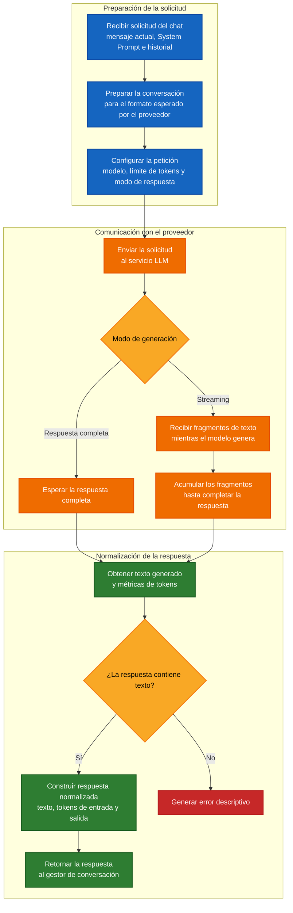
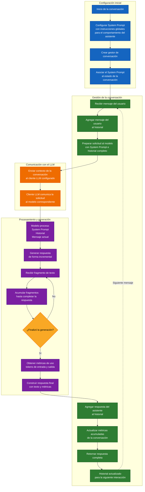

# 🤖 CHAT CON UN LLM

Un chat con un **LLM (Large Language Model)** mantiene una conversación de varios turnos mediante un historial de mensajes.

En cada interacción, la aplicación combina:

- 🧠 El `System Prompt`.
- 💬 El mensaje actual.
- 📚 El historial de la conversación.
- 📡 La respuesta generada por el modelo.
- 📊 Las métricas de tokens.

El historial permite conservar el contexto, mientras que el `System Prompt` define el comportamiento general del asistente.

---

## 🧩 Componentes principales

### 💬 Gestor de conversación

Administra el estado del chat:

- Guarda los mensajes del usuario y del asistente.
- Conserva el `System Prompt`.
- Envía el contexto al cliente LLM.
- Registra las métricas de tokens.
- Permite reiniciar la conversación.

### 🔌 Cliente LLM

Se encarga de comunicarse con el proveedor configurado:

- Adapta los mensajes al formato esperado.
- Incorpora el `System Prompt`.
- Envía la solicitud.
- Recibe la respuesta completa o mediante streaming.
- Normaliza el texto y las métricas obtenidas.

Esta separación evita que la lógica de conversación dependa directamente de un proveedor específico.

---

## 🔌 Procesamiento de solicitudes en el cliente LLM

El cliente recibe el contexto del chat, prepara la solicitud y la envía al modelo.

Después procesa la respuesta y devuelve una estructura común con:

- El texto generado.
- Los tokens de entrada.
- Los tokens de salida.



🔵 **Azul** → Preparación de la solicitud.
🟠 **Naranja** → Comunicación con el proveedor.
🟢 **Verde** → Procesamiento y normalización de la respuesta.
🟡 **Amarillo** → Decisiones del flujo.
🔴 **Rojo** → Manejo de respuestas inválidas.

---

## 📨 Contexto enviado al modelo

Cada solicitud contiene tres elementos principales.

### 🧠 System Prompt

Define las instrucciones generales del asistente:

- Rol.
- Tono.
- Dominio permitido.
- Restricciones.
- Formato de respuesta.

Ejemplo:

```text
Eres un asistente especializado en documentación técnica.

Responde únicamente preguntas relacionadas con programación,
documentación y análisis de código.
```

### 💬 Mensaje actual

Es la nueva pregunta o instrucción enviada por el usuario.

```text
¿Qué significa async/await en Node.js?
```

### 📚 Historial

Contiene los mensajes anteriores de la conversación.

```text
user: ¿Qué significa async/await en Node.js?
assistant: async/await facilita el trabajo con promesas.
user: ¿Cómo se manejan los errores?
```

El historial es administrado por la aplicación y se vuelve a enviar en cada interacción.

```text
System Prompt
+
Historial anterior
+
Mensaje actual
```

Por esta razón, el consumo de tokens de entrada aumenta a medida que la conversación crece.

---

## 📡 Modos de generación

### 📦 Respuesta completa

La aplicación espera hasta que el modelo termine de generar todo el contenido.

```text
Solicitud
    ↓
Respuesta completa
```

### ⚡ Streaming

El modelo entrega pequeños fragmentos mientras genera la respuesta.

```text
"`async/await`"
" facilita"
" el manejo"
" de promesas"
```

La aplicación acumula los fragmentos hasta obtener el texto completo.

```text
`async/await` facilita el manejo de promesas
```

El laboratorio utiliza streaming para mostrar la respuesta de forma incremental.

---

## 💬 Flujo de una conversación con un LLM

Por cada interacción ocurre el siguiente proceso:

1. 👤 Se recibe el mensaje del usuario.
2. 📚 Se agrega al historial.
3. 🧠 Se prepara el contexto con el `System Prompt`.
4. 🔌 Se envía la solicitud al cliente LLM.
5. 📡 Se recibe la respuesta mediante streaming.
6. 🤖 Se agrega la respuesta al historial.
7. 📊 Se actualizan las métricas.
8. 🔁 El historial queda listo para el siguiente turno.



🔵 **Azul** → Configuración de la conversación.
🟢 **Verde** → Gestión del historial y las métricas.
🟠 **Naranja** → Comunicación con el cliente LLM.
🟣 **Morado** → Generación y procesamiento de la respuesta.
🟡 **Amarillo** → Finalización del streaming.

---

## 🗂️ Historial y turnos

El historial utiliza mensajes con un rol y un contenido.

```text
[
  {
    role: "user",
    content: "¿Qué significa async/await en Node.js?"
  },
  {
    role: "assistant",
    content: "async/await facilita el manejo de promesas."
  }
]
```

Los roles disponibles son:

- 👤 `user`
- 🤖 `assistant`
- ⚙️ `system`

Un turno representa un intercambio completo:

```text
user
assistant
```

Por ejemplo, cuatro mensajes completos representan dos turnos.

---

## 📊 Métricas de tokens

La aplicación registra:

- 📥 Tokens de entrada reportados por el proveedor.
- 📤 Tokens de salida generados por el modelo.
- 📏 Una estimación del tamaño del historial actual.

La estimación utiliza la regla aproximada:

```text
1 token ≈ 4 caracteres
```

Este valor es orientativo, ya que cada modelo utiliza un tokenizador diferente.

Los tokens acumulados de entrada pueden ser mayores que el tamaño del historial actual porque los mensajes anteriores se vuelven a enviar en cada solicitud.

---

## 🧹 Reinicio de la conversación

Al limpiar la conversación se eliminan:

- El historial de mensajes.
- Los turnos.
- Los tokens acumulados de entrada.
- Los tokens acumulados de salida.

El `System Prompt` se conserva porque forma parte de la configuración del gestor de conversación.

---

## ⚠️ Limitaciones actuales

La implementación actual está orientada al aprendizaje y mantiene el flujo simple.

Actualmente:

- El historial se almacena únicamente en memoria.
- No existe persistencia de conversaciones.
- No se limita automáticamente el tamaño del contexto.
- No se resumen mensajes antiguos.
- El streaming escribe directamente los fragmentos recibidos.
- No se incluyen herramientas, RAG ni contenido multimodal.
- Si una solicitud falla, el mensaje del usuario puede quedar registrado sin respuesta.

---

## ✅ Beneficios del diseño

- 🔌 Permite utilizar distintos proveedores.
- 🧩 Separa la conversación de la comunicación con el modelo.
- 📚 Conserva el contexto entre turnos.
- 📡 Permite respuestas mediante streaming.
- 📊 Registra el consumo de tokens.
- 🧠 Mantiene activas las instrucciones del `System Prompt`.

---

## 🎯 Conclusión

El chat mantiene el estado de la conversación dentro de la aplicación.

En cada turno, el sistema combina el `System Prompt`, el historial y el mensaje actual, envía ese contexto al modelo y registra la respuesta obtenida.

Este flujo proporciona una base para incorporar posteriormente persistencia, control del contexto, herramientas o RAG.

---

## 🧪 Laboratorio

El laboratorio permite comprobar:

- ✅ El uso del `System Prompt`.
- ✅ La conservación del historial.
- ✅ La generación mediante streaming.
- ✅ El conteo de turnos.
- ✅ El registro de tokens.
- ✅ El reinicio de la conversación.

### 📋 Resultado de la ejecución

````text
╔════════════════════════════════════════╗
║    Asistente de Documentación IA       ║
╚════════════════════════════════════════╝

💬 Escribe tu pregunta y presiona Enter.
   Comandos: /clear, /stats, /exit

Tú: que significa async/await en Node.js?

Asistente: `async/await` es una sintaxis que facilita el manejo de promesas en JavaScript, especialmente en entornos asíncronos como Node.js.

### ¿Qué son las Promesas?

Las Promesas son objetos que representan eventualmente un resultado exitoso o fallido de una operación asincrónica. Son fundamentales para manejar tareas asíncronas de manera más clara y controlada.

### ¿Cómo Funcionan las Promesas?

1. **Estado**: Una promesa puede estar en uno de los siguientes estados:
   - `pending`: La operación aún no ha terminado.
   - `fulfilled`: La operación se completó exitosamente.
   - `rejected`: La operación falló.

2. **Callbacks**: Las promesas tienen dos métodos principales: `.then()` y `.catch()`.
   - `.then()` se ejecuta cuando la promesa es resuelta (fulfilled).
   - `.catch()` se ejecuta si la promesa es rechazada (rejected).

### ¿Qué Es `async`?

El keyword `async` se utiliza antes de una función para indicar que esa función devuelve una promesa. Cuando una función asíncrona termina, automáticamente devuelve una promesa.

```javascript
async function fetchData() {
  // Código asincrónico aquí
}
```

### ¿Qué Es `await`?

El keyword `await` se utiliza dentro de funciones asíncronas para pausar la ejecución hasta que una promesa sea resuelta. Solo puede ser usado dentro de funciones declaradas con `async`.

```javascript
async function fetchData() {
  const response = await fetch('https://api.example.com/data');
  const data = await response.json();
  return data;
}
```

### ¿Cuándo Se Utiliza `async/await`?

- **Simplicidad**: Reduce la complejidad de manejar callbacks anidados.
- **Clara Estructura**: Facilita la lectura y comprensión del código.
- **Error Handling**: Permite manejar errores de manera más clara.

### Ejemplo Completo

```javascript
async function main() {
  try {
    const data = await fetchData();
    console.log(data);
  } catch (error) {
    console.error('Error fetching data:', error);
  }
}

function fetchData() {
  return fetch('https://api.example.com/data')
    .then(response => response.json())
    .catch(error => Promise.reject(new Error('Failed to fetch data')));
}

main();
```

En este ejemplo, `async/await` simplifica la gestión de las promesas y hace que el código sea más legible y fácil de entender.


Tú: Cual es la ciudad mas alta del mundo?

Asistente: Esta pregunta está fuera de mi alcance. Puedo ayudarte con documentación técnica, programación y análisis de código.


Tú: /stats

📊 Estadísticas de la conversación:
   • Turnos: 2
   • Tokens de entrada acumulados: 2065
   • Tokens de salida acumulados: 601
   • Tokens estimados en contexto actual: 615

Tú: /clear
 Conversación reiniciada.

Tú: /exit

Resumen: 0 turnos, 0 tokens de entrada, 0 tokens de salida.
````

---

## 🔍 Análisis de los resultados

### 🧠 Aplicación del System Prompt

La primera consulta pertenece al dominio técnico configurado, por lo que el asistente genera una respuesta detallada.

La segunda consulta está fuera de ese dominio. El modelo evita responderla y comunica el alcance permitido.

Esto confirma que el `System Prompt` condiciona el comportamiento del asistente durante la conversación.

### 📊 Historial y métricas

Antes del reinicio se registran:

```text
2 turnos
2065 tokens de entrada
601 tokens de salida
615 tokens estimados en el contexto actual
```

Los tokens de entrada acumulados incluyen el contexto reenviado en cada interacción.

### 🧹 Reinicio

Después de limpiar la conversación, el resumen muestra:

```text
0 turnos
0 tokens de entrada
0 tokens de salida
```

Esto confirma que el historial y las métricas se reinician correctamente.

---

## 📖 Resumen

**El chat mantiene un historial en memoria, aplica un `System Prompt`, genera respuestas mediante streaming y registra métricas de tokens. Cada nueva interacción incluye el contexto anterior y, al reiniciar la conversación, se eliminan los mensajes y las métricas acumuladas.**

---

[REGRESAR](./README.md)
