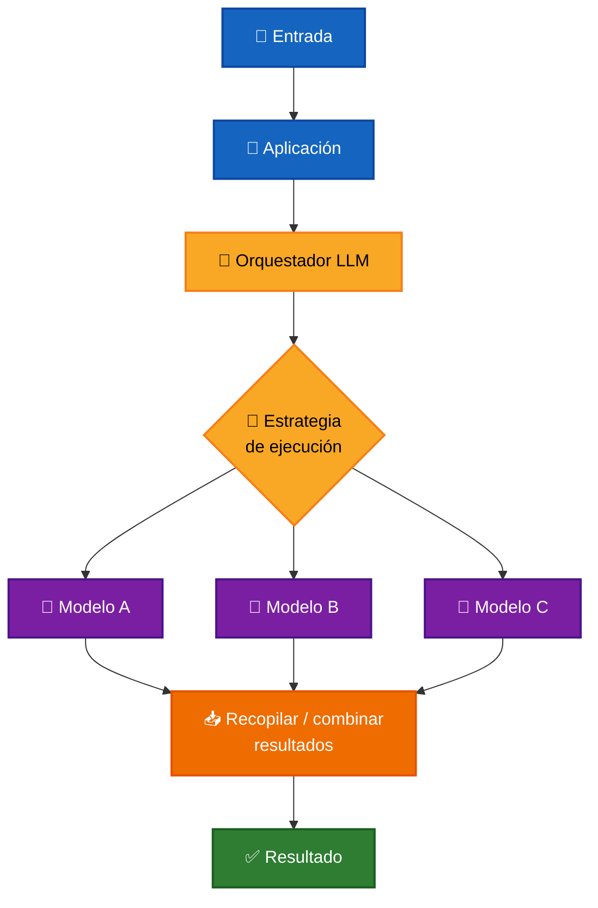
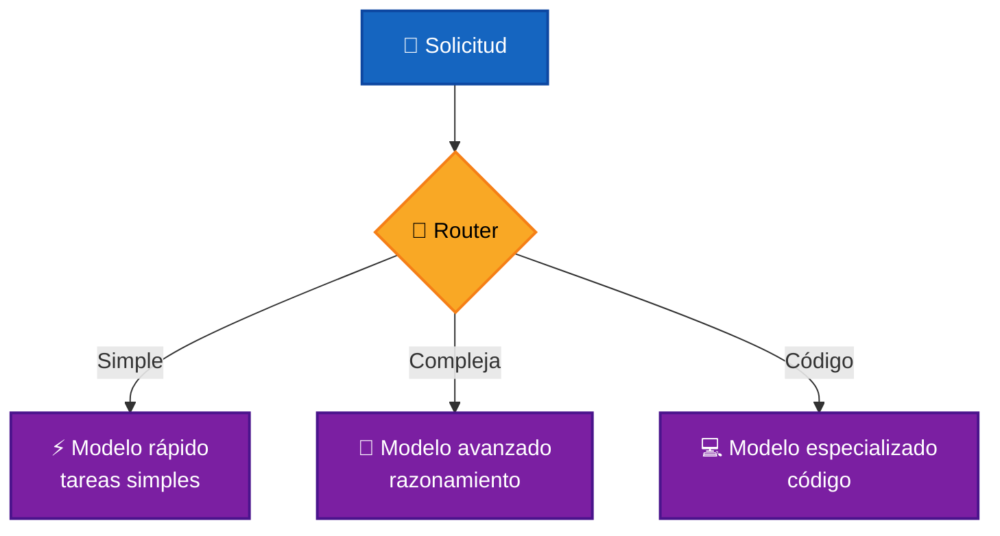
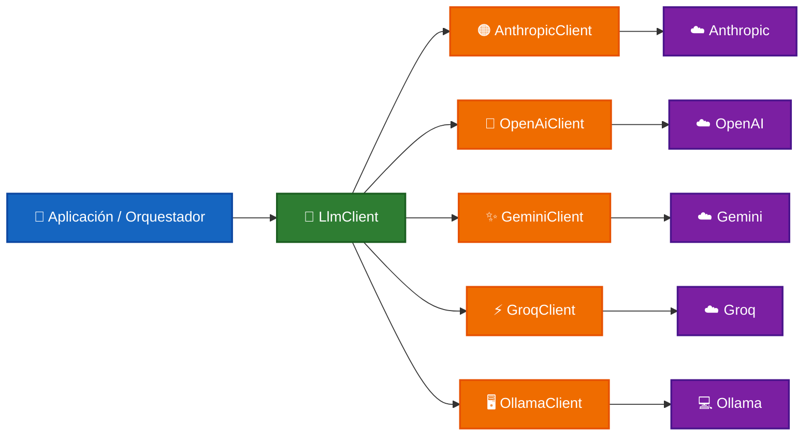

# 🧠 Orquestación de LLMs

La **orquestación de LLMs** consiste en coordinar uno o varios modelos de lenguaje dentro de un flujo de ejecución para resolver una tarea.

En lugar de depender directamente de un único modelo, una aplicación puede decidir:

- 🤖 Qué modelo utilizar.
- 🔀 Cómo distribuir las solicitudes.
- ⚡ Qué operaciones ejecutar en paralelo.
- 🧩 Cómo combinar resultados.
- 🔁 Cuándo utilizar un modelo alternativo.
- ⚖️ Cómo evaluar diferentes respuestas.
- 💰 Cómo equilibrar calidad, costo y latencia.

La orquestación introduce una capa entre la aplicación y los modelos:

```text
Aplicación
    ↓
Orquestador
    ↓
Uno o varios LLMs
    ↓
Resultado
```

El orquestador determina **cómo participan los modelos dentro del proceso**, mientras que cada cliente LLM se encarga únicamente de comunicarse con su proveedor.

---

## 🎯 Objetivo

El objetivo de la orquestación es evitar que la lógica de una aplicación dependa directamente de un único modelo o proveedor.

Una arquitectura orquestada puede utilizar diferentes LLMs según las necesidades de cada operación.

Por ejemplo:

```text
Consulta simple
     ↓
Modelo rápido y económico

Consulta compleja
     ↓
Modelo con mayor capacidad

Proveedor no disponible
     ↓
Modelo alternativo
```

Esto permite construir sistemas más flexibles y preparados para evolucionar a medida que aparecen nuevos modelos, proveedores y capacidades.

---

## ⭐ Importancia

Los modelos de lenguaje presentan diferencias en aspectos como:

- 🧠 Capacidad de razonamiento.
- ⚡ Velocidad.
- 💰 Costo.
- 📏 Ventana de contexto.
- 🛠️ Soporte de herramientas.
- 🖼️ Capacidades multimodales.
- 📝 Generación de código.
- 🌎 Disponibilidad por proveedor.
- 🔒 Requisitos de privacidad o ejecución local.

Por esta razón, utilizar siempre el mismo modelo no necesariamente es la mejor estrategia.

La orquestación permite seleccionar o combinar modelos según el contexto de ejecución.

---

## ✅ Beneficios

Una arquitectura de orquestación puede aportar:

### 🔌 Desacoplamiento

La aplicación depende de una abstracción común en lugar de las APIs particulares de cada proveedor.

```text
Aplicación
    ↓
LlmClient
    ↓
OpenAI / Anthropic / Gemini / Groq / Ollama
```

---

### 🔀 Flexibilidad

Es posible seleccionar diferentes modelos según la tarea.

```text
Clasificación   → Modelo A
Código          → Modelo B
Razonamiento    → Modelo C
```

---

### 🛡️ Resiliencia

Si un proveedor falla, la aplicación puede utilizar una alternativa.

```text
Modelo principal
      ↓
    Error
      ↓
Modelo alternativo
```

---

### ⚡ Optimización

Las tareas independientes pueden ejecutarse simultáneamente para reducir el tiempo total de procesamiento.

---

### 💰 Control de costos

Las operaciones sencillas pueden delegarse a modelos más económicos y reservar modelos más capaces para tareas complejas.

---

### 🧩 Especialización

Cada modelo puede utilizarse para la tarea donde ofrece mejores resultados.

---

## 🏗️ Arquitectura general

Una arquitectura de orquestación puede representarse de forma genérica de la siguiente manera:



🔵 **Azul** → Entrada y aplicación. <br />
🟡 **Amarillo** → Decisiones de orquestación. <br />
🟣 **Morado** → Modelos participantes. <br />
🟠 **Naranja** → Procesamiento de resultados. <br />
🟢 **Verde** → Resultado final. <br />

El punto importante es que la aplicación no necesita decidir directamente cómo utilizar cada modelo.

Esa responsabilidad pertenece al **orquestador**.

---

# 🧩 Componentes principales

Una solución de orquestación puede estar formada por diferentes componentes dependiendo de su complejidad.

## 🔌 Clientes LLM

Cada proveedor dispone de un cliente encargado de encapsular los detalles específicos de comunicación con su API o runtime.

```text
Aplicación
    ↓
LlmClient
    ↓
Cliente específico
    ↓
Proveedor / Modelo
```

Por ejemplo:

```text
AnthropicClient
OpenAiClient
GeminiClient
GroqClient
OllamaClient
```

Todos implementan una interfaz común que permite utilizarlos de forma intercambiable.

---

## 🔀 Orquestador

El orquestador contiene las reglas que determinan cómo utilizar los modelos.

Puede decidir:

- qué modelo ejecutar;
- cuántos modelos utilizar;
- si ejecutar operaciones en serie o en paralelo;
- qué hacer cuando ocurre un error;
- cómo procesar múltiples respuestas;
- cuándo utilizar un modelo evaluador.

Conceptualmente:

```text
Entrada
   ↓
Orquestador
   ↓
Estrategia
   ↓
Modelo(s)
```

---

## 🧠 Estrategia de ejecución

La estrategia determina cómo participan los modelos dentro del flujo.

No todas las aplicaciones necesitan ejecutar varios modelos al mismo tiempo.

La elección depende del problema que se quiera resolver.

---

# 🔀 Estrategias de orquestación

Existen diferentes patrones que pueden utilizarse según el caso de uso.

## 🎯 Routing

El orquestador selecciona un modelo dependiendo de las características de la solicitud.



Este patrón puede utilizarse para equilibrar:

```text
Calidad
  +
Costo
  +
Latencia
```

---

## ⚡ Ejecución paralela

Cuando varias operaciones son independientes, pueden ejecutarse simultáneamente.

```text
                  ┌──► Modelo A ──┐
                  │               │
Entrada ──────────┼──► Modelo B ──┼──► Resultados
                  │               │
                  └──► Modelo C ──┘
```

En Node.js este tipo de procesamiento puede implementarse mediante:

```typescript
const results = await Promise.all([
  modelA.ask(request),
  modelB.ask(request),
  modelC.ask(request),
]);
```

La sincronización ocurre cuando todas las operaciones han finalizado.

---

## 🔁 Fallback

El sistema dispone de un modelo alternativo cuando el principal no puede completar la solicitud.

```text
Modelo principal
      ↓
¿Respuesta válida?
  ↙           ↘
Sí             No
↓               ↓
Resultado    Modelo alternativo
```

Este patrón puede mejorar la disponibilidad de aplicaciones que dependen de servicios externos.

---

## ⛓️ Encadenamiento

La salida de un modelo puede convertirse en la entrada de otro.

```text
Entrada
   ↓
Modelo A
   ↓
Resultado intermedio
   ↓
Modelo B
   ↓
Resultado final
```

Por ejemplo:

```text
Documento
   ↓
Modelo A
   ↓
Resumen
   ↓
Modelo B
   ↓
Evaluación
```

Cada modelo cumple una responsabilidad específica dentro del flujo.

---

## ⚖️ Evaluación de respuestas

También es posible ejecutar varios modelos y utilizar otro LLM para comparar sus resultados.

```text
                  ┌──► Modelo A ──┐
                  │               │
Pregunta ─────────┼──► Modelo B ──┼──► Respuestas
                  │               │
                  └──► Modelo C ──┘
                                  ↓
                               ⚖️ Juez
                                  ↓
                              Evaluación
```

El modelo evaluador puede considerar criterios como:

- 🧠 razonamiento;
- 🎯 cumplimiento de requisitos;
- 📝 claridad;
- 💡 utilidad;
- 🧭 plan de acción.

Este patrón se aplica, por ejemplo, en la [comparación de modelos](./applications/model-comparison.md), donde un LLM puede actuar como juez de las respuestas generadas por otros modelos.

---

# 🛠️ Aplicaciones

Las estrategias de orquestación pueden combinarse para resolver diferentes tipos de problemas.

Para mantener separada la explicación general de la orquestación de sus casos de uso, cada aplicación se documenta de forma independiente. En estos documentos pueden incorporarse su arquitectura, implementación, laboratorio, resultados y consideraciones específicas.

| Aplicación | Objetivo |
| ---------- | -------- |
| 🤖 [Selección dinámica de modelos](./applications/model-selection.md) | Seleccionar automáticamente el modelo más apropiado según la solicitud. |
| 💻 [Procesamiento especializado](./applications/specialized-processing.md) | Asignar tareas o responsabilidades específicas a diferentes modelos. |
| 🧪 [Comparación de modelos](./applications/model-comparison.md) | Ejecutar la misma entrada en varios LLMs y comparar sus resultados. |
| ⚖️ [Evaluación automática](./applications/evaluator.md) | Utilizar un LLM para validar la respuesta generada por otro y solicitar una corrección cuando sea necesario. |
| 🔁 [Recuperación ante fallos](./applications/fallback.md) | Utilizar un modelo alternativo cuando el modelo principal falla o no está disponible. |
| 💰 [Optimización de costos](./applications/cost-optimization.md) | Seleccionar modelos considerando costo, capacidad y complejidad de la tarea. |

➡️ [Ver todas las aplicaciones](./applications/README.md)

---

# 🏗️ Arquitectura con múltiples clientes

La aplicación utiliza una abstracción común que permite trabajar con diferentes implementaciones de `LlmClient`.



La abstracción común permite:

- 🔌 Sustituir proveedores con cambios localizados.
- ➕ Incorporar nuevos clientes.
- ♻️ Reutilizar la lógica de ejecución.
- 🧩 Separar las responsabilidades.
- 🧪 Comparar diferentes modelos.
- 🔀 Implementar diferentes estrategias de orquestación.

---

# ⚠️ Consideraciones

Introducir múltiples modelos también aumenta la complejidad del sistema.

Es necesario considerar:

- 💰 Costos de múltiples solicitudes.
- ⚡ Latencia.
- 🔌 Disponibilidad de proveedores.
- 📊 Observabilidad.
- 🚨 Manejo de errores.
- 📏 Límites de tokens.
- 🔁 Estrategias de reintento.
- 🎯 Selección del modelo.
- 🧠 Consistencia entre respuestas.

Cuando existen múltiples proveedores también puede ser necesario normalizar:

```text
Requests
Responses
Token usage
Tool calls
Errors
Streaming
```

Por esta razón resulta importante mantener una abstracción común entre la lógica de aplicación y los clientes específicos.

---

# 🎯 Conclusión

La orquestación de LLMs introduce una capa responsable de decidir **cómo utilizar uno o varios modelos para resolver una tarea**.

Esta capa puede implementar diferentes estrategias:

```text
                 Orquestación
                      │
       ┌──────────────┼──────────────┐
       │              │              │
       ▼              ▼              ▼
    Routing       Paralelismo      Fallback
       │              │              │
       └──────────────┼──────────────┘
                      │
                Encadenamiento
                      │
                      ▼
                  Evaluación
```

La arquitectura basada en una interfaz común permite mantener separados:

```text
Lógica de aplicación
        ↓
Orquestación
        ↓
Abstracción LLM
        ↓
Proveedores
```

Esto facilita construir aplicaciones capaces de seleccionar, combinar y sustituir modelos sin acoplar la lógica principal a las particularidades de un proveedor específico.

---

# 📖 Resumen

**La orquestación de LLMs coordina uno o varios modelos dentro de un mismo flujo de ejecución y define cómo deben seleccionarse, ejecutarse y combinarse sus resultados.**

Puede utilizar estrategias como **routing, ejecución paralela, fallback, encadenamiento y evaluación**, permitiendo optimizar calidad, disponibilidad, latencia y costo.

Una abstracción común como `LlmClient` mantiene desacoplada la lógica de orquestación de las APIs específicas de cada proveedor y facilita incorporar nuevos modelos conforme evoluciona la aplicación.

---

[REGRESAR](./README.md)
