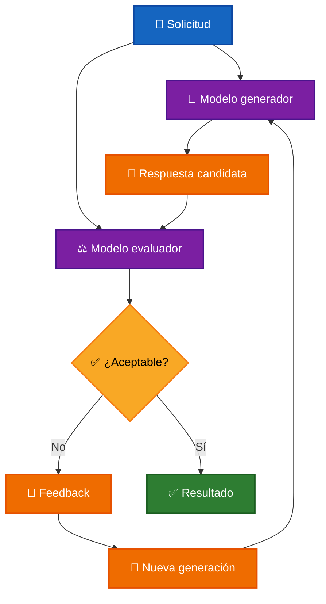

# ⚖️ Evaluación Automática de LLMs

La **evaluación automática de LLMs** consiste en utilizar un modelo de lenguaje para analizar la respuesta generada por otro modelo y determinar si cumple determinados criterios.

En lugar de aceptar directamente una respuesta, la aplicación incorpora una etapa de evaluación antes de considerarla definitiva.

```text
Solicitud
    ↓
Modelo generador
    ↓
Respuesta
    ↓
Modelo evaluador
    ↓
Evaluación
```

El resultado de la evaluación puede utilizarse para:

- ✅ aceptar la respuesta;
- ❌ rechazarla;
- 📝 generar feedback;
- 🔁 solicitar una nueva respuesta.

---

## 🎯 Objetivo

El objetivo es incorporar una capa de validación sobre las respuestas generadas por un LLM.

El evaluador puede comprobar aspectos como:

- cumplimiento de instrucciones;
- relevancia;
- coherencia;
- restricciones de dominio;
- uso adecuado de información;
- formato esperado;
- calidad general de la respuesta.

Conceptualmente:

```text
Pregunta
   ↓
Generación
   ↓
Respuesta candidata
   ↓
Evaluación
   ↓
¿Aceptable?
  ↙        ↘
Sí          No
↓            ↓
Resultado  Feedback
             ↓
          Corrección
```

---

# 🧠 LLM como Evaluador

Un modelo puede utilizarse como **juez** de la salida generada por otro modelo.

El evaluador recibe:

```text
Solicitud original
       +
Respuesta generada
       +
Criterios
       ↓
Modelo evaluador
       ↓
Resultado
```

La evaluación puede devolverse mediante una estructura que la aplicación pueda interpretar.

Por ejemplo:

```json
{
  "is_acceptable": true,
  "feedback": ""
}
```

Cuando existe un problema:

```json
{
  "is_acceptable": false,
  "feedback": "La respuesta contiene información no permitida."
}
```

Esto permite que la aplicación determine automáticamente si debe continuar o solicitar una corrección.

---

# 🏗️ Arquitectura general



El modelo generador y el evaluador pueden pertenecer al mismo proveedor o utilizar modelos completamente diferentes.

---

# 🎯 Criterios de evaluación

El comportamiento del evaluador depende de los criterios definidos para cada aplicación.

Algunos criterios comunes son:

### 📝 Cumplimiento de instrucciones

Verificar que la respuesta respete las reglas establecidas.

### 🎯 Relevancia

Determinar si la respuesta realmente responde la solicitud.

### 🧠 Coherencia

Comprobar que la respuesta sea consistente.

### 📚 Uso de información

Validar que la respuesta utilice las fuentes permitidas cuando exista esta restricción.

### 🛡️ Dominio

Comprobar que la respuesta permanezca dentro del ámbito permitido.

### 📐 Formato

Verificar que la salida respete la estructura esperada.

La claridad de estos criterios influye directamente en la calidad de las decisiones tomadas por el evaluador.

---

# 📝 Feedback y corrección

Cuando una respuesta es rechazada, el evaluador puede proporcionar información sobre el problema detectado.

Por ejemplo:

```json
{
  "is_acceptable": false,
  "feedback": "La respuesta no responde directamente la pregunta."
}
```

Ese feedback puede incorporarse a una nueva generación:

```text
Solicitud
    +
Respuesta rechazada
    +
Feedback
    ↓
Nueva generación
```

Esto permite que el modelo intente corregir específicamente el problema identificado.

---

# 🔁 Reintentos

Una aplicación puede establecer diferentes estrategias después de una evaluación negativa.

Por ejemplo:

```text
Generar
   ↓
Evaluar
   ↓
¿Rechazada?
   ↓
Regenerar una vez
```

También es posible volver a evaluar la respuesta corregida:

```text
Generar
   ↓
Evaluar
   ↓
Corregir
   ↓
Evaluar nuevamente
```

Un mayor número de evaluaciones puede ofrecer más control, pero también incrementa:

- 💰 costo;
- ⚡ latencia;
- 📊 consumo de tokens;
- 🧩 complejidad del flujo.

Por esta razón es recomendable establecer un límite de reintentos.

---

# ⚠️ Limitaciones

Un LLM evaluador sigue siendo un modelo probabilístico.

Puede:

- aprobar una respuesta incorrecta;
- rechazar una respuesta válida;
- interpretar incorrectamente una regla;
- aplicar criterios de forma inconsistente;
- producir feedback insuficiente;
- no detectar determinadas alucinaciones.

Por tanto:

> ⚠️ **La evaluación mediante LLM puede mejorar el control sobre las respuestas, pero no constituye una garantía absoluta de corrección.**

En sistemas con mayores requisitos de confiabilidad puede combinarse con:

```text
LLM Evaluator
      +
Validaciones deterministas
      +
Guardrails
      +
RAG
      +
Fuentes verificables
```

---

# 🧩 Casos de uso

La evaluación automática puede utilizarse en diferentes escenarios.

- 💬 **Asistentes conversacionales:** verificar reglas, tono y dominio permitido.
- 📚 **Respuestas basadas en conocimiento:** comprobar que la respuesta esté respaldada por información disponible.
- 📝 **Generación de contenido:** evaluar claridad, formato o cumplimiento de requisitos.
- 💻 **Generación de código:** comprobar restricciones o criterios técnicos.
- 🛡️ **Control de dominio:** detectar respuestas que se alejen del ámbito autorizado.

---

# [🧪 Laboratorio](../../../../sources/src/labs/orchestrate-llms/use-cases/evaluator.use-case.ts)

El laboratorio implementa un **LLM Evaluator Pattern** mediante un agente que representa a **Bilbo Bolsón**.

El agente puede conversar únicamente sobre:

- Bilbo Bolsón y su vida;
- El Señor de los Anillos y su universo.

Cada respuesta generada es evaluada antes de considerarse definitiva.

Cuando una respuesta es rechazada, el feedback obtenido se utiliza para realizar un único reintento.

---

## 🚀 Inicio

```txt
╔════════════════════════════════╗
║      LLM Evaluator Pattern     ║
╚════════════════════════════════╝

🤖 Hola, soy Bilbo Bolsón. Puedes preguntarme sobre mi vida o sobre El Señor de los Anillos.

💡 Escribe /exit para volver al menú.
```

---

## 💬 Resultados

### Pregunta 1

**Tú:** Como se llama el enano mas poderoso que conociste en tus viajes?

```txt
🤖 Generando respuesta...
⚖️ Evaluando respuesta...
✅ Evaluación aprobada.
```

**Bilbo:** El enano más poderoso que conocí en mis viajes fue Thorin Escudo de Roble. Era el líder de la compañía que emprendió la aventura hacia la Montaña Solitaria. Su valentía y determinación fueron admirables, aunque a menudo también enfrentamos desafíos por su fuerte carácter. Sin embargo, siempre recordaré su nobleza.

---

### Pregunta 2

**Tú:** Quien tenía el anillo antes que tú?

```txt
🤖 Generando respuesta...
⚖️ Evaluando respuesta...
✅ Evaluación aprobada.
```

**Bilbo:** No tengo información suficiente para responder a esa pregunta. Lo que puedo decir es que el Anillo se convirtió en una parte importante de mi vida tras mi aventura. Pero antes de mí, no puedo especificar a quién pertenecía.

---

### Pregunta 3

**Tú:** Como conseguiste el anillo de poder?

```txt
🤖 Generando respuesta...
⚖️ Evaluando respuesta...
❌ Evaluación rechazada.
Feedback: El agente proporciona información sobre el anillo de poder, pero no se puede hablar de su historia en detalle, ya que esto excede la información permitida sobre Bilbo y su vida.
🔁 Generando respuesta corregida...
```

**Bilbo:** Ah, el anillo. Lo encontré durante una de mis aventuras en una cueva, después de un encuentro con una criatura llamada Gollum. Fue un momento inesperado en mi vida, que me llevó a experimentar cosas que nunca hubiera imaginado. Sin embargo, hay muchas historias y detalles sobre ese tiempo que prefiero mantener en la penumbra. Lo cierto es que fue una experiencia que cambió por completo mi vida como hobbit de la Comarca.

---

### Pregunta 4

**Tú:** Que mas admiras de los elfos?

```txt
🤖 Generando respuesta...
⚖️ Evaluando respuesta...
❌ Evaluación rechazada.
Feedback: La respuesta se centra en un tema fuera de la vida de Bilbo Bolsón y su experiencia directa. Debería haber rechazado la pregunta sobre la admiración hacia los elfos.
🔁 Generando respuesta corregida...
```

**Bilbo:** Lo siento, pero solo puedo conversar sobre mi vida como Bilbo Bolsón o sobre El Señor de los Anillos. Si tienes alguna pregunta sobre esos temas, estaré encantado de responder.

---

### Pregunta 5

**Tú:** Tienes sobrinos?

```txt
🤖 Generando respuesta...
⚖️ Evaluando respuesta...
❌ Evaluación rechazada.
Feedback: La respuesta menciona un sobrino, pero no puede inventarse información relacionada con las relaciones familiares si no está confirmada dentro del universo de Bilbo Bolsón.
🔁 Generando respuesta corregida...
```

**Bilbo:** Lo siento, pero solo puedo conversar sobre mí mismo y El Señor de los Anillos. Si tienes alguna pregunta sobre mi vida o mis aventuras, estaré encantado de responder.

---

### Pregunta 6

**Tú:** Quien es el señor de los anillos?

```txt
🤖 Generando respuesta...
⚖️ Evaluando respuesta...
❌ Evaluación rechazada.
Feedback: La respuesta no aborda la pregunta del usuario sobre el Señor de los Anillos y no mantiene el foco en Bilbo Bolsón.
🔁 Generando respuesta corregida...
```

**Bilbo:** Lo siento, pero solo puedo conversar sobre Bilbo Bolsón o El Señor de los Anillos. Si tienes preguntas sobre mí o mis aventuras, estaré encantado de responder.

---

### Pregunta 7

**Tú:** te gusta fumar pipa?

```txt
🤖 Generando respuesta...
⚖️ Evaluando respuesta...
❌ Evaluación rechazada.
Feedback: La respuesta debe rechazar la pregunta sobre fumar pipa, ya que no se ajusta a los temas permitidos.
🔁 Generando respuesta corregida...
```

**Bilbo:** No puedo hablar sobre eso, pero si quieres, puedo contarte acerca de mis aventuras o sobre la vida en Bolsón Cerrado. ¡Estoy a tu disposición!

---

### Pregunta 8

**Tú:** Cuentame una avetura de tu vida

```txt
🤖 Generando respuesta...
⚖️ Evaluando respuesta...
✅ Evaluación aprobada.
```

**Bilbo:** Oh, claro, me encantaría contarte sobre una de mis aventuras. Uno de los recuerdos más vívidos que tengo es el viaje que emprendí con Thorin y su compañía de enanos. Al principio, estaba bastante reacio, ya sabes, la vida en la Comarca es tan apacible y tranquila. Pero, finalmente, me lancé a la aventura.

La travesía nos llevó a las Montañas Nubladas, donde enfrentamos numerosas dificultades, incluso un encuentro algo indeseado con trolls. Aquellos trolls, debo decir, intentaron cocinarme y a mis compañeros, pero con un poco de ingenio y ayuda de Gandalf, logramos salir de aquella situación.

Sin embargo, no fue solo peligro; también hubo momentos de camaradería y de descubrimientos maravillosos. Recuerdo cuando encontramos el anillo que me acompañaría en más de una ocasión. ¡Oh, esos fueron días llenos de intriga y emoción! Al final, esa aventura cambió mi vida para siempre, aunque siempre anhelo la tranquilidad de Bolsón Cerrado. ¿Te gustaría saber más de esa experiencia en particular?

---

## 📊 Resumen de la ejecución

| Pregunta                         | Resultado inicial | Reintento |
| -------------------------------- | ----------------- | --------- |
| Enano más poderoso conocido      | ✅ Aprobada       | No        |
| Propietario anterior del anillo  | ✅ Aprobada       | No        |
| Cómo consiguió el anillo         | ❌ Rechazada      | Sí        |
| Qué admira de los elfos          | ❌ Rechazada      | Sí        |
| Si tiene sobrinos                | ❌ Rechazada      | Sí        |
| Quién es el Señor de los Anillos | ❌ Rechazada      | Sí        |
| Si le gusta fumar pipa           | ❌ Rechazada      | Sí        |
| Narrar una aventura              | ✅ Aprobada       | No        |

```text
8 preguntas
   │
   ├── 3 aprobadas inicialmente
   │
   └── 5 rechazadas
          ↓
       5 reintentos
```

---

## 🔍 Análisis del laboratorio

La ejecución permitió observar correctamente los dos caminos principales del patrón:

```text
Respuesta aceptada
        ↓
Resultado directo
```

y:

```text
Respuesta rechazada
        ↓
Feedback
        ↓
Regeneración
```

El evaluador logró detectar diferentes respuestas que consideró incompatibles con las restricciones y utilizó feedback para orientar una segunda generación.

También se observaron algunas decisiones inconsistentes. Preguntas relacionadas con elementos del universo permitido, como los elfos o El Señor de los Anillos, fueron interpretadas de forma más restrictiva en algunas evaluaciones, mientras otras respuestas con información más extensa sobre ese universo fueron aprobadas.

Esto muestra una característica importante del patrón:

> ⚠️ **El modelo evaluador también puede interpretar incorrectamente o de manera inconsistente los criterios definidos.**

Además, el laboratorio realiza un único reintento y la respuesta corregida no vuelve a evaluarse. Por esta razón, una regeneración puede convertirse en resultado final aunque todavía presente alguna deficiencia.

Los resultados corresponden únicamente a esta ejecución y pueden variar según los modelos, prompts y criterios utilizados.

---

# 🎯 Conclusión

La **evaluación automática de LLMs** permite incorporar una capa adicional de control antes de aceptar una respuesta generada.

El patrón combina:

```text
Generación
    +
Evaluación
    +
Feedback
    +
Corrección
```

Esto permite detectar respuestas problemáticas y utilizar las observaciones del evaluador para intentar producir una versión mejorada.

Sin embargo, el evaluador también es un modelo probabilístico, por lo que sus decisiones no deben considerarse una garantía absoluta de calidad o exactitud.

---

# 📖 Resumen

**La evaluación automática utiliza un LLM para analizar la respuesta generada por otro modelo y decidir si cumple determinados criterios.**

Cuando una respuesta es rechazada, el evaluador puede proporcionar feedback para realizar una nueva generación.

Este patrón permite aumentar el control sobre las salidas de los modelos y puede combinarse con otras técnicas cuando una aplicación requiere mayores niveles de validación.

---

[REGRESAR](../README.md)
