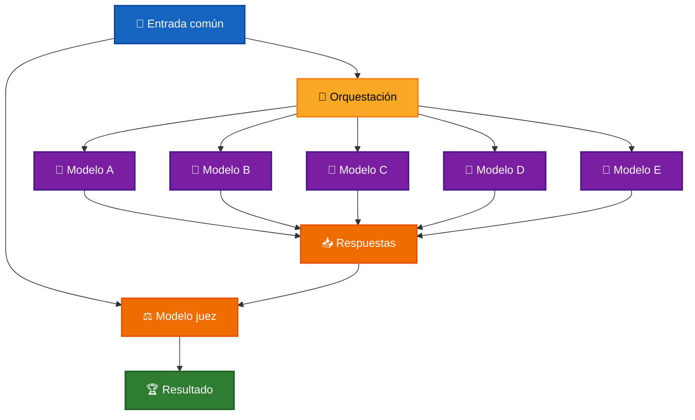

# 🧪 Comparación de Modelos LLM

La **comparación de modelos LLM** consiste en ejecutar una misma solicitud utilizando diferentes modelos de lenguaje y analizar sus respuestas bajo condiciones comunes.

Este enfoque permite observar diferencias entre modelos en aspectos como:

- 🧠 calidad del razonamiento;
- 🎯 cumplimiento de requisitos;
- 📝 claridad;
- 💡 utilidad;
- ⚡ velocidad;
- 📊 consumo de tokens;
- 🔄 consistencia.

La comparación puede realizarse manualmente o utilizar otro LLM como **modelo juez** para evaluar y clasificar las respuestas.

---

## 🎯 Objetivo

El objetivo es analizar cómo diferentes modelos resuelven una misma tarea utilizando una entrada y criterios comunes.

Conceptualmente:

```text
Pregunta común
      ↓
┌─────┼─────┬─────┬─────┐
↓     ↓     ↓     ↓     ↓
LLM A LLM B LLM C LLM D LLM E
│     │     │     │     │
└─────┴─────┼─────┴─────┘
            ↓
       Respuestas
            ↓
       Evaluación
            ↓
          Ranking
```

Para que la comparación sea consistente, los modelos deben recibir la misma solicitud y las mismas restricciones.

---

# 🧠 ¿Cómo funciona?

Una comparación puede dividirse en cuatro etapas principales:

```text
1. Definir una entrada común
            ↓
2. Ejecutar varios modelos
            ↓
3. Recopilar las respuestas
            ↓
4. Evaluar y comparar resultados
```

Cada modelo responde de forma independiente.

Posteriormente, las respuestas pueden analizarse utilizando métricas, criterios definidos o un modelo evaluador.

---

# 🏗️ Arquitectura general



La orquestación coordina la ejecución de los modelos y recopila sus resultados para posteriormente compararlos.

---

# ⚡ Ejecución paralela

Cuando las respuestas de los modelos son independientes, pueden generarse simultáneamente.

```text
                ┌──► Modelo A ──┐
                │               │
Pregunta ───────┼──► Modelo B ──┼──► Respuestas
                │               │
                ├──► Modelo C ──┤
                │               │
                └──► Modelo D ──┘
```

La ejecución paralela puede reducir el tiempo total de la comparación respecto a ejecutar los modelos secuencialmente.

El procesamiento continúa cuando todos los participantes han terminado.

---

# ⚖️ LLM como juez

Un LLM puede utilizarse para evaluar y clasificar las respuestas generadas por otros modelos.

El juez recibe:

```text
Pregunta original
       +
Respuestas generadas
       +
Criterios de evaluación
       ↓
Modelo juez
       ↓
Clasificación
```

El resultado puede solicitarse en un formato estructurado.

Por ejemplo:

```json
{
  "resultados": [1, 2, 4, 3, 5]
}
```

El primer índice representa al competidor mejor evaluado.

---

# 🎯 Criterios de comparación

La utilidad de una comparación depende de los criterios utilizados.

Algunos criterios comunes son:

### 🧠 Razonamiento

Analizar la calidad del razonamiento utilizado para llegar a una conclusión.

### 🎯 Cumplimiento de requisitos

Comprobar si la respuesta respeta las condiciones de la solicitud.

### 📝 Claridad

Evaluar si la respuesta es comprensible y está correctamente estructurada.

### 💡 Utilidad

Determinar si la respuesta proporciona información práctica y relevante.

### 📊 Consumo

Comparar métricas como tokens de entrada y salida.

### ⚡ Latencia

Observar cuánto tarda cada modelo en completar la tarea.

Los criterios deben mantenerse iguales para todos los participantes.

---

# 📊 Métricas

Además de analizar el contenido de las respuestas, pueden recopilarse métricas cuantitativas.

Por ejemplo:

```text
Modelo
  │
  ├── Tokens de entrada
  ├── Tokens de salida
  ├── Tiempo de respuesta
  └── Costo estimado
```

Estas métricas permiten complementar la evaluación cualitativa del contenido.

Un modelo puede producir una respuesta de mayor calidad pero requerir más tokens, mayor latencia o un costo superior.

---

# ⚠️ Consideraciones

Una comparación de modelos no representa una medición absoluta de su calidad.

Los resultados pueden cambiar dependiendo de:

- la pregunta utilizada;
- los prompts;
- los modelos seleccionados;
- la configuración de generación;
- los límites de tokens;
- los criterios de evaluación;
- el modelo utilizado como juez.

También debe considerarse que un LLM juez puede introducir sus propios sesgos o interpretar los criterios de manera diferente entre ejecuciones.

> ⚠️ **Un ranking representa el resultado de una ejecución concreta y no una clasificación absoluta entre modelos o proveedores.**

Para comparaciones más rigurosas pueden utilizarse múltiples preguntas, diferentes categorías de tareas y evaluaciones repetidas.

---

# [🧪 Laboratorio](../../../../sources/src/labs/orchestrate-llms/use-cases/compare.use-case.ts)

El laboratorio ejecuta la misma pregunta utilizando cinco modelos de diferentes proveedores.

Posteriormente, otro LLM analiza las respuestas y genera un ranking.

El flujo utilizado es:

```text
Generar pregunta
      ↓
Ejecutar cinco modelos
      ↓
Recopilar respuestas
      ↓
Modelo juez
      ↓
Ranking
```

Los modelos participantes son:

| Proveedor | Modelo               |
| --------- | -------------------- |
| Anthropic | `claude-sonnet-4-6`  |
| OpenAI    | `gpt-4o-mini`        |
| Gemini    | `gemini-2.5-flash`   |
| Groq      | `openai/gpt-oss-20b` |
| Ollama    | `llama3.2:3b`        |

---

## 📝 Pregunta generada

```text
Si tienes un presupuesto limitado de $500 y solo dos días para organizar la fiesta de cumpleaños de tu mejor amigo, y tienes que elegir entre alquilar un lugar para la fiesta o comprar comida y bebidas para llevar a casa, ¿cuál opción priorizarías y por qué?
```

La misma pregunta fue enviada a todos los modelos participantes.

---

## 🚀 Modelos ejecutados

```text
---- LLAMAR A ANTHROPIC / claude-sonnet-4-6 ----
---- LLAMAR A OPENAI / gpt-4o-mini ----
---- LLAMAR A GEMINI / gemini-2.5-flash ----
---- LLAMAR A GROQ / openai/gpt-oss-20b ----
---- LLAMAR A OLLAMA / llama3.2:3b ----
```

---

# 💬 Respuestas

## 🟠 Anthropic — `claude-sonnet-4-6`

### Decisión: Priorizar Comida y Bebidas en Casa

**Elegiría comprar comida y bebidas** por estas razones:

#### Factores determinantes

**💰 Económicos**

- El alquiler de un local típicamente consume $300-400 del presupuesto, dejando muy poco para lo demás.
- En casa, los $500 rinden significativamente más en comida, decoración y detalles especiales.

**⏱️ Logísticos**

- Con solo dos días, encontrar y reservar un lugar adecuado es arriesgado.
- Organizar una fiesta en casa es más rápido y controlable.

**🎉 Experiencia**

- Una fiesta íntima en casa puede ser _más memorable_ que un local genérico.
- El ambiente personalizado demuestra mayor esfuerzo y cariño.

#### Cómo distribuiría el presupuesto

| Concepto         | Estimado |
| ---------------- | -------: |
| Comida y bebidas |     $300 |
| Decoración       |     $100 |
| Pastel especial  |      $70 |
| Imprevistos      |      $30 |

**Conclusión:** La fiesta más especial no depende del lugar, sino de la **atención al detalle y el ambiente**. Con creatividad, una celebración en casa puede superar con creces a un local alquilado a mitad de presupuesto.

### Tokens

```text
Entrada: 102
Salida: 359
```

---

## 🤖 OpenAI — `gpt-4o-mini`

Con un presupuesto limitado de $500 y solo dos días para organizar la fiesta de cumpleaños, priorizaría comprar comida y bebidas para llevar a casa. Esta opción permite crear un ambiente más personal y acogedor, ideal para celebrar con amigos cercanos. Al organizar la fiesta en casa, se pueden evitar los costos adicionales de alquiler de un lugar, que suelen incluir depósitos y tarifas de limpieza.

Además, al elegir la comida y las bebidas, tengo control sobre el menú, lo que me permite adaptarlo a los gustos del cumpleañero y los invitados. Se puede optar por hacer algo sencillo, como una comida tipo buffet con opciones para todos, y seleccionar bebidas económicas pero apropiadas para la ocasión.

Esto también brinda la oportunidad de decorar el espacio de manera creativa y personalizar la celebración, lo que puede hacerla más especial sin necesidad de un gasto elevado. En resumen, celebrar en casa con buenas opciones de comida y bebida es más manejable y permite crear un ambiente cálido y memorable, clave para una gran fiesta de cumpleaños con amigos.

### Tokens

```text
Entrada: 71
Salida: 212
```

---

## ✨ Gemini — `gemini-2.5-flash`

Priorizaría **comprar comida y bebidas para celebrar en casa**.

Con un presupuesto limitado de $500 y solo dos días, alquilar un lugar para la fiesta sería casi imposible. Un

### Tokens

```text
Entrada: 70
Salida: 41
```

---

## ⚡ Groq — `openai/gpt-oss-20b`

Con un presupuesto de $500 y solo dos días, priorizaría la compra de comida y bebidas. Un espacio alquilado suele costar entre $200 y $300, dejando muy poco para lo que realmente hace que la fiesta sea memorable: la comida. Además, con el dinero que se ahorra en el alquiler puedes invertir en snacks variados, bebidas de calidad y, si quieres, un toque de decoración. Puedes organizar la fiesta en casa, en el patio o en un parque cercano, lugares que no cuestan nada y que permiten mayor flexibilidad de horarios y ambiente. La comida es el elemento central que mantiene a los invitados felices y satisfechos; un espacio barato pero sin comida puede resultar anticlimático. Así, con $500, consigues más sabor y experiencia que espacio, garantizando un día especial sin sobresaltos.

### Tokens

```text
Entrada: 135
Salida: 275
```

---

## 🖥️ Ollama — `llama3.2:3b`

En este escenario, priorizaría comprar comida y bebidas para llevar a casa. Aunque es más conveniente alquilar un lugar para la fiesta, con un presupuesto limitado de $500 y solo dos días para organizarla, creo que puedo encontrar una forma de hacerlo funcionar sin gastar todo el dinero en un alquiler.

Comprar comida y bebidas para llevar a casa me permitiría controlar mejor el costo y elegir opciones que se ajusten a mi presupuesto. Además, podré personalizar la comida y los postres según las preferencias de mi amigo y invitados, lo que hará que la fiesta sea más especial y memorable.

Además, con un poco de creatividad y planificación, puedo crear un ambiente festivo en casa o en un lugar cercano, utilizando decoraciones y elementos que ya tengo o que se pueden encontrar asequibles. De esta manera, podré disfrutar de una celebración divertida y significativa sin gastar todo el dinero en un alquiler.

### Tokens

```text
Entrada: 100
Salida: 219
```

---

# ⚖️ Resultado del juez

El modelo juez retornó:

```json
{
  "resultados": [1, 2, 4, 5, 3]
}
```

Los índices representan:

```text
1 → Anthropic
2 → OpenAI
3 → Gemini
4 → Groq
5 → Ollama
```

---

# 🏆 Ranking final

| Posición | Proveedor | Modelo               |
| -------- | --------- | -------------------- |
| 🥇 **1** | Anthropic | `claude-sonnet-4-6`  |
| 🥈 **2** | OpenAI    | `gpt-4o-mini`        |
| 🥉 **3** | Groq      | `openai/gpt-oss-20b` |
| **4**    | Ollama    | `llama3.2:3b`        |
| **5**    | Gemini    | `gemini-2.5-flash`   |

El modelo mejor evaluado en esta ejecución fue:

```text
🥇 Anthropic / claude-sonnet-4-6
```

---

## 📊 Consumo de tokens

| Proveedor | Tokens entrada | Tokens salida |
| --------- | -------------: | ------------: |
| Anthropic |            102 |           359 |
| OpenAI    |             71 |           212 |
| Gemini    |             70 |            41 |
| Groq      |            135 |           275 |
| Ollama    |            100 |           219 |

---

## 🔍 Análisis del laboratorio

Todos los modelos coincidieron en la decisión principal:

> **Priorizar la compra de comida y bebidas y realizar la celebración en casa.**

Las principales diferencias estuvieron en la profundidad y estructura de las respuestas.

Anthropic presentó la respuesta más detallada y organizada, incluyendo argumentos económicos, logísticos y una distribución concreta del presupuesto, obteniendo la primera posición.

OpenAI y Groq también desarrollaron argumentos claros sobre costos, flexibilidad y experiencia, ocupando la segunda y tercera posición respectivamente.

Ollama presentó una respuesta coherente pero menos estructurada, mientras que Gemini produjo una respuesta incompleta y considerablemente más breve, obteniendo la última posición.

> ⚠️ **El ranking corresponde únicamente a esta ejecución.**
>
> Puede cambiar al modificar la pregunta, los modelos, los prompts o los criterios utilizados por el juez.

---

# 🎯 Conclusión

La **comparación de modelos LLM** permite analizar cómo diferentes modelos responden ante exactamente las mismas condiciones.

La combinación de:

```text
Entrada común
     +
Ejecución de varios modelos
     +
Criterios comunes
     +
Evaluación
```

permite observar diferencias tanto cualitativas como cuantitativas entre los participantes.

El uso de un LLM como juez permite automatizar parte del análisis y producir una clasificación, aunque su resultado también debe considerarse probabilístico.

Por esta razón, una comparación debe interpretarse como evidencia correspondiente a un conjunto específico de condiciones y no como una clasificación definitiva de los modelos.

---

# 📖 Resumen

**La comparación de modelos LLM ejecuta una misma solicitud en varios modelos para analizar las diferencias entre sus respuestas.**

La comparación puede considerar calidad, cumplimiento de requisitos, consumo de tokens, latencia y otros criterios.

Cuando se utiliza un **LLM como juez**, las respuestas pueden evaluarse y clasificarse automáticamente, facilitando experimentos y análisis entre diferentes modelos o proveedores.

---

[REGRESAR](../README.md)
