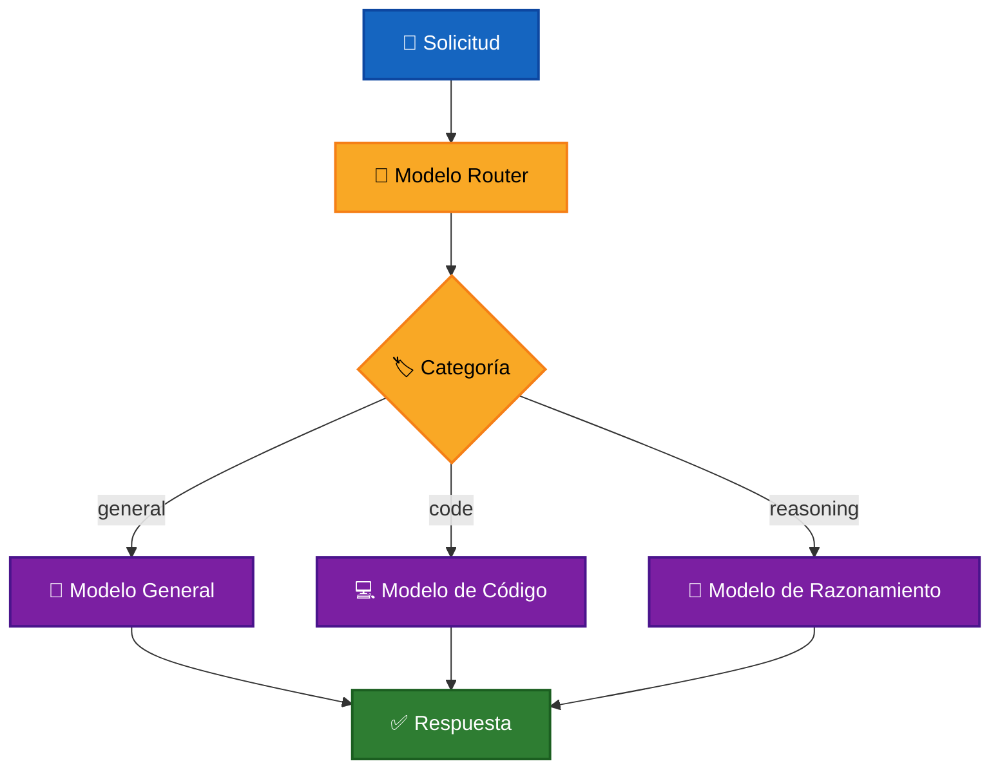

# 🤖 Selección Dinámica de Modelos

La **selección dinámica de modelos** consiste en elegir automáticamente qué LLM debe procesar una solicitud según las características de la tarea.

En lugar de utilizar siempre el mismo modelo, la aplicación incorpora una etapa de clasificación que determina qué modelo resulta más apropiado para cada solicitud.

```text
Solicitud
    ↓
Clasificación
    ↓
Selección de modelo
    ↓
LLM seleccionado
    ↓
Respuesta
```

Este enfoque permite utilizar diferentes modelos según sus capacidades, especialización, costo o características de ejecución.

---

## 🎯 Objetivo

El objetivo es evitar que todas las solicitudes sean procesadas obligatoriamente por el mismo modelo.

Una aplicación puede disponer de varios LLMs y seleccionar uno dependiendo del tipo de tarea.

Por ejemplo:

```text
Pregunta general
      ↓
Modelo general

Problema de razonamiento
      ↓
Modelo de razonamiento

Solicitud de código
      ↓
Modelo especializado
```

Esto permite asignar cada solicitud al modelo considerado más adecuado para resolverla.

---

# 🧠 Clasificación de solicitudes

Para seleccionar dinámicamente un modelo, primero es necesario determinar qué tipo de tarea representa la solicitud.

Una clasificación sencilla puede utilizar categorías como:

```text
general
code
reasoning
```

Cada categoría representa una necesidad diferente.

### 💬 General

Consultas sencillas, preguntas de conocimiento general, definiciones o explicaciones que no requieren procesamiento especializado.

Ejemplos:

```text
¿Cuál es la capital de Bolivia?

¿Qué es una API?

¿Para qué sirve HTTP?
```

---

### 💻 Code

Solicitudes relacionadas con:

- programación;
- generación de código;
- debugging;
- APIs;
- bases de datos;
- arquitectura de software;
- tecnologías y frameworks.

Ejemplo:

```text
Genera una función en TypeScript que imprima
un carácter durante cinco segundos.
```

---

### 🧠 Reasoning

Problemas que requieren:

- análisis;
- interpretación;
- comparación de alternativas;
- razonamiento lógico;
- toma de decisiones.

Ejemplo:

```text
Si pienso y luego existo,
entonces si no pienso, ¿existo?
```

---

# 🔀 Modelo Router

Una forma de implementar la selección dinámica es utilizar un LLM como **router**.

El router no responde directamente la solicitud.

Su responsabilidad es analizarla y seleccionar una categoría.

```text
Solicitud
    ↓
LLM Router
    ↓
Categoría
    ↓
Modelo asociado
```

Por ejemplo:

```text
¿Cuál es la capital de Bolivia?
        ↓
      Router
        ↓
      general
        ↓
   Modelo general
```

Otro ejemplo:

```text
Genera una función en TypeScript
        ↓
      Router
        ↓
       code
        ↓
   Modelo de código
```

El modelo router puede ser pequeño o económico, ya que su tarea únicamente consiste en clasificar la solicitud.

---

# 🏗️ Arquitectura general



La decisión sobre qué modelo utilizar se realiza durante la ejecución y depende de la solicitud recibida.

---

# 🔄 Flujo de selección

El proceso puede dividirse en tres etapas principales.

## 1. 🏷️ Clasificar

La solicitud se envía al modelo encargado del routing.

```text
Solicitud
    ↓
Router
    ↓
Categoría
```

Por ejemplo:

```json
{
  "task": "reasoning"
}
```

---

## 2. 🤖 Seleccionar

La categoría se utiliza para localizar el modelo asociado.

Conceptualmente:

```text
general   → Modelo A
code      → Modelo B
reasoning → Modelo C
```

La relación entre categoría y modelo forma parte de la configuración de la aplicación y puede modificarse sin cambiar el flujo general.

---

## 3. 🚀 Ejecutar

Una vez seleccionado el modelo, la solicitud original se envía únicamente a ese LLM.

```text
Solicitud
    ↓
Modelo seleccionado
    ↓
Respuesta
```

Los demás modelos disponibles no necesitan ejecutarse.

---

# 📦 Respuesta estructurada del Router

Cuando la selección debe ser procesada mediante código, es conveniente solicitar una salida estructurada.

Por ejemplo:

```json
{
  "task": "code"
}
```

Los valores permitidos pueden limitarse a las categorías configuradas:

```text
general
code
reasoning
```

Esto permite transformar la decisión del LLM en una operación de aplicación:

```text
"general"
    ↓
Modelo General

"code"
    ↓
Modelo de Código

"reasoning"
    ↓
Modelo de Razonamiento
```

La respuesta del router debe validarse antes de utilizarla para seleccionar un modelo.

---

# 🎯 Criterios de selección

La selección dinámica puede utilizar diferentes criterios dependiendo de las necesidades de la aplicación.

## 🧠 Capacidad

Asignar tareas complejas a modelos con mayores capacidades de razonamiento.

---

## 💻 Especialización

Seleccionar modelos especialmente adecuados para determinadas tareas.

Por ejemplo:

```text
Código       → Modelo especializado
Razonamiento → Modelo avanzado
General      → Modelo general
```

---

## 💰 Costo

Utilizar modelos económicos para tareas sencillas y reservar modelos más costosos para solicitudes que realmente lo necesiten.

```text
Solicitud simple
      ↓
Modelo económico

Solicitud compleja
      ↓
Modelo avanzado
```

---

## ⚡ Latencia

Seleccionar un modelo rápido cuando el tiempo de respuesta tenga mayor prioridad.

---

## 🔒 Privacidad

Algunas solicitudes pueden dirigirse hacia modelos locales cuando existan requisitos específicos de privacidad.

```text
Solicitud sensible
      ↓
Modelo local
```

---

# 🧩 Selección por reglas o mediante LLM

La decisión no necesariamente tiene que realizarse mediante otro modelo.

Existen diferentes estrategias.

## 📏 Reglas deterministas

La aplicación puede seleccionar un modelo mediante condiciones conocidas.

```text
¿Contiene código?
      ↓
Modelo especializado

¿Solicitud simple?
      ↓
Modelo económico
```

Este enfoque puede ser adecuado cuando las reglas son claras y fáciles de mantener.

---

## 🤖 LLM Router

Un modelo analiza semánticamente la solicitud y determina la categoría.

```text
Solicitud
    ↓
LLM Router
    ↓
Clasificación
```

Este enfoque resulta útil cuando las solicitudes son más variadas y difíciles de clasificar mediante reglas simples.

---

# 💰 Relación con optimización de costos

La selección dinámica puede utilizarse como mecanismo para optimizar costos.

Por ejemplo:

```text
Tarea sencilla
    ↓
Modelo pequeño
    ↓
Menor costo

Tarea compleja
    ↓
Modelo avanzado
    ↓
Mayor capacidad
```

Sin embargo, **selección dinámica** y **optimización de costos** no representan exactamente el mismo objetivo.

La selección dinámica decide:

> **¿Qué modelo debe ejecutar esta solicitud?**

La optimización de costos utiliza esa capacidad para decidir:

> **¿Qué modelo puede resolverla con el costo adecuado?**

---

# ⚠️ Consideraciones

La selección dinámica agrega una nueva decisión antes de ejecutar el modelo final.

Es necesario considerar:

- 🎯 calidad de la clasificación;
- 💰 costo adicional del router;
- ⚡ latencia adicional;
- 🧠 categorías correctamente definidas;
- 🔀 asignación adecuada entre categorías y modelos;
- 🚨 manejo de clasificaciones inválidas;
- 📊 observabilidad de las decisiones.

El router también puede equivocarse.

Por ejemplo:

```text
Solicitud de código
       ↓
Router
       ↓
general ❌
       ↓
Modelo incorrecto
```

Por esta razón, las categorías deben ser claras y el resultado de la clasificación debe validarse antes de seleccionar el modelo.

---

# 🧩 Casos de uso

La selección dinámica puede utilizarse en diferentes escenarios.

- 💬 **Asistentes generales:** seleccionar diferentes modelos según el tipo de pregunta.
- 💻 **Plataformas de desarrollo:** dirigir tareas de programación hacia modelos especializados.
- 🧠 **Problemas complejos:** utilizar modelos avanzados únicamente cuando se requiere razonamiento.
- 💰 **Optimización de costos:** evitar ejecutar modelos costosos para solicitudes sencillas.
- ⚡ **Optimización de latencia:** utilizar modelos rápidos para operaciones frecuentes.
- 🔒 **Privacidad:** dirigir determinadas solicitudes hacia modelos locales.

---

# [🧪 Laboratorio](../../../../sources/src/labs/orchestrate-llms/use-cases/select-model.use-case.ts)

El laboratorio implementa una selección dinámica utilizando tres categorías:

```text
general
code
reasoning
```

Cada categoría está asociada a un modelo diferente:

| Categoría   | Proveedor | Modelo               |
| ----------- | --------- | -------------------- |
| `general`   | Ollama    | `llama3.2:3b`        |
| `reasoning` | OpenAI    | `gpt-4o-mini`        |
| `code`      | Groq      | `openai/gpt-oss-20b` |

El usuario introduce una solicitud y el sistema determina automáticamente qué modelo debe procesarla.

---

## 🚀 Inicio

```text
╔════════════════════════════════╗
║   Selección Dinámica de LLMs   ║
╚════════════════════════════════╝

💡 Escribe una pregunta y el sistema seleccionará el modelo.
💡 Escribe /exit para volver al menú.
```

---

## 💬 Pregunta general

**Tú:** Cual es la capital de Bolivia?

```text
🔀 Seleccionando modelo...
✅ Categoría: general
🤖 Modelo: Ollama / llama3.2:3b
```

**Ollama:**

> La capital de Bolivia es Sucre. Sin embargo, en 2009 se decidió que La Paz sería la nueva capital del país y desde entonces ha sido el centro administrativo y político de Bolivia.
>
> Sin embargo, es importante destacar que Sucre sigue siendo considerada la "Capital Constitucional" de Bolivia, ya que fue elegida como la sede de la Asamblea Constituyente en 2009. La Asamblea Constituyente se reunió en Sucre para redactar y aprobación de la nueva constitución boliviana.
>
> En resumen:
>
> - Sucre es la "Capital Constitucional" de Bolivia.
> - La Paz es la capital administrativa y política del país desde 2009.

---

## 🧠 Pregunta de razonamiento

**Tú:** Si pienso y luego existo, entonces si no pienso, existo?

```text
🔀 Seleccionando modelo...
✅ Categoría: reasoning
🤖 Modelo: OpenAI / gpt-4o-mini
```

**OpenAI:**

> La famosa frase "Pienso, luego existo" de René Descartes sugiere que la actividad de pensar es prueba de la existencia del ser. Sin embargo, el hecho de no pensar no necesariamente implica que uno no exista. La existencia puede ser independiente del pensamiento consciente.
>
> En otras palabras, tu existencia no depende únicamente de tu capacidad de pensar; incluso en momentos de inactividad mental, tu ser sigue presente. La reflexión sobre la existencia puede llevar a cuestionamientos más profundos sobre la naturaleza de la conciencia y el ser.

---

## 💻 Solicitud de código

**Tú:** Genera una función que escriba en consola un caracter enviado por el usuario por 5 seguntos en typescript

```text
🔀 Seleccionando modelo...
✅ Categoría: code
🤖 Modelo: Groq / openai/gpt-oss-20b
```

**Groq:**

> **Tip: “por 5 segundos” → 5 segundos.**
>
> Para “escribir en consola un carácter enviado por el usuario durante 5 segundos” lo más útil es imprimirlo repetidamente cada segundo, y después de 5 segundos dejar de hacerlo.

```typescript
/**
 * Imprime el carácter recibido en la consola cada segundo,
 * y deja de hacerlo después de 5 segundos.
 *
 * @param char - El carácter que se imprimirá.
 */
function imprimirCaracterDurante5Segundos(char: string): void {
  if (char.length !== 1) {
    console.error("Solo se permite un carácter.");

    return;
  }

  const intervalo = setInterval(() => console.log(char), 1000);

  setTimeout(() => {
    clearInterval(intervalo);

    console.log("¡Fin de los 5 segundos!");
  }, 5000);
}
```

La respuesta continuó explicando el funcionamiento y proponiendo una variante utilizando `async/await`.

---

## 📊 Resumen de la ejecución

| Solicitud                               | Categoría seleccionada | Modelo                      |
| --------------------------------------- | ---------------------- | --------------------------- |
| Capital de Bolivia                      | `general`              | Ollama / `llama3.2:3b`      |
| Problema sobre existencia y pensamiento | `reasoning`            | OpenAI / `gpt-4o-mini`      |
| Generación de función TypeScript        | `code`                 | Groq / `openai/gpt-oss-20b` |

Conceptualmente:

```text
Pregunta general
      ↓
    general
      ↓
    Ollama

Razonamiento
      ↓
   reasoning
      ↓
    OpenAI

Código
      ↓
     code
      ↓
     Groq
```

---

## 🔍 Análisis del laboratorio

El router clasificó correctamente las tres solicitudes según las categorías definidas:

```text
general
reasoning
code
```

y cada pregunta fue enviada únicamente al modelo asociado a esa categoría.

El resultado demuestra correctamente el objetivo principal de la selección dinámica:

> **la aplicación puede decidir durante la ejecución qué modelo debe resolver cada solicitud.**

También se observaron dos aspectos importantes.

La selección correcta del modelo no garantiza por sí misma que el contenido generado sea correcto. El modelo elegido para la categoría `general` produjo afirmaciones que podrían requerir validación adicional.

Además, la respuesta de código terminó incompleta durante una variante con `async/await`, mostrando que aspectos como límites de salida o generación también siguen siendo relevantes después de seleccionar el modelo.

> ⚠️ **El routing decide qué modelo utilizar, pero la calidad final continúa dependiendo del modelo seleccionado y de su respuesta.**

Los resultados corresponden únicamente a esta ejecución y pueden variar según los modelos, prompts y configuración utilizada.

---

# 🎯 Conclusión

La **selección dinámica de modelos** permite decidir qué LLM utilizar según las características de cada solicitud.

El patrón puede resumirse como:

```text
Solicitud
    ↓
Clasificación
    ↓
Selección
    ↓
Modelo apropiado
    ↓
Respuesta
```

Este enfoque permite aprovechar diferentes capacidades dentro de una misma aplicación sin depender siempre de un único modelo.

La selección puede considerar criterios como especialización, razonamiento, costo, velocidad o privacidad.

Sin embargo, seleccionar correctamente un modelo no garantiza automáticamente la calidad de su respuesta. El routing resuelve **qué modelo ejecutar**, mientras otros mecanismos pueden encargarse posteriormente de validar **qué tan buena es la respuesta obtenida**.

---

# 📖 Resumen

**La selección dinámica de modelos utiliza información sobre una solicitud para decidir qué LLM debe procesarla.**

La decisión puede realizarse mediante reglas deterministas o utilizando otro LLM como router.

Una arquitectura de este tipo permite asociar diferentes categorías de tareas a modelos especializados:

```text
General
   ↓
Modelo A

Código
   ↓
Modelo B

Razonamiento
   ↓
Modelo C
```

Esto proporciona una base para construir sistemas capaces de seleccionar modelos según sus capacidades, costo, latencia o especialización.

---

[REGRESAR](../README.md)
