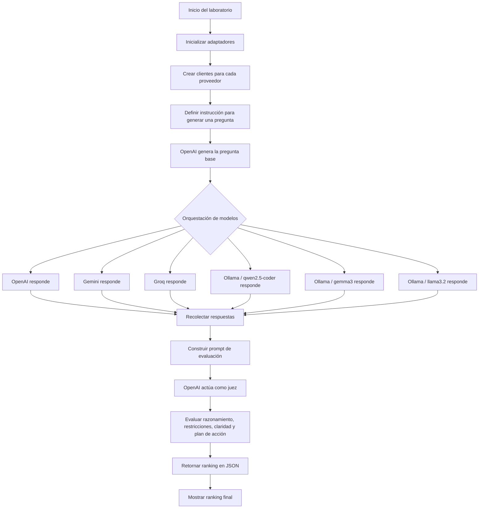

## 🧠 Orquestando LLMs

Este laboratorio demuestra cómo coordinar múltiples modelos de lenguaje dentro de un mismo flujo de ejecución. A partir de una pregunta base, la aplicación invoca diferentes LLMs, recopila sus respuestas y utiliza un modelo evaluador para comparar los resultados.

El ejemplo permite analizar cómo varían las respuestas entre proveedores como **OpenAI**, **Gemini**, **Groq** y **Ollama**, aplicando una arquitectura basada en adaptadores para mantener el código modular, extensible y fácil de mantener. 🚀



### Resultados

```text
---- GENERA PREGUNTA A OPENIA ----
Una persona con recursos limitados debe elegir entre gastar 4,000 euros en una reparación urgente de su vivienda, que debe estar lista en dos semanas, o invertir ese dinero en un curso que podría mejorar significativamente sus ingresos, cuyo inicio es en 5 días. ¿Qué decisión tomaría y por qué?
---- LLAMAR A OPENIA ----
---- LLAMAR A GEMINI ----
---- LLAMAR A GROQ ----
---- LLAMAR A OLLAMA #1 ----
---- LLAMAR A OLLAMA #2 ----
---- LLAMAR A OLLAMA #3 ----

**** RESPUESTAS MODELOS *****
gpt-5-nano
Con 4,000 euros disponibles, debe elegir entre una reparación urgente de la vivienda que debe estar lista en dos semanas o un curso que podría aumentar significativamente sus ingresos y comienza en cinco días; ¿qué decisión tomaría y por qué?

gemini-2.5-flash-lite
Ante la urgencia de la reparación de la vivienda (dos semanas) y la oportunidad de mejorar ingresos con un curso (inicio en 5 días), ambos con un costo de 4,000 euros y recursos limitados, ¿priorizaría la seguridad y habitabilidad inmediata de su hogar o la inversión a largo plazo en su potencial económico, y cuál sería su justificación?

llama-3.3-70b-versatile
Priorizaría la reparación de la vivienda por seguridad y habitabilidad, justificada por la urgencia y necesidad de un hogar digno.

qwen2.5-coder:3b
La persona con recursos limitados debería priorizar la reparación urgente de su vivienda debido a la urgencia y necesidad de un hogar seguro, aunque consideraría el curso como una inversión potencialmente lucrativa que podría mejorar sus ingresos en el futuro.

gemma3:4b
Considerando la urgencia de la reparación y la necesidad inmediata de un hogar seguro, la persona probablemente invertiría los 4,000 euros en la vivienda. La prioridad sería asegurar su habitabilidad y bienestar, priorizando una solución a corto plazo sobre una inversión con un inicio más lejano y menos garantizado.

llama3.2
La persona con recursos limitados priorizaría la reparación de su vivienda debido a la urgencia y necesidad inmediata de un hogar seguro. Aunque consideraría el curso como una inversión potencialmente lucrativa, la seguridad y habitabilidad de su hogar serían su principal prioridad. La decisión se tomaría basada en la necesidad inmediata de asegurar su bienestar y la importancia de tener un lugar donde vivir sin preocupaciones.

**** RESULTADO DEL JUEZ *****
{"resultados": [4, 6, 5, 3, 1, 2]}

**** RANKING *****
Rank 1: qwen2.5-coder:3b
Rank 2: llama3.2
Rank 3: gemma3:4b
Rank 4: llama-3.3-70b-versatile
Rank 5: gpt-5-nano
Rank 6: gemini-2.5-flash-lite
```

[REGRESAR](./README.md)
