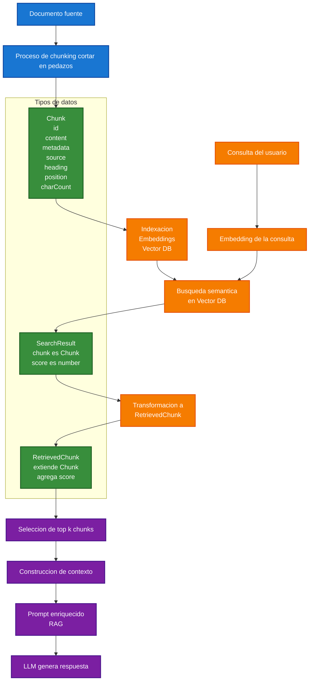

# 🔎 RAG

## 🧠 Cómo funciona un sistema RAG (Retrieval-Augmented Generation)

Un sistema **RAG (Generación aumentada mediante recuperación de información)** combina las capacidades de búsqueda de información con la potencia de generación de texto de un **LLM (Large Language Model)**.

Su principal objetivo es proporcionar respuestas más precisas, actualizadas y fundamentadas utilizando información recuperada desde documentos, bases de conocimiento o repositorios de información.

En lugar de depender únicamente del conocimiento con el que fue entrenado el modelo, RAG permite incorporar contexto adicional en tiempo real antes de generar una respuesta.

---

## 🏗️ Flujo General de RAG



### 🎨 Leyenda del Diagrama

🔵 **Azul** → Ingesta y preparación de documentos.  
🟢 **Verde** → Estructuras de datos (`Chunk`, `SearchResult`, `RetrievedChunk`).  
🟠 **Naranja** → Embeddings, indexación y recuperación semántica.  
🟣 **Morado** → Construcción del contexto y generación de la respuesta.

---

### 📥 1. Ingesta del documento

Todo comienza con un **documento fuente**.

Este documento puede provenir de diferentes orígenes:

- 📄 PDF
- 🌐 Página web
- 📚 Base de conocimiento
- 📖 Documentación técnica
- 📝 Archivos Markdown
- 💾 Repositorios locales

Los modelos de lenguaje poseen límites de contexto, por lo que documentos muy grandes no pueden procesarse de una sola vez.

Para resolver este problema se utiliza una técnica llamada **chunking**, que consiste en dividir el contenido en fragmentos más pequeños llamados **chunks**.

#### Beneficios

- ✅ Reduce el tamaño de los documentos.
- ✅ Mejora la precisión de búsqueda.
- ✅ Permite recuperar únicamente las secciones relevantes.

---

### 📦 2. Creación de los objetos de datos

Cada fragmento generado durante el proceso de chunking se representa mediante una estructura denominada **Chunk**.

Un `Chunk` almacena:

- Un identificador (`id`).
- El contenido textual (`content`).
- Metadatos (`metadata`).

#### Ejemplo de metadatos

- Documento de origen (`source`).
- Título o encabezado (`heading`).
- Posición dentro del documento (`position`).
- Número de caracteres (`charCount`).

#### ¿Por qué son importantes los metadatos?

Los metadatos permiten:

- 🔍 Identificar el origen de la información.
- 📍 Determinar dónde se encontraba dentro del documento.
- 📚 Mostrar referencias al usuario.
- 🧩 Construir contexto de mejor calidad.

---

### 🧮 3. Indexación en la base vectorial

Una vez creados los chunks, cada uno es convertido a un vector numérico mediante un modelo de [embedding](./embedding.md).

#### ¿Qué hacen los embeddings?

Los embeddings transforman texto en representaciones matemáticas capaces de capturar significado semántico.

Por ejemplo:

```text
"¿Cómo funciona una Vector DB?"
```

y

```text
"¿Qué es una base de datos vectorial?"
```

pueden generar vectores muy cercanos aunque utilicen palabras distintas.

#### Resultado

```text
Chunk
    ↓
Embedding
    ↓
Vector DB
```

Los vectores generados se almacenan en una **Vector Database (Vector DB)** junto con la referencia al chunk original.

---

### ❓ 4. Procesamiento de la consulta

Cuando un usuario realiza una pregunta ocurre el siguiente flujo:

1. 📥 Se recibe la consulta.
2. 🧮 Se genera un embedding de la consulta.
3. 🔗 Se utiliza el mismo modelo de embeddings empleado durante la indexación.

#### Objetivo

Representar tanto documentos como preguntas dentro del mismo espacio vectorial.

Gracias a ello resulta posible comparar similitud semántica entre ambos.

---

### 🔍 5. Búsqueda semántica

Ahora la aplicación compara:

```text
Embedding del usuario
```

contra

```text
Embeddings almacenados en la Vector DB
```

La búsqueda devuelve los fragmentos conceptualmente más cercanos a la consulta.

#### Resultado obtenido

La búsqueda genera objetos:

```text
SearchResult
```

que contienen:

- El chunk encontrado.
- El grado de similitud (`score`).

#### Ventaja principal

A diferencia de una búsqueda tradicional por palabras clave, la búsqueda semántica encuentra información relacionada por significado.

---

### 📊 6. Conversión a resultados enriquecidos

Los resultados de búsqueda se transforman en objetos **RetrievedChunk**.

Un `RetrievedChunk` contiene:

- Toda la información del `Chunk`.
- La puntuación de relevancia (`score`).

#### Beneficios

- 📈 Permite ordenar resultados.
- 🎯 Facilita seleccionar los elementos más relevantes.
- 🧠 Mejora la calidad del contexto final.

---

### 🏆 7. Selección de los mejores fragmentos

No todos los chunks recuperados son utilizados.

El sistema selecciona únicamente los de mayor relevancia mediante una estrategia conocida como:

```text
Top-K Retrieval
```

Donde:

- `K = 3` → 3 fragmentos.
- `K = 5` → 5 fragmentos.
- `K = 10` → 10 fragmentos.

La cantidad exacta depende de la configuración del sistema.

#### Objetivo

Maximizar la calidad de la información enviada al modelo evitando ruido innecesario.

---

### 🧩 8. Construcción del contexto

Los chunks seleccionados se combinan para crear un contexto enriquecido.

```text
Chunk 1
+
Chunk 2
+
Chunk 3
=
Contexto
```

Este contexto representa la información más relevante para responder la consulta realizada por el usuario.

---

### 📝 9. Creación del Prompt RAG

El contexto recuperado se incorpora al prompt enviado al LLM.

El resultado es un **Prompt Enriquecido** que contiene:

- ❓ Pregunta del usuario.
- 📚 Fragmentos recuperados.
- ⚙️ Instrucciones del sistema.
- 🎯 Reglas de comportamiento.

#### Ejemplo conceptual

```text
Contexto:
[Información recuperada]

Pregunta:
¿Cómo funciona RAG?

Instrucciones:
Responde utilizando únicamente el contexto proporcionado.
```

---

### 🤖 10. Generación de la respuesta

Finalmente el LLM procesa:

- 🧠 Su conocimiento general.
- 📚 El contexto recuperado.
- ❓ La pregunta realizada.

Y genera una respuesta final.

#### Beneficios

✅ Respuestas más precisas.  
✅ Información respaldada por documentación real.  
✅ Menor probabilidad de alucinaciones.  
✅ Mejor aprovechamiento del conocimiento corporativo.  
✅ Posibilidad de utilizar información reciente sin reentrenar el modelo.

---

## 🔄 Resumen Visual del Proceso

```text
Documento
    ↓
Chunking
    ↓
Chunks
    ↓
Embeddings
    ↓
Vector DB

Pregunta
    ↓
Embedding
    ↓
Busqueda Semantica
    ↓
Top K Chunks
    ↓
Contexto
    ↓
Prompt RAG
    ↓
LLM
    ↓
Respuesta
```

---

## ✅ Ventajas de utilizar RAG

### 📚 Información actualizada

Permite utilizar conocimiento que no estaba presente durante el entrenamiento del modelo.

### 🎯 Mayor precisión

Recupera información relevante antes de generar la respuesta.

### 🔍 Trazabilidad

Es posible identificar el origen de la información utilizada.

### 💰 Menor costo

No es necesario reentrenar un modelo para incorporar nueva documentación.

### 🏢 Ideal para entornos empresariales

Permite consultar documentación interna, manuales, procedimientos, bases de conocimiento y repositorios corporativos.

---

## 🎯 Conclusión

RAG combina lo mejor de dos mundos:

- 🔎 Recuperación inteligente de información.
- 🤖 Generación de lenguaje natural mediante LLMs.

Gracias a esta arquitectura, los modelos pueden responder utilizando conocimiento específico y actualizado, aumentando significativamente la calidad, precisión y confiabilidad de las respuestas.

---

### 📖 Resumen

**RAG funciona dividiendo documentos en fragmentos, transformándolos en embeddings, almacenándolos en una base de datos vectorial, recuperando los fragmentos más relevantes para una consulta y utilizándolos como contexto adicional para que el LLM genere respuestas mejor fundamentadas.**

---

[REGRESAR](./README.md)
