# ✂️ Chunking

El **chunking** es el proceso de dividir un documento grande en fragmentos más pequeños llamados `chunks`.

En documentos Markdown, una estrategia útil consiste en dividir primero el contenido por títulos y subtítulos, preservando su estructura semántica. Cuando una sección continúa siendo demasiado grande, puede subdividirse por párrafos.

### Ejemplo Chunking de un Markdown

```mermaid
flowchart LR
    A["Documento largo en Markdown"]
    B["Separar por headings<br/>## y ###"]
    C["Secciones semánticas"]
    D{"¿La sección<br/>es muy larga?"}

    E["Crear un chunk<br/>por sección"]
    F["Subdividir<br/>por párrafos"]

    G["Preservar el<br/>heading padre"]
    H["Aplicar overlap<br/>entre chunks"]
    I["Repetir el último párrafo<br/>en el siguiente chunk"]

    J["Chunk 1"]
    K["Chunk 2"]
    L["Chunk 3"]

    M["Vectorizar cada chunk<br/>individualmente"]

    N["Búsqueda semántica<br/>más precisa"]
    O["Citas exactas<br/>de la fuente"]
    P["Evitar superar<br/>el límite de tokens"]

    A --> B
    B --> C
    C --> D

    D -- "No" --> E
    D -- "Sí" --> F

    E --> G
    F --> G

    G --> H
    H --> I

    I --> J
    I --> K
    I --> L

    J --> M
    K --> M
    L --> M

    M --> N
    M --> O
    M --> P

    classDef ingestion fill:#0B3B60,stroke:#42A5F5,color:#FFFFFF,stroke-width:2px;
    classDef processing fill:#263238,stroke:#B0BEC5,color:#FFFFFF,stroke-width:2px;
    classDef decision fill:#5A3500,stroke:#FF9800,color:#FFFFFF,stroke-width:2px;
    classDef chunk fill:#123D20,stroke:#4CAF50,color:#FFFFFF,stroke-width:2px;
    classDef result fill:#4A1010,stroke:#EF5350,color:#FFFFFF,stroke-width:2px;

    class A ingestion;
    class B,C,E,F,G,H,I processing;
    class D decision;
    class J,K,L,M chunk;
    class N,O,P result;
```



### 🎨 Leyenda del diagrama

🔵 **Azul** → Documento original e ingesta del contenido.  
⚪ **Gris** → División, preparación y preservación de la estructura.  
🟠 **Naranja** → Decisión sobre el tamaño de cada sección.  
🟢 **Verde** → Chunks generados y vectorización individual.  
🔴 **Rojo** → Resultados y beneficios de la recuperación semántica.

---

## 🔄 Explicación del flujo

El proceso comienza con un documento extenso escrito en Markdown.

Primero, el contenido se separa utilizando sus títulos y subtítulos:

```markdown
## Autenticación

### Configuración de JWT

### Protección de rutas
```

Cada sección resultante representa una unidad semántica, es decir, un bloque de contenido relacionado con un mismo tema.

Después se evalúa el tamaño de cada sección:

- Si la sección tiene un tamaño adecuado, se utiliza como un único chunk.
- Si la sección es demasiado grande, se subdivide por párrafos.

Durante la división se conserva el título de la sección padre para evitar que el fragmento pierda contexto.

Por ejemplo:

```text
Heading padre:
## Autenticación

Contenido:
JWT permite identificar al usuario...
```

El chunk almacenado podría mantener ambos elementos:

```text
## Autenticación

JWT permite identificar al usuario...
```

A continuación, puede aplicarse un pequeño **overlap** entre fragmentos. Esto significa repetir una parte del chunk anterior al inicio del siguiente.

```text
Chunk 1:
Párrafo A
Párrafo B
Párrafo C

Chunk 2:
Párrafo C
Párrafo D
Párrafo E
```

Finalmente, cada chunk se transforma individualmente en un embedding y se almacena en una base de datos vectorial.

```text
Chunk 1 ──► Embedding 1
Chunk 2 ──► Embedding 2
Chunk 3 ──► Embedding 3
```

Esto permite recuperar únicamente los fragmentos más relacionados con la pregunta del usuario.

---

## ANEXO

[Chunking en otros formatos](./chunking-otros-formatos.md)

---

## 🧠 ¿Por qué dividir por headings?

Los headings de Markdown representan la estructura lógica del documento.

```markdown
## Configuración

### Variables de entorno

### Base de datos

## Autenticación

### JWT

### Guards
```

Separar usando estos elementos suele ser mejor que cortar el texto cada cierta cantidad fija de caracteres, porque ayuda a conservar temas completos dentro del mismo chunk.

```text
División por tamaño fijo
        │
        └── Puede cortar una explicación a la mitad

División por headings
        │
        └── Mantiene juntas las secciones relacionadas
```

---

## 🔗 ¿Qué es el overlap?

El **overlap** es una pequeña porción de contenido que se repite entre chunks consecutivos.

Su objetivo es evitar que una idea quede separada justo en el límite entre dos fragmentos.

Sin overlap:

```text
Chunk 1:
El token JWT debe enviarse...

Chunk 2:
...en la cabecera Authorization.
```

Con overlap:

```text
Chunk 1:
El token JWT debe enviarse en la cabecera Authorization.

Chunk 2:
El token JWT debe enviarse en la cabecera Authorization.
El servidor valida su firma antes de autorizar la solicitud.
```

El overlap debe ser moderado. Repetir demasiado contenido aumenta el almacenamiento, genera embeddings redundantes y puede producir resultados repetidos durante la búsqueda.

---

## 📏 Tamaño de los chunks

No existe un tamaño ideal para todos los documentos.

El tamaño debe definirse según:

- La estructura del contenido.
- El nivel de detalle esperado en las respuestas.
- El modelo de embeddings utilizado.
- La longitud del contexto admitido por el LLM.
- La cantidad de información que debe recuperarse por consulta.

Un chunk demasiado pequeño puede perder contexto:

```text
"El token debe renovarse."
```

Un chunk demasiado grande puede mezclar diferentes temas:

```text
Autenticación + base de datos + despliegue + pruebas
```

El objetivo es generar fragmentos suficientemente pequeños para ser precisos, pero suficientemente grandes para conservar una idea completa.

---

## 🏷️ Metadatos recomendados

Además del contenido y del embedding, es útil almacenar metadatos que permitan identificar el origen de cada chunk.

```ts
interface Chunk {
  id: string;
  content: string;
  embedding: number[];

  documentId: string;
  source: string;
  heading?: string;
  chunkIndex: number;
}
```

Estos metadatos permiten:

- Mostrar la fuente original.
- Construir citas.
- Ordenar fragmentos.
- Filtrar por documento o sección.
- Reconstruir el contexto alrededor de un resultado.

---

## ✅ Beneficios del chunking

El chunking permite:

- Realizar búsquedas semánticas más precisas.
- Recuperar solo la información relevante.
- Evitar enviar documentos completos al LLM.
- Reducir el consumo de tokens.
- Mantener referencias exactas a la fuente.
- Mejorar la calidad del contexto utilizado en RAG.
- Procesar documentos mayores que el límite de entrada de los modelos.

```text
Documento completo
       │
       ▼
División semántica
       │
       ▼
Chunks con contexto y metadatos
       │
       ▼
Embeddings individuales
       │
       ▼
Recuperación precisa
```

En términos simples:

> **Chunking consiste en dividir un documento en fragmentos con significado propio para poder almacenarlos, buscarlos y recuperarlos de forma precisa.**

---

[RAG](./rag.md) || [REGRESAR - MODELO EMBEDDING](./modelo-embedding.md)
