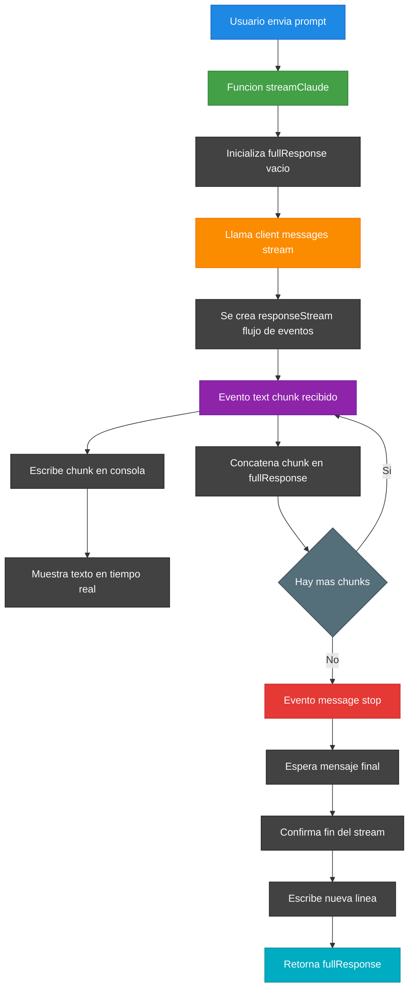

# 📡 Streaming de Respuestas

El `Streaming de Respuestas` permite que una aplicacion consuma las respuestas generadas por un modelo de IA en modo **streaming**, mostrando el contenido al usuario en tiempo real mientras construye la respuesta completa internamente.

---

## 🌟 Beneficios del Streaming de Respuestas

El Streaming de Respuestas permite ofrecer una experiencia mas rapida, interactiva y moderna, al combinar:

- ⚡ Visualizacion inmediata del contenido.
- 👀 Retroalimentacion continua.
- 😊 Mejor experiencia de usuario.
- 📈 Mayor rendimiento percibido.
- 🗄️ Disponibilidad de la respuesta completa al finalizar.

Por estas razones, el streaming se ha convertido en una practica recomendada en aplicaciones conversacionales y soluciones basadas en IA generativa.

## 🔄 Flujo Streaming de Respuestas



---

### 👤 1. El usuario envia un prompt

El proceso comienza cuando el usuario envia una solicitud o **prompt** al sistema.

El prompt contiene la pregunta o instruccion que sera procesada por el modelo de IA.

---

### ⚙️ 2. Se invoca la funcion `streamClaude`

La funcion `streamClaude` recibe el prompt y se encarga de gestionar toda la comunicacion con el modelo, incluyendo la recepcion de eventos de streaming.

---

### 🧱 3. Se inicializa `fullResponse`

Antes de comenzar a recibir contenido, se crea una variable vacia llamada `fullResponse`.

Su objetivo es almacenar la respuesta completa a medida que los fragmentos de texto vayan llegando.

```text
fullResponse = ""
```

---

### 🌐 4. Se inicia el stream con el modelo

La funcion realiza una llamada a:

```text
client.messages.stream
```

Esta llamada no devuelve la respuesta completa de una sola vez.

En su lugar, devuelve un flujo continuo de eventos.

---

### 📡 5. Se crea el flujo de eventos

El resultado de la llamada es un objeto denominado `responseStream`.

Este objeto comienza a emitir eventos a medida que el modelo genera contenido.

---

### 📝 6. Se recibe un evento de texto

Cada vez que el modelo produce una nueva porcion de respuesta, se recibe un evento de tipo:

```text
text
```

Este evento contiene un fragmento de texto o **chunk**.

---

### 💬 7. El texto se muestra en tiempo real

Cada chunk recibido se escribe inmediatamente en la salida estandar mediante:

```text
process.stdout.write
```

Gracias a este comportamiento, el usuario puede visualizar la respuesta progresivamente sin esperar a que termine toda la generacion.

---

### 📦 8. El chunk se agrega a la respuesta completa

Ademas de mostrarse en pantalla, cada fragmento recibido se concatena en la variable acumuladora:

```text
fullResponse += chunk
```

De esta forma se conserva una copia integra de la respuesta.

---

### 🔄 9. Se verifica si existen mas chunks

Despues de procesar cada fragmento, el flujo continua escuchando nuevos eventos.

#### ✅ Si existen mas chunks

El proceso regresa al paso de recepcion de eventos de texto y continua mostrando y acumulando contenido.

#### ⛔ Si no existen mas chunks

El modelo emite un evento indicando que la generacion ha concluido.

---

### 🛑 10. Se recibe el evento `message_stop`

Este evento indica que el modelo ha terminado de generar la respuesta y que no se enviaran mas fragmentos de texto.

---

### ⏳ 11. Se espera el mensaje final

Se ejecuta:

```text
await finalMessage()
```

Este paso garantiza que toda la informacion pendiente haya sido procesada correctamente.

---

### ✅ 12. Se confirma la finalizacion del stream

El sistema verifica que el flujo haya concluido exitosamente y que no existan eventos adicionales pendientes de recibir.

---

### 📄 13. Se escribe una nueva linea

Una vez finalizado el procesamiento, se agrega un salto de linea en la salida para mantener un formato limpio en la consola.

---

### 🎯 14. Se retorna la respuesta completa

Finalmente, la funcion devuelve el contenido acumulado en:

```text
fullResponse
```

Esta variable contiene exactamente la misma informacion que fue mostrada en tiempo real al usuario, pero consolidada en una unica cadena de texto.

---

## 📋 Resumen

El flujo persigue dos objetivos simultaneos:

### 💬 Mostrar la respuesta en tiempo real

Permite que el usuario vea el contenido conforme el modelo lo va generando, mejorando significativamente la experiencia de uso.

### 🗄️ Construir una respuesta completa

Mantiene una copia acumulada de todos los chunks recibidos para que posteriormente pueda ser:

- Retornada por la funcion.
- Almacenada en una base de datos.
- Registrada en logs.
- Procesada por otras partes de la aplicacion.

---

## Laboratorio

**Pregunta**:

Qué es async/await en javascript?, de manera resumida

### ✅ Demo 1: Enviando código SIN streaming

---

## Respuesta:

Async/Await en JavaScript: Es una forma de manejar **código asíncrono** de manera más legible, como si fuera código síncrono.

---

### Conceptos clave

- **`async`** → Declara que una función es asíncrona (siempre retorna una `Promise`)
- **`await`** → Pausa la ejecución hasta que la `Promise` se resuelva _(solo funciona dentro de `async`)_

---

### Ejemplo

```javascript
// Con Promises tradicionales 😵
fetch("/api/user")
  .then((res) => res.json())
  .then((data) => console.log(data))
  .catch((err) => console.error(err));

// Con Async/Await 😊
async function getUser() {
  try {
    const res = await fetch("/api/user");
    const data = await res.json();
    console.log(data);
  } catch (err) {
    console.error(err);
  }
}
```

---

### Resumen rápido

|     |                                            |
| --- | ------------------------------------------ |
| ✅  | Código más limpio y legible                |
| ✅  | Manejo de errores con `try/catch`          |
| ⚠️  | `await` solo funciona en funciones `async` |
| ⚠️  | No bloquea el hilo principal               |

> **En esencia:** es "azúcar sintáctica" sobre las **Promises**, no un concepto nuevo.

---

### ✅ Demo 2: Enviando código CON streaming

## Respuesta:

Async/Await en JavaScript: Es **azúcar sintáctica** sobre Promises que hace el código asíncrono más legible, escribiéndolo como si fuera síncrono.

### Conceptos clave

- `async` → marca una función para que **siempre retorne una Promise**
- `await` → **pausa la ejecución** dentro de la función hasta que la Promise se resuelva

### Ejemplo

```javascript
// ❌ Con Promises (difícil de leer)
function obtenerUsuario() {
  fetch("/api/user")
    .then((res) => res.json())
    .then((data) => console.log(data))
    .catch((err) => console.error(err));
}

// ✅ Con Async/Await (más limpio)
async function obtenerUsuario() {
  try {
    const res = await fetch("/api/user");
    const data = await res.json();
    console.log(data);
  } catch (err) {
    console.error(err);
  }
}
```

### Reglas rápidas

1. Solo puedes usar `await` **dentro** de una función `async`
2. Los errores se manejan con **try/catch** (en lugar de `.catch()`)
3. No bloquea el hilo principal — sigue siendo **no bloqueante**

---

[REGRESAR](./README.md)
