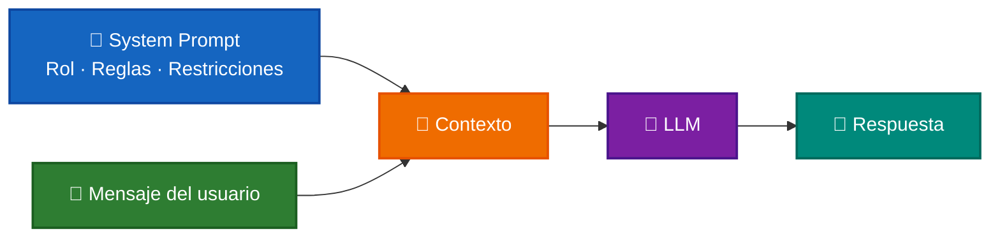
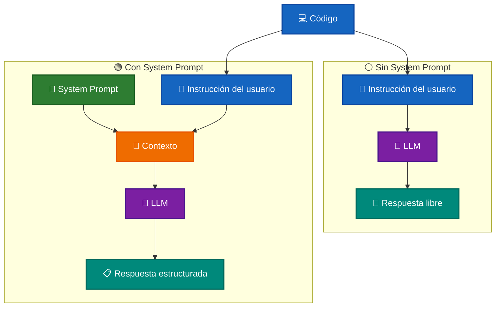

# 🤖 System Prompts

Un **System Prompt** es una instrucción de alto nivel que se proporciona al modelo para definir cómo debe comportarse durante una interacción.

Permite establecer reglas globales relacionadas con:

- 🎯 Rol o especialidad del modelo.
- 📝 Formato de las respuestas.
- ✅ Criterios que debe evaluar o priorizar.
- 🌎 Idioma de respuesta.
- 📏 Longitud, estilo y nivel de detalle.
- 🔒 Restricciones y límites de comportamiento.

En términos simples:

```text
System Prompt
      +
Mensaje del usuario
      ↓
     LLM
      ↓
Respuesta condicionada
```

El mismo mensaje de usuario puede producir respuestas diferentes dependiendo de las instrucciones definidas en el `System Prompt`.

---

## 🎯 Objetivo

El comportamiento de un mismo modelo cambia cuando procesa exactamente la misma entrada:

```text
⚪ Sin System Prompt
        vs.
🟢 Con System Prompt
```

La comparación permite observar diferencias en:

- 📐 Estructura de la respuesta.
- 🎯 Nivel de enfoque.
- ✂️ Cantidad de contenido generado.
- 🔒 Priorización de seguridad y buenas prácticas.
- 📏 Nivel de detalle.
- ⚡ Consumo potencial de tokens.

---

# 🧩 ¿Dónde interviene el System Prompt?

El `System Prompt` forma parte del contexto enviado al modelo.



El usuario proporciona la tarea concreta, mientras que el `System Prompt` establece las reglas bajo las cuales debe ejecutarse.

Por ejemplo:

```text
🧠 System Prompt
Eres un Senior Developer especializado en Code Reviews.

👤 Usuario
Revisa este código.
```

El modelo procesa ambas instrucciones como parte de su contexto.

---

# ⚪ Sin System Prompt

Cuando no se proporciona un `System Prompt`, el modelo responde utilizando únicamente la información disponible en la consulta y su comportamiento general.

Esto implica que el modelo decide libremente aspectos como:

- estructura;
- longitud;
- nivel de detalle;
- problemas que considera importantes;
- formato de presentación.

El resultado puede ser válido, pero menos consistente entre diferentes casos de uso.

---

# 🟢 Con System Prompt

Cuando existe un `System Prompt`, la aplicación puede definir explícitamente cómo debe comportarse el modelo.

Por ejemplo:

```text
Eres un Senior Developer con 10+ años de experiencia realizando code reviews.

Prioriza:
- Correctitud
- Seguridad
- Legibilidad
- Mantenibilidad

Sé conciso.
Máximo 5 hallazgos.
```

Esto permite conseguir respuestas más alineadas con los requisitos de la aplicación.

---

# [🧪 Laboratorio](../../sources/src/labs/02-system-prompt.ts)

Se utiliza el mismo código en las dos ejecuciones.

## 📥 Código de entrada

**Pregunta:**

> Revisa este código:

```javascript
async function getUser(id) {
  const query = "SELECT * FROM users WHERE id = " + id;
  const result = await db.query(query);
  return result[0];
}

function calcularDescuento(precio, tipo) {
  if (tipo == "vip") {
    return precio * 0.8;
  } else if (tipo == "regular") {
    return precio * 0.9;
  } else {
    return precio;
  }
}
```

---

# ⚪ Demo 1 — Sin System Prompt

El código se envía directamente al modelo sin instrucciones adicionales que controlen la revisión.

## 📤 Respuesta

### Revisión de Código

### 🚨 Problemas Críticos

#### 1. Inyección SQL (`getUser`)

```javascript
// ❌ PELIGROSO - Vulnerable a SQL Injection
const query = "SELECT * FROM users WHERE id = " + id;

// ✅ CORRECTO - Usar consultas parametrizadas
async function getUser(id) {
  const query = "SELECT * FROM users WHERE id = ?";
  const result = await db.query(query, [id]);
  return result[0] ?? null;
}
```

> Un atacante podría pasar `id = "1 OR 1=1"` y obtener **todos los usuarios**.

---

### ⚠️ Problemas Menores

#### 2. Comparación débil (`calcularDescuento`)

```javascript
// ❌ Usa == (comparación débil, ignora tipo de dato)
if (tipo == "vip")

// ✅ Usar === (comparación estricta)
if (tipo === "vip")
```

#### 3. Magic numbers poco descriptivos

```javascript
// ❌ ¿Qué significa 0.8?
return precio * 0.8;

// ✅ Nombrar las constantes
const DESCUENTOS = {
  vip: 0.2,
  regular: 0.1,
};
```

---

### ✅ Código Refactorizado

```javascript
const DESCUENTOS = {
  vip: 0.2,
  regular: 0.1,
};

async function getUser(id) {
  if (!id) throw new Error("ID inválido");

  const result = await db.query("SELECT * FROM users WHERE id = ?", [id]);

  return result[0] ?? null;
}

function calcularDescuento(precio, tipo) {
  if (typeof precio !== "number" || precio < 0) {
    throw new Error("Precio inválido");
  }

  const descuento = DESCUENTOS[tipo] ?? 0;

  return precio * (1 - descuento);
}
```

### 📋 Resumen

| Problema                 | Severidad  | Estado    |
| ------------------------ | ---------- | --------- |
| SQL Injection            | 🔴 Crítico | Corregido |
| Comparación débil `==`   | 🟡 Medio   | Corregido |
| Magic numbers            | 🟠 Bajo    | Corregido |
| Sin validación de inputs | 🟡 Medio   | Agregada  |

---

# 🟢 Demo 2 — Con System Prompt

En esta ejecución se utiliza exactamente el mismo código, pero antes se configura el comportamiento esperado del modelo.

## 🧠 System Prompt

```text
Eres un Senior Developer con 10+ años de experiencia realizando code reviews.

Analiza únicamente los aspectos que tengan impacto real:
- Correctitud (bugs y lógica incorrecta)
- Seguridad (si aplica)
- Legibilidad
- Mantenibilidad
- Performance (solo si existen problemas evidentes)

Reglas:
- Sé conciso y prioriza hallazgos importantes.
- No expliques conceptos básicos ni teoría innecesaria.
- No menciones problemas menores o puramente subjetivos.
- Máximo 5 hallazgos en total.
- Usa snippets solo cuando aporten valor real.
- Si no hay problemas relevantes, indícalo explícitamente.
- Mantén toda la respuesta por debajo de 400 palabras.

Formato de respuesta:

Resumen:
1-2 líneas describiendo el estado general del código.

✅ Bien hecho
- Solo menciona fortalezas relevantes.
- Máximo 2 puntos.

⚠️ Sugerencias
- [Alta|Media|Baja] Descripción breve.
- [Alta|Media|Baja] Descripción breve.

🐛 Bugs
- Solo incluir si existen errores o riesgos funcionales.
- Descripciones breves y directas.

🔒 Seguridad
- Solo incluir si existen riesgos de seguridad.
- Descripciones breves y directas.

💡 Código sugerido
- Mostrar únicamente los cambios relevantes.
- Si el código es corto, mostrar la versión corregida.
- Si es largo, mostrar solo la función o fragmento modificado.

⭐ Puntuación
X/10

🚀 Comentario
Una frase breve y motivadora.

Responde en español si el código está en español; en inglés en caso contrario.
```

---

## 📤 Respuesta

### Resumen

Código con un problema crítico de seguridad en la consulta SQL y algunas oportunidades de mejora en la lógica de descuentos.

### ✅ Bien hecho

- `calcularDescuento` tiene lógica clara y casos bien definidos.
- Uso correcto de `async/await` en `getUser`.

### ⚠️ Sugerencias

- **[Media]** Usar `===` en lugar de `==` en `calcularDescuento` para evitar coerciones de tipo inesperadas.
- **[Baja]** Extraer los factores de descuento a constantes nombradas mejora la legibilidad y el mantenimiento.

### 🐛 Bugs

- `getUser` no maneja el caso en que `result` esté vacío o sea `null`, lo que puede causar un retorno `undefined` silencioso sin que el llamador lo espere.

### 🔒 Seguridad

- **[Crítico]** `getUser` construye la query concatenando `id` directamente, lo que abre una vulnerabilidad de **SQL Injection**. Cualquier input no sanitizado puede comprometer la base de datos.

### 💡 Código sugerido

```javascript
async function getUser(id) {
  const query = "SELECT * FROM users WHERE id = ?";
  const result = await db.query(query, [id]);

  if (!result || result.length === 0) {
    return null;
  }

  return result[0];
}

const DESCUENTOS = {
  vip: 0.8,
  regular: 0.9,
};

function calcularDescuento(precio, tipo) {
  const factor = DESCUENTOS[tipo] ?? 1;
  return precio * factor;
}
```

> ⚠️ La sintaxis del placeholder (`?`, `$1`, etc.) depende del driver de base de datos utilizado.

### ⭐ Puntuación

**4/10**

### 🚀 Comentario

El SQL Injection es un bloqueante crítico, pero con los ajustes sugeridos este código queda limpio y seguro. ¡Buen camino!

---

# 🔍 Comparación de resultados

Las dos ejecuciones utilizan:

```text
Mismo modelo
+
Misma pregunta
+
Mismo código
```

La diferencia está en las instrucciones añadidas mediante el `System Prompt`.

| Aspecto      | ⚪ Sin System Prompt         | 🟢 Con System Prompt  |
| ------------ | ---------------------------- | --------------------- |
| Rol          | Genérico                     | Senior Developer      |
| Prioridades  | Decididas por el modelo      | Definidas previamente |
| Formato      | Libre                        | Estructurado          |
| Longitud     | Variable                     | Limitada              |
| Hallazgos    | Sin límite explícito         | Máximo 5              |
| Seguridad    | Según criterio del modelo    | Prioridad explícita   |
| Idioma       | No controlado explícitamente | Definido por reglas   |
| Consistencia | Menor                        | Mayor                 |

El `System Prompt` no modifica el código recibido.

Modifica **cómo debe analizarlo y cómo debe construir la respuesta**.

---

# 🔄 Flujo de ambas ejecuciones



---

# 🔎 Relación con RAG

El `System Prompt` y `RAG` cumplen responsabilidades diferentes.

El `System Prompt` define principalmente:

```text
¿Cómo debe comportarse el modelo?
```

RAG incorpora otra pregunta:

```text
¿Qué información externa necesita el modelo
para responder esta consulta?
```

Por tanto, una futura arquitectura RAG puede extender el contexto sin sustituir el `System Prompt`.

Actualmente:

```text
System Prompt
      +
Mensaje del usuario
      ↓
     LLM
```

Con historial de conversación:

```text
System Prompt
      +
   Historial
      +
Mensaje actual
      ↓
     LLM
```

Y posteriormente con RAG:

```text
System Prompt
      +
   Historial
      +
Contexto recuperado
      +
Mensaje actual
      ↓
     LLM
```

---

# ✅ Beneficios del System Prompt

Utilizar un `System Prompt` permite:

- 🎯 Especializar el comportamiento del modelo.
- 📐 Mantener formatos consistentes.
- ✂️ Controlar el nivel de detalle.
- 🔒 Priorizar criterios importantes.
- 🌎 Definir el idioma esperado.
- 📏 Limitar la extensión de las respuestas.
- 🧩 Separar las reglas de comportamiento de la consulta del usuario.
- 🔎 Preparar una estructura de contexto extensible posteriormente con RAG.

---

# ⚠️ Consideraciones

Un `System Prompt` permite orientar el comportamiento del modelo, pero forma parte de una arquitectura más amplia.

A medida que la aplicación evolucione pueden incorporarse otras capas:

```text
🧠 System Prompt
        ↓
💬 Conversación
        ↓
🔎 RAG
        ↓
🛠️ Tools
        ↓
🛡️ Guardrails
        ↓
🤖 Agentes
```

Cada mecanismo resuelve una responsabilidad diferente.

El `System Prompt` se ocupa principalmente de **definir instrucciones y comportamiento**.

# 📖 Resumen

**Un `System Prompt` define las instrucciones globales que condicionan el comportamiento de un LLM. Permite controlar el rol, formato, prioridades, restricciones y nivel de detalle de las respuestas sin modificar la consulta del usuario.**

**En una arquitectura RAG, estas instrucciones permanecen separadas del conocimiento recuperado: el `System Prompt` define cómo debe actuar el modelo, mientras que RAG aporta la información externa necesaria para responder.**

---

[REGRESAR](./README.md)
