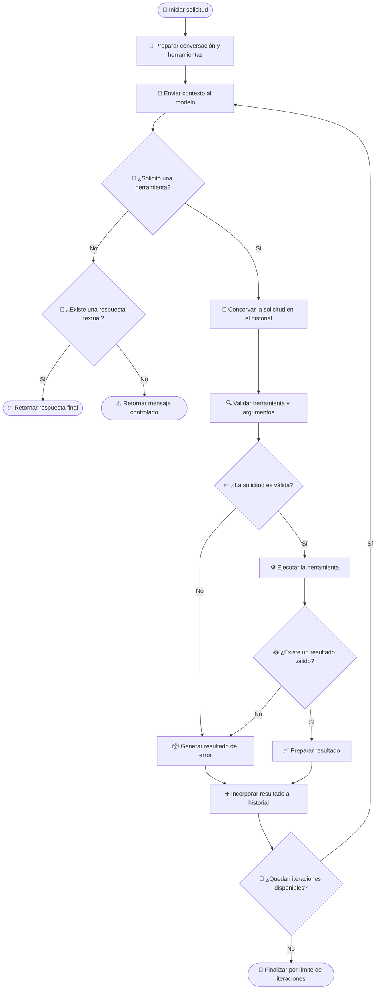
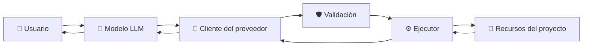

# 🧰 Manejo de Tools en clientes LLM

## 📌 Descripción general

Los clientes LLM del proyecto soportan un flujo de herramientas que permite al modelo solicitar operaciones externas durante una conversación.

El modelo no ejecuta directamente estas operaciones. Su responsabilidad es seleccionar una herramienta y generar los argumentos necesarios. La aplicación valida la solicitud, ejecuta la herramienta y devuelve el resultado al modelo para que continúe procesando la tarea.

Aunque cada proveedor utiliza estructuras diferentes, todos los clientes implementan el mismo flujo funcional:

1. Enviar la conversación y las herramientas disponibles.
2. Detectar solicitudes de herramientas.
3. Validar el nombre y los argumentos.
4. Ejecutar la operación solicitada.
5. Incorporar el resultado al historial.
6. Consultar nuevamente al modelo.
7. Retornar la respuesta final.

---

## 📚 Documentación por cliente

Cada cliente adapta el contrato común de herramientas al formato nativo de su proveedor.

| Cliente   | Documentación                                                     |
| --------- | ----------------------------------------------------------------- |
| Anthropic | [Flujo de Tools en Anthropic](./tools_clients/anthropic-tools.md) |
| Gemini    | [Flujo de Tools en Gemini](./tools_clients/gemini-tools.md)       |
| Groq      | [Flujo de Tools en Groq](./tools_clients/groq-tools.md)           |
| Ollama    | [Flujo de Tools en Ollama](./tools_clients/ollama-tools.md)       |
| OpenAI    | [Flujo de Tools en OpenAI](./tools_clients/openai-tools.md)       |

Los documentos individuales describen:

- La librería utilizada.
- El formato nativo de las herramientas.
- La estructura del historial.
- La validación de argumentos.
- La ejecución de herramientas.
- La incorporación de resultados.
- Las condiciones de finalización.
- Las particularidades de cada proveedor.

---

## 🧩 Contrato común de herramientas

Todos los clientes reciben herramientas mediante el contrato interno `ToolDefinition`.

Conceptualmente, cada definición contiene:

- 🏷️ Un nombre único.
- 📝 Una descripción de la operación.
- 📥 Un esquema de entrada.
- ✅ Los argumentos obligatorios.

```ts
interface ToolDefinition {
  name: string;
  description: string;
  parameters: {
    type: "object";
    properties: Record<string, unknown>;
    required?: string[];
  };
}
```

> [!NOTE]
> La estructura exacta de `ToolDefinition` depende de los tipos definidos en el proyecto. El ejemplo anterior representa únicamente sus responsabilidades conceptuales.

Cada cliente convierte este contrato al formato requerido por el proveedor.

```text
ToolDefinition
      │
      ▼
Adaptador del cliente
      │
      ▼
Formato nativo del proveedor
```

Esta separación permite definir las herramientas una sola vez y reutilizarlas con diferentes modelos.

---

## 🤖 Comparación de proveedores

| Proveedor | SDK                 | Solicitud de herramienta | Argumentos      | Resultado enviado al modelo |
| --------- | ------------------- | ------------------------ | --------------- | --------------------------- |
| OpenAI    | `openai`            | `function_call`          | String con JSON | `function_call_output`      |
| Anthropic | `@anthropic-ai/sdk` | `tool_use`               | Objeto          | `tool_result`               |
| Gemini    | `@google/genai`     | `functionCall`           | Objeto          | `functionResponse`          |
| Groq      | `groq-sdk`          | `tool_calls`             | String con JSON | Mensaje con rol `tool`      |
| Ollama    | `ollama`            | `message.tool_calls`     | Objeto          | Mensaje con rol `tool`      |

Las diferencias se encuentran principalmente en:

- El formato de definición de herramientas.
- La representación de los argumentos.
- El identificador utilizado para relacionar solicitudes y resultados.
- El rol o tipo del mensaje de resultado.
- La estructura que debe conservarse en el historial.

---

## 🔄 Ciclo común de ejecución

El flujo se implementa como un ciclo iterativo o **agentic loop**.

En cada iteración, el modelo puede generar una respuesta final o solicitar una herramienta.



---

## 📝 Manejo del historial

El historial debe mantenerse durante todo el ciclo.

Además de los mensajes convencionales, puede contener:

- Solicitudes de herramientas generadas por el modelo.
- Resultados de herramientas.
- Identificadores de correlación.
- Contenido intermedio del modelo.
- Elementos nativos requeridos por el proveedor.

> [!IMPORTANT]
> El historial no debe reconstruirse desde cero después de ejecutar una herramienta. Debe conservar las estructuras requeridas por el proveedor para relacionar correctamente cada solicitud con su resultado.

El flujo conceptual es el siguiente:

```text
Usuario:
  Solicitud original

Modelo:
  Solicitud de herramienta

Aplicación:
  Resultado de la herramienta

Modelo:
  Nueva solicitud o respuesta final
```

---

## 🔗 Correlación entre solicitudes y resultados

Cada proveedor utiliza un mecanismo diferente para asociar una solicitud con su resultado.

| Proveedor | Identificador de solicitud                  | Correlación del resultado |
| --------- | ------------------------------------------- | ------------------------- |
| OpenAI    | `call_id`                                   | `call_id`                 |
| Anthropic | `id` del bloque `tool_use`                  | `tool_use_id`             |
| Gemini    | `id`, cuando está disponible, y nombre      | `id` y `name`             |
| Groq      | `tool_calls[].id`                           | `tool_call_id`            |
| Ollama    | Nombre de herramienta o identificador local | `tool_name`               |

> [!IMPORTANT]
> Cuando el proveedor incluye un identificador de llamada, el resultado debe conservar exactamente ese valor.

---

## 🔍 Validación de herramientas

Antes de ejecutar una herramienta, todos los clientes deben verificar:

1. Que el nombre esté presente.
2. Que la herramienta exista en `ToolDefinition`.
3. Que los argumentos tengan una estructura válida.
4. Que estén presentes los argumentos obligatorios.
5. Que la misma llamada no haya sido procesada anteriormente.

La aplicación no debe confiar directamente en los argumentos generados por el modelo.

```text
Solicitud del modelo
        │
        ▼
Validar herramienta registrada
        │
        ▼
Validar estructura de argumentos
        │
        ▼
Validar campos obligatorios
        │
        ▼
Detectar llamadas duplicadas
        │
        ▼
Ejecutar operación
```

---

## ♻️ Prevención de llamadas duplicadas

Los clientes mantienen un registro de las herramientas ejecutadas y sus argumentos.

Una firma conceptual puede construirse utilizando:

```json
{
  "name": "nombre_de_la_herramienta",
  "arguments": {
    "parametro": "valor"
  }
}
```

Si una nueva solicitud contiene el mismo nombre y los mismos argumentos, puede rechazarse como duplicada.

Esta protección evita:

- Ciclos repetitivos.
- Ejecuciones innecesarias.
- Consumo excesivo de tokens.
- Operaciones repetidas sobre los mismos recursos.

> [!NOTE]
> El momento en que la firma se registra puede variar entre clientes. Algunos la registran antes de ejecutar la herramienta y otros únicamente después de una ejecución válida.

---

## ⚙️ Ejecución de herramientas

La ejecución real corresponde a la aplicación.

El modelo únicamente indica:

- La herramienta solicitada.
- Los argumentos que desea utilizar.

El ejecutor interno relaciona el nombre de la herramienta con la operación correspondiente.

```text
Modelo
  │
  ▼
Cliente LLM
  │
  ▼
Validador
  │
  ▼
Ejecutor de herramientas
  │
  ▼
Operación del proyecto
```

Dependiendo del cliente y del modelo, las herramientas pueden ejecutarse de forma paralela o secuencial.

| Cliente   | Comportamiento                                                             |
| --------- | -------------------------------------------------------------------------- |
| Anthropic | Puede procesar varias herramientas en paralelo.                            |
| Gemini    | Puede procesar varias herramientas en paralelo.                            |
| OpenAI    | Puede procesar varias herramientas en paralelo.                            |
| Groq      | Se configura para priorizar una herramienta por turno.                     |
| Ollama    | El prompt instruye al modelo para solicitar una herramienta por iteración. |

> [!NOTE]
> En Ollama, la limitación de una herramienta por iteración se define mediante el prompt del sistema debido a las restricciones de recursos del modelo local. No se aplica como una restricción directa en el código.

---

## 📦 Formato de resultados

Los resultados exitosos y los errores se devuelven al modelo como contenido serializado.

Ejemplo de resultado exitoso:

```json
{
  "success": true,
  "data": {
    "files": ["src/index.ts", "src/config/index.ts"]
  }
}
```

Ejemplo de error:

```json
{
  "success": false,
  "error": "missing_required_arguments",
  "message": "Faltan argumentos requeridos.",
  "missing": ["path"]
}
```

El proveedor puede requerir que este contenido se envíe como:

- Un bloque especializado.
- Un elemento de entrada.
- Una respuesta de función.
- Un mensaje con rol `tool`.
- Un mensaje de usuario con resultados de herramientas.

---

## 🛡️ Manejo de errores

Los clientes utilizan códigos comunes para representar errores de validación y ejecución.

| Código                       | Descripción                                                    |
| ---------------------------- | -------------------------------------------------------------- |
| `missing_tool_name`          | La solicitud no incluye el nombre de la herramienta.           |
| `tool_not_found`             | La herramienta solicitada no está registrada.                  |
| `invalid_arguments`          | Los argumentos no tienen una estructura válida.                |
| `missing_required_arguments` | Faltan argumentos obligatorios.                                |
| `duplicated_tool_call`       | La misma operación ya fue ejecutada con los mismos argumentos. |
| `empty_tool_result`          | La herramienta no devolvió contenido.                          |
| `tool_execution_failed`      | Ocurrió una excepción durante la ejecución.                    |

Los errores deben incorporarse al historial como resultados de herramientas.

Esto permite que el modelo pueda:

- Corregir los argumentos.
- Seleccionar otra herramienta.
- Reformular la operación.
- Generar una respuesta alternativa.

Un error individual no debe detener automáticamente todo el ciclo, salvo que impida conservar un historial válido.

---

## 📊 Seguimiento de ejecución

Durante el ciclo se acumula información que se incluye en la respuesta final del cliente.

### Tokens

Cada llamada al modelo puede producir consumo adicional.

Por esta razón, los tokens deben acumularse durante todas las iteraciones:

- Tokens de entrada.
- Tokens de salida.

### Herramientas utilizadas

Los clientes mantienen un conjunto con los nombres de las herramientas ejecutadas.

El uso de una colección sin duplicados permite reportar una herramienta una sola vez, aunque se haya utilizado varias veces.

### Iteraciones

Cada llamada al modelo representa una iteración.

El número máximo debe configurarse para prevenir ejecuciones indefinidas.

---

## 🛑 Condiciones de finalización

El ciclo puede terminar por las siguientes razones:

| Condición                                         | Resultado                                               |
| ------------------------------------------------- | ------------------------------------------------------- |
| El modelo genera texto sin solicitar herramientas | Se retorna la respuesta final.                          |
| El modelo no genera texto ni herramientas         | Se retorna un mensaje controlado.                       |
| La respuesta no contiene la estructura esperada   | Se retorna un error controlado.                         |
| Se alcanza el máximo de iteraciones               | Se detiene el ciclo.                                    |
| El proveedor devuelve una finalización inesperada | Se retorna el contenido disponible o la razón recibida. |

El límite de iteraciones protege al sistema frente a:

- Ciclos prolongados.
- Solicitudes repetitivas.
- Consumo excesivo de tokens.
- Uso innecesario de recursos.
- Comportamientos inesperados del modelo.

---

## 🧱 Responsabilidades por capa

| Capa        | Responsabilidad                                              |
| ----------- | ------------------------------------------------------------ |
| Modelo      | Decide si necesita una herramienta y genera sus argumentos.  |
| Cliente LLM | Traduce entre el formato interno y el formato del proveedor. |
| Validador   | Verifica herramientas, argumentos obligatorios y duplicados. |
| Ejecutor    | Relaciona el nombre de la herramienta con una operación.     |
| Utilitarios | Ejecutan acciones concretas sobre archivos u otros recursos. |
| Aplicación  | Controla límites, permisos, errores y seguridad.             |

---

## 🏗️ Arquitectura general



La lógica de herramientas permanece separada del proveedor del modelo.

Esto permite:

- Cambiar de LLM sin reescribir las operaciones.
- Mantener validaciones comunes.
- Reutilizar `ToolDefinition`.
- Incorporar nuevos proveedores mediante adaptadores.
- Centralizar la seguridad y los límites.
- Probar las herramientas de forma independiente.

---

## ✅ Principio de diseño

```text
Proveedor LLM
      │
      ▼
Adaptador específico
      │
      ▼
Contrato común de herramientas
      │
      ▼
Validación y ejecución compartidas
```

Cada proveedor controla la forma en que solicita herramientas, pero la aplicación mantiene el control sobre:

- Qué herramientas están disponibles.
- Qué argumentos son válidos.
- Qué recursos pueden consultarse.
- Cómo se ejecutan las operaciones.
- Cuántas iteraciones están permitidas.
- Qué resultados se devuelven al modelo.
