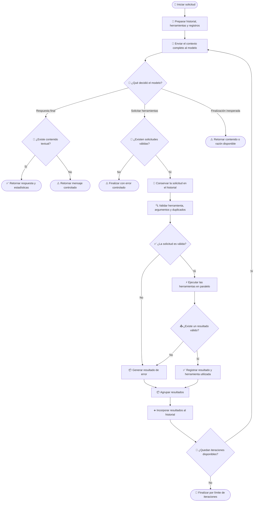

# 🧰 Manejo de herramientas en el cliente Anthropic

## 📌 Descripción general

Este cliente integra la API de Anthropic y adapta su funcionamiento al contrato común definido para los clientes LLM del proyecto.

El cliente soporta un flujo iterativo de herramientas en el que el modelo puede:

1. Analizar una solicitud.
2. Solicitar una o varias herramientas.
3. Recibir sus resultados.
4. Continuar el razonamiento.
5. Generar una respuesta final.

Este comportamiento constituye el patrón base que deberán implementar los demás clientes LLM del proyecto.

---

## 🤖 Librería LLM utilizada

| Propiedad               | Valor                                        |
| ----------------------- | -------------------------------------------- |
| Proveedor               | Anthropic                                    |
| SDK                     | `@anthropic-ai/sdk`                          |
| API utilizada           | Messages API                                 |
| Modelo                  | Configurado mediante `config.anthropicModel` |
| Soporte de herramientas | Sí                                           |
| Ejecución paralela      | Sí                                           |
| Control de iteraciones  | Sí                                           |
| Acumulación de tokens   | Sí                                           |

```ts
import Anthropic from "@anthropic-ai/sdk";
```

El SDK oficial se utiliza para enviar mensajes, registrar herramientas, procesar solicitudes de ejecución y continuar la conversación con los resultados obtenidos.

---

## 🧩 Dependencia de `ToolDefinition`

El manejo de herramientas depende del contrato común `ToolDefinition`.

```ts
ToolDefinition[]
```

Este contrato desacopla la definición interna de las herramientas del formato específico requerido por cada proveedor LLM.

Una definición contiene conceptualmente:

- 🏷️ Un nombre único.
- 📝 Una descripción de su propósito.
- 📥 Un esquema de argumentos.
- ✅ Los argumentos obligatorios.

Antes de enviar la solicitud, el cliente transforma las definiciones internas al formato esperado por Anthropic.

Este diseño permite:

- Definir las herramientas una sola vez.
- Reutilizarlas entre diferentes proveedores.
- Mantener una validación consistente.
- Evitar que la lógica de negocio dependa del SDK de Anthropic.

> [!IMPORTANT]
> Todos los clientes LLM deben recibir `ToolDefinition` como contrato común y adaptar internamente las herramientas al formato nativo de su proveedor.

---

## 🔄 Flujo de manejo de herramientas

El proceso mantiene un historial acumulativo durante toda la conversación.

Este historial contiene:

- El mensaje actual del usuario.
- Los mensajes anteriores.
- Las solicitudes de herramientas generadas por el asistente.
- Los resultados devueltos por las herramientas.

Cada iteración representa una nueva llamada al modelo y el ciclo continúa hasta obtener una respuesta final o alcanzar una condición de salida.

---

### 1. 📝 Preparación del contexto

Al iniciar la operación se construye el historial y se inicializan los valores utilizados durante el ciclo:

- Tokens de entrada acumulados.
- Tokens de salida acumulados.
- Herramientas ejecutadas correctamente.
- Llamadas de herramientas procesadas previamente.

El historial se conserva y amplía después de cada iteración; no se reconstruye desde cero.

> [!IMPORTANT]
> Mantener el historial nativo del proveedor es necesario para preservar la relación entre las solicitudes de herramientas y sus resultados.

---

### 2. 🧠 Consulta al modelo

En cada iteración se envían:

- El prompt del sistema.
- El historial completo.
- Las herramientas disponibles.
- El máximo de tokens configurado para este flujo.

Después de recibir la respuesta, el cliente analiza:

- El contenido textual.
- Las solicitudes de herramientas.
- La razón de finalización.
- El consumo de tokens.

Los tokens utilizados se acumulan en cada llamada, por lo que las estadísticas finales representan el consumo total del ciclo.

---

### 3. ✅ Respuesta final

Cuando el modelo indica que terminó su turno, el contenido textual se considera la respuesta final.

Si la respuesta no contiene texto, el cliente retorna un mensaje controlado indicando que Anthropic no generó contenido textual.

---

### 4. 🧰 Solicitud de herramientas

Cuando el modelo solicita herramientas, el cliente conserva primero el mensaje original del asistente dentro del historial.

Este mensaje debe permanecer antes de los resultados para mantener la relación entre:

- La solicitud del modelo.
- El identificador de la llamada.
- El resultado de la ejecución.

> [!IMPORTANT]
> El mensaje del asistente que contiene las solicitudes debe estar inmediatamente antes del mensaje de usuario que contiene sus resultados.

---

### 5. 🔍 Validación de la solicitud

Antes de ejecutar una herramienta se verifica:

1. Que la herramienta esté registrada en `ToolDefinition`.
2. Que los argumentos sean un objeto JSON válido.
3. Que estén presentes los argumentos obligatorios.
4. Que la misma llamada no haya sido procesada anteriormente.

Para detectar llamadas repetidas se construye una firma con el nombre de la herramienta y sus argumentos:

```json
{
  "name": "nombre_de_la_herramienta",
  "arguments": {
    "parametro": "valor"
  }
}
```

Cuando la firma ya existe, la herramienta no se ejecuta nuevamente.

> [!NOTE]
> La llamada se registra antes de ejecutar la herramienta. Si la ejecución falla, una nueva solicitud con los mismos argumentos también será considerada duplicada.

---

### 6. ⚙️ Ejecución de herramientas

Cuando el modelo solicita varias herramientas en una misma respuesta, estas se ejecutan en paralelo:

```ts
await Promise.all(/* herramientas solicitadas */);
```

Cada ejecución genera un resultado asociado al identificador de la solicitud original.

Una herramienta se registra como utilizada únicamente cuando su ejecución produce una salida válida.

> [!NOTE]
> Las herramientas ejecutadas en una misma iteración deben ser independientes, ya que se procesan en paralelo y no pueden utilizar el resultado de otra herramienta del mismo grupo.

---

### 7. 📦 Incorporación de resultados

Los resultados de todas las herramientas solicitadas en una iteración se agrupan dentro de un único mensaje con rol de usuario.

```ts
{
  type: "tool_result",
  tool_use_id: "identificador_de_la_llamada",
  content: "resultado_de_la_herramienta"
}
```

El campo `tool_use_id` permite que Anthropic relacione cada resultado con su solicitud correspondiente.

El historial queda organizado conceptualmente de la siguiente forma:

```text
Usuario:
  Solicitud original

Asistente:
  Solicitud de una o varias herramientas

Usuario:
  Resultado de la herramienta A
  Resultado de la herramienta B

Asistente:
  Nueva solicitud de herramientas o respuesta final
```

Después de incorporar los resultados, el ciclo vuelve a consultar al modelo.

---

## 🛡️ Manejo de errores

Los errores de validación o ejecución se convierten en resultados estructurados y se devuelven al modelo.

Esto permite que el modelo pueda corregir los argumentos, seleccionar otra herramienta o generar una respuesta alternativa.

| Código                       | Descripción                                                      |
| ---------------------------- | ---------------------------------------------------------------- |
| `tool_not_found`             | La herramienta solicitada no está registrada.                    |
| `invalid_arguments`          | Los argumentos no representan un objeto JSON válido.             |
| `missing_required_arguments` | Faltan argumentos obligatorios definidos en `ToolDefinition`.    |
| `duplicated_tool_call`       | La misma herramienta ya fue procesada con los mismos argumentos. |
| `empty_tool_result`          | La herramienta no devolvió contenido.                            |
| `tool_execution_failed`      | Ocurrió una excepción durante la ejecución.                      |

Un error individual no interrumpe automáticamente todo el proceso. El resultado del error se incorpora al historial para que el modelo decida cómo continuar.

---

## 🛑 Condiciones de finalización

El ciclo termina cuando ocurre alguna de las siguientes condiciones:

| Condición                        | Resultado                                               |
| -------------------------------- | ------------------------------------------------------- |
| Respuesta final                  | Se retorna el contenido generado por el modelo.         |
| Solicitud sin herramientas       | Se retorna un error controlado.                         |
| Razón de finalización inesperada | Se retorna el contenido disponible o la razón recibida. |
| Máximo de iteraciones            | Se detiene el ciclo para evitar consumo indefinido.     |

El límite de iteraciones protege al sistema frente a:

- Ciclos prolongados.
- Uso excesivo de tokens.
- Solicitudes repetitivas.
- Comportamientos inesperados del modelo.

---

## 🗺️ Diagrama del proceso



---

## 🧱 Requisitos para otros clientes LLM

Los clientes que implementen herramientas deben mantener el mismo comportamiento funcional, aunque cada proveedor utilice estructuras diferentes.

Cada cliente debe encargarse de:

1. Convertir `ToolDefinition` al formato nativo del proveedor.
2. Detectar solicitudes de herramientas.
3. Validar herramientas y argumentos.
4. Relacionar solicitudes y resultados mediante identificadores.
5. Evitar llamadas duplicadas.
6. Ejecutar múltiples herramientas cuando sea necesario.
7. Incorporar los resultados al historial.
8. Repetir el ciclo hasta obtener una respuesta final.
9. Limitar el número de iteraciones.
10. Acumular tokens y registrar las herramientas utilizadas.

Los siguientes elementos pueden variar entre proveedores:

- Formato de definición de herramientas.
- Estructura de las solicitudes.
- Estructura de los resultados.
- Roles utilizados en el historial.
- Razones de finalización.
- Información de consumo de tokens.

---

## ✅ Resultado del proceso

```txt
╔═════════════════╗
║ Agentic Loop IA ║
╚═════════════════╝
```

```txt
💬 Escribe tu pregunta y presiona Enter.
Tengo acceso a 4 tools: list_files, find_files, read_file, search_code
Comandos: /clear, /stats, /tools, /exit
```

**Tú:** /tools

```txt
Conversación reiniciada.

Tools disponibles (4):

- list_files(path, extension)
  Lista recursivamente los archivos existentes dentro de un directorio del proyecto.
- find_files(file_name, path, exact_match)
  Busca recursivamente archivos por nombre dentro de un directorio y sus subdirectorios.
- read_file(file_path)
  Lee y devuelve el contenido completo y literal de un archivo del proyecto.
- search_code(pattern, path, file_extension)
  Busca un patrón de texto dentro del contenido de los archivos del proyecto y retorna las líneas coincidentes con dos líneas de contexto antes y después.
```

**Tú:** Que archivos TypeScript contiene el directorio ./src/config

```txt
Asistente:
Pensando... (iteración 1)
Ejecutando tool: list_files ({"path":"./src/config","extension":".ts"})
Herramienta completada: list_files

Pensando... (iteración 2)
Respuesta final generada
```

El directorio `./src/config` contiene **3 archivos TypeScript**:

| Archivo                     | Descripción                                              |
| --------------------------- | -------------------------------------------------------- |
| `env.settings.ts`           | Configuración relacionada con variables de entorno       |
| `file-reviewer.settings.ts` | Configuración para el revisor de archivos                |
| `index.ts`                  | Punto de entrada/exportación del módulo de configuración |

¿Te gustaría ver el contenido de alguno de ellos?

**Tú:** Busca el archivo request.ts y muestrame su contenido

```txt
Asistente:
Pensando... (iteración 1)
Ejecutando tool: find_files ({"file_name":"request.ts","exact_match":true})
Herramienta completada: find_files

Pensando... (iteración 2)
Ejecutando tool: read_file ({"file_path":"./src/types/agent/messages/request.ts"})
Herramienta completada: read_file

Pensando... (iteración 3)
Respuesta final generada
```

Aquí tienes el contenido de `./src/types/agent/messages/request.ts`:

```typescript
import { Message } from "../chat/index.js";
import { ToolDefinition } from "../tools/index.js";

export interface AgentRequest {
  prompt: string;
  systemPrompt?: string;
  messages?: Message[];
  tools?: ToolDefinition[];
}
```

### Descripción

Define la interfaz **`AgentRequest`**, que representa la estructura de una solicitud hacia un agente. Sus propiedades son:

| Propiedad      | Tipo               | Requerido | Descripción                             |
| -------------- | ------------------ | --------- | --------------------------------------- |
| `prompt`       | `string`           | ✅        | El mensaje principal enviado al agente  |
| `systemPrompt` | `string`           | ❌        | Instrucción de sistema opcional         |
| `messages`     | `Message[]`        | ❌        | Historial de mensajes del chat          |
| `tools`        | `ToolDefinition[]` | ❌        | Herramientas disponibles para el agente |

Importa los tipos `Message` y `ToolDefinition` desde los módulos `../chat/index.js` y `../tools/index.js` respectivamente.

**Tú:** Busca los archivos que contienen la palabra getListFiles

```txt
Asistente:
Pensando... (iteración 1)
Ejecutando tool: search_code ({"pattern":"getListFiles"})
Herramienta completada: search_code

Pensando... (iteración 2)
Respuesta final generada
```

Se encontraron **3 coincidencias** en los siguientes archivos:

---

### 1. `./src/tools/actions/file-system.actions.ts` — línea 85

Aquí se **define** el método `getListFiles` como un método estático de la clase `FileSystemToolActions`:

```typescript
static async getListFiles(params: {
  path: string;
  extension?: string;
```

---

### 2. `./src/tools/definitions/tools.definitions.ts` — línea 121

Aquí aparece como **ejemplo** dentro de la descripción de una herramienta:

```typescript
"Ejemplos: 'getListFiles', 'export const MODEL_PROVIDERS', ";
```

---

### 3. `./src/tools/executor/files-tools.executor.ts` — línea 17

Aquí se **invoca** el método `getListFiles` desde el ejecutor de herramientas:

```typescript
return FileSystemToolActions.getListFiles({
  path: p.path,
  extension: typeof p.extension === "string" ? p.extension : undefined,
```

---

¿Quieres ver el contenido completo de alguno de estos archivos?

**Tú:** /stats

```txt
📊 Estadísticas de la conversación:
• Turnos: 3
• Tokens de entrada acumulados: 18466
• Tokens de salida acumulados: 1037
• Tokens estimados en contexto actual: 597
```

**Tú:** /exit

Resumen: 3 turnos, 18466 tokens de entrada, 1037 tokens de salida.

---

[TOOLS](../tools.md) | [SIGUIENTE - GEMINI](./gemini-tools.md)
