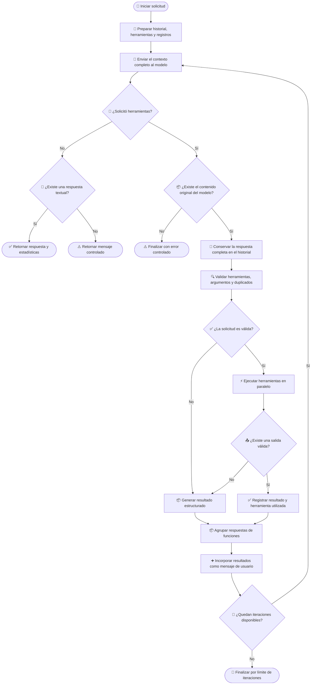

# 🧰 Manejo de herramientas en el cliente Gemini

## 📌 Descripción general

Este cliente integra la API de Gemini y adapta su funcionamiento al contrato común definido para los clientes LLM del proyecto.

El cliente soporta un flujo iterativo de herramientas en el que el modelo puede:

1. Analizar la solicitud del usuario.
2. Solicitar una o varias herramientas.
3. Recibir los resultados de las ejecuciones.
4. Incorporar los resultados al contexto.
5. Continuar el razonamiento hasta generar una respuesta final.

Este flujo sigue el contrato común del proyecto, pero utiliza las estructuras nativas de Gemini para representar las solicitudes y respuestas de funciones.

---

## 🤖 Librería LLM utilizada

| Propiedad               | Valor                                     |
| ----------------------- | ----------------------------------------- |
| Proveedor               | Google                                    |
| SDK                     | `@google/genai`                           |
| API utilizada           | Gemini Generate Content API               |
| Cliente                 | `GoogleGenAI`                             |
| Modelo                  | Configurado mediante `config.geminiModel` |
| Soporte de herramientas | Sí                                        |
| Ejecución paralela      | Sí                                        |
| Control de iteraciones  | Sí                                        |
| Acumulación de tokens   | Sí                                        |

```ts
import { GoogleGenAI, type Content } from "@google/genai";
```

El SDK oficial se utiliza para enviar el historial al modelo, registrar herramientas, detectar solicitudes de funciones y continuar la conversación con sus resultados.

---

## 🧩 Dependencia de `ToolDefinition`

El manejo de herramientas depende del contrato común `ToolDefinition`.

```ts
ToolDefinition[]
```

Este contrato desacopla la definición interna de las herramientas del formato específico requerido por Gemini.

Una definición representa conceptualmente:

- 🏷️ Un nombre único.
- 📝 Una descripción de la operación.
- 📥 Un esquema de argumentos.
- ✅ Los argumentos obligatorios.

Antes de realizar la solicitud, el cliente convierte las definiciones al formato de herramientas esperado por Gemini.

Esta separación permite:

- Definir las herramientas una sola vez.
- Reutilizarlas entre clientes LLM.
- Mantener reglas de validación comunes.
- Evitar dependencias del SDK de Google en la lógica de negocio.

> [!IMPORTANT]
> Todos los clientes LLM deben recibir `ToolDefinition` como contrato común. Cada implementación es responsable de convertirlo al formato nativo de su proveedor.

---

## 🔄 Flujo de manejo de herramientas

El proceso utiliza un historial acumulativo basado en objetos `Content` de Gemini.

Durante las iteraciones, este historial puede contener:

- Mensajes del usuario.
- Respuestas anteriores del modelo.
- Solicitudes de funciones.
- Resultados de funciones.
- Texto generado por el modelo.
- Metadatos internos incluidos en la respuesta original.

Cada iteración representa una nueva llamada al modelo y utiliza el historial completo generado hasta ese momento.

---

### 1. 📝 Preparación del contexto

Al iniciar el proceso se construye el historial con:

- La solicitud actual.
- Los mensajes previos.
- Las instrucciones del sistema.
- Las herramientas disponibles.

También se inicializan los registros que permanecen activos durante todo el ciclo:

- Tokens de entrada acumulados.
- Tokens de salida acumulados.
- Herramientas utilizadas.
- Llamadas procesadas anteriormente.

> [!IMPORTANT]
> El historial debe conservarse en el formato nativo de Gemini. No debe reconstruirse después de cada ejecución de herramientas.

---

### 2. 🧠 Consulta al modelo

En cada iteración se envían:

- El historial completo.
- Las instrucciones del sistema.
- Las herramientas convertidas al formato de Gemini.
- El máximo de tokens configurado para el flujo.

Después de recibir la respuesta, el cliente obtiene:

- El texto generado.
- Las solicitudes de funciones.
- El contenido original del candidato.
- Los metadatos de consumo.

Los tokens de entrada y salida se acumulan en cada llamada para representar el consumo total del proceso.

---

### 3. ✅ Respuesta final

Cuando Gemini no solicita ninguna herramienta, la respuesta se considera definitiva.

Si existe texto, el cliente finaliza el ciclo y retorna el contenido generado junto con las estadísticas acumuladas.

Si no existe texto ni solicitudes de herramientas, se retorna un mensaje controlado indicando que el proveedor no produjo contenido procesable.

---

### 4. 🧰 Solicitud de herramientas

Gemini representa las solicitudes mediante bloques de llamada a funciones.

Una misma respuesta puede incluir una o varias solicitudes.

Antes de ejecutar las herramientas, el cliente conserva el contenido completo generado por el modelo dentro del historial.

Esto es importante porque la respuesta original puede incluir:

- Solicitudes de funciones.
- Texto adicional.
- Firmas de razonamiento.
- Identificadores internos.
- Metadatos necesarios para continuar la conversación.

> [!IMPORTANT]
> Debe conservarse el contenido original del modelo y no solamente reconstruirse la lista de solicitudes de herramientas.

Si Gemini reporta llamadas a funciones pero no incluye el contenido original del candidato, el proceso termina con un error controlado.

---

### 5. 🔍 Validación de solicitudes

Antes de ejecutar una herramienta se valida:

1. Que tenga un nombre registrado en `ToolDefinition`.
2. Que los argumentos representen un objeto JSON válido.
3. Que incluya los argumentos obligatorios.
4. Que la misma llamada no haya sido procesada previamente.

Para detectar solicitudes repetidas se genera una firma utilizando el nombre de la herramienta y sus argumentos:

```json
{
  "name": "nombre_de_la_herramienta",
  "arguments": {
    "parametro": "valor"
  }
}
```

Si la firma ya existe, la operación no se ejecuta nuevamente.

> [!NOTE]
> La firma se registra antes de ejecutar la herramienta. Una nueva solicitud con los mismos argumentos será considerada duplicada aunque la ejecución anterior haya fallado.

---

### 6. ⚙️ Ejecución de herramientas

Cuando Gemini solicita varias herramientas dentro de una misma respuesta, estas se ejecutan en paralelo:

```ts
await Promise.all(/* herramientas solicitadas */);
```

Cada resultado mantiene:

- El identificador de la llamada, cuando está disponible.
- El nombre de la herramienta.
- La salida de la ejecución.

> [!NOTE]
> Las herramientas solicitadas dentro de una misma iteración deben ser independientes, ya que se ejecutan simultáneamente.

Las herramientas ejecutadas se registran en una colección sin duplicados para incluirlas posteriormente en la respuesta del cliente.

---

### 7. 📦 Incorporación de resultados

Gemini recibe los resultados como un nuevo contenido con rol de usuario.

Cada resultado se representa mediante una respuesta de función:

```ts
{
  functionResponse: {
    id: "identificador_opcional",
    name: "nombre_de_la_herramienta",
    response: {
      output: "resultado_de_la_ejecución"
    }
  }
}
```

Todos los resultados generados en una iteración se agrupan en un único contenido:

```ts
{
  role: "user",
  parts: [
    // Respuestas de las funciones ejecutadas
  ]
}
```

El historial queda organizado conceptualmente de esta manera:

```text
Usuario:
  Solicitud original

Modelo:
  Solicitud de una o varias funciones

Usuario:
  Respuesta de la función A
  Respuesta de la función B

Modelo:
  Nueva solicitud de funciones o respuesta final
```

Después de incorporar los resultados, el historial completo vuelve a enviarse al modelo.

---

## 🛡️ Manejo de errores

Los errores de validación o ejecución se serializan como resultados estructurados.

Estos resultados se devuelven a Gemini para que el modelo pueda corregir los argumentos, seleccionar otra herramienta o generar una respuesta alternativa.

| Código                       | Descripción                                                      |
| ---------------------------- | ---------------------------------------------------------------- |
| `tool_not_found`             | La herramienta solicitada no está registrada.                    |
| `invalid_arguments`          | Los argumentos no representan un objeto JSON válido.             |
| `missing_required_arguments` | Faltan argumentos obligatorios definidos en `ToolDefinition`.    |
| `duplicated_tool_call`       | La misma herramienta ya fue procesada con los mismos argumentos. |
| `empty_tool_result`          | La herramienta no devolvió contenido.                            |
| `tool_execution_failed`      | Ocurrió una excepción durante la ejecución.                      |

Ejemplo conceptual de un resultado de error:

```json
{
  "success": false,
  "error": "missing_required_arguments",
  "message": "Faltan argumentos requeridos para la herramienta.",
  "missing": ["path"]
}
```

Un error individual no interrumpe automáticamente el ciclo. Gemini recibe el resultado y decide cómo continuar.

> [!NOTE]
> Cuando una herramienta retorna contenido vacío, el cliente reemplaza su salida por un resultado estructurado con el código `empty_tool_result`.

---

## 🛑 Condiciones de finalización

| Condición                                  | Resultado                                              |
| ------------------------------------------ | ------------------------------------------------------ |
| No existen solicitudes y hay texto         | Se retorna la respuesta final del modelo.              |
| No existen solicitudes ni texto            | Se retorna un mensaje controlado.                      |
| No existe contenido original del candidato | Se detiene el proceso con un error controlado.         |
| Se alcanza el máximo de iteraciones        | Se finaliza el ciclo para evitar ejecución indefinida. |

El límite de iteraciones protege al sistema frente a:

- Ciclos prolongados.
- Solicitudes repetitivas.
- Consumo excesivo de tokens.
- Comportamientos inesperados del modelo.

---

## 🗺️ Diagrama del proceso



---

## 🧱 Requisitos para otros clientes LLM

Los demás clientes deben mantener el mismo comportamiento funcional, aunque cada proveedor utilice estructuras diferentes.

Cada cliente debe:

1. Convertir `ToolDefinition` al formato nativo del proveedor.
2. Mantener el historial acumulativo.
3. Detectar solicitudes de herramientas.
4. Conservar la respuesta original del modelo cuando sea necesario.
5. Validar herramientas y argumentos.
6. Evitar llamadas duplicadas.
7. Ejecutar múltiples herramientas cuando sean solicitadas.
8. Relacionar cada resultado con su solicitud.
9. Incorporar los resultados al historial.
10. Repetir el ciclo hasta obtener una respuesta final.
11. Controlar el máximo de iteraciones.
12. Acumular tokens y registrar las herramientas utilizadas.

Los siguientes elementos dependen de cada proveedor:

- Formato de definición de herramientas.
- Estructura de las solicitudes.
- Estructura de los resultados.
- Roles del historial.
- Identificadores de llamadas.
- Metadatos internos del modelo.
- Información de consumo de tokens.

---

## ✅ Resultado del proceso

```txt
╔═════════════════╗
║ Agentic Loop IA ║
╚═════════════════╝
```

```txt
💬 Escribe tu pregunta y presiona Enter.
Tengo acceso a 4 tools: list_files, find_files, read_file, search_code
Comandos: /clear, /stats, /tools, /exit
```

**Tú:** /tools

```txt
Conversación reiniciada.

Tools disponibles (4):

- list_files(path, extension)
  Lista recursivamente los archivos existentes dentro de un directorio del proyecto.
- find_files(file_name, path, exact_match)
  Busca recursivamente archivos por nombre dentro de un directorio y sus subdirectorios.
- read_file(file_path)
  Lee y devuelve el contenido completo y literal de un archivo del proyecto.
- search_code(pattern, path, file_extension)
  Busca un patrón de texto dentro del contenido de los archivos del proyecto y retorna las líneas coincidentes con dos líneas de contexto antes y después.
```

**Tú:** Que archivos TypeScript contiene el directorio ./src/config?

```txt
Asistente:
Pensando... (iteración 1)
Ejecutando tool: list_files ({"path":"./src/config","extension":".ts"})
Herramienta completada: list_files

Pensando... (iteración 2)
Respuesta final generada
```

El directorio `./src/config` contiene los siguientes archivos TypeScript:

- `./src/config/env.settings.ts`
- `./src/config/file-reviewer.settings.ts`
- `./src/config/index.ts`

**Tú:** Busca el archivo request.ts y muestrame su contenido

```txt
Asistente:
Pensando... (iteración 1)
Ejecutando tool: find_files ({"file_name":"request.ts","exact_match":true})
Herramienta completada: find_files

Pensando... (iteración 2)
Ejecutando tool: read_file ({"file_path":"./src/types/agent/messages/request.ts"})
Herramienta completada: read_file

Pensando... (iteración 3)
Respuesta final generada
```

El contenido del archivo `./src/types/agent/messages/request.ts` es:

```typescript
import { Message } from "../chat/index.js";
import { ToolDefinition } from "../tools/index.js";

export interface AgentRequest {
  prompt: string;
  systemPrompt?: string;
  messages?: Message[];
  tools?: ToolDefinition[];
}
```

**Tú:** Busca los archivos que contienen la palabra getListFiles

```txt
Asistente:
Pensando... (iteración 1)
Ejecutando tool: search_code ({"pattern":"getListFiles"})
Herramienta completada: search_code

Pensando... (iteración 2)
Respuesta final generada
```

Se encontraron coincidencias de la palabra `getListFiles` en los siguientes archivos:

- **`./src/tools/actions/file-system.actions.ts`**:

  ```typescript
     * @returns Resultado serializado con los archivos encontrados o el error producido.
     */
    static async getListFiles(params: {
      path: string;
      extension?: string;
  ```

  Aquí, `getListFiles` parece ser un método estático dentro de la clase `FileSystemToolActions` que toma un objeto `params` con propiedades `path` y `extension`. Probablemente se encarga de listar archivos.

- **`./src/tools/definitions/tools.definitions.ts`**:

  ```typescript
              "Texto literal que debe existir dentro del contenido de los archivos. " +
              "La búsqueda es por substring y sensible a mayúsculas. " +
              "Ejemplos: 'getListFiles', 'export const MODEL_PROVIDERS', " +
              "'import OpenAI', 'class GroqClient'. " +
              "No debe contener únicamente el nombre de un archivo.",
  ```

  En este archivo, `getListFiles` se menciona como un ejemplo en un comentario o cadena de texto que describe un patrón de búsqueda, lo que sugiere que es un término relevante para la funcionalidad de búsqueda de código.

- **`./src/tools/executor/files-tools.executor.ts`**:
  ```typescript
            });
          }
          return FileSystemToolActions.getListFiles({
            path: p.path,
            extension: typeof p.extension === "string" ? p.extension : undefined,
  ```
  En este archivo, se hace una llamada al método `FileSystemToolActions.getListFiles`, pasándole un objeto con `path` y `extension`. Esto confirma que `getListFiles` es una función utilizada para obtener listas de archivos, y este archivo es donde se ejecuta dicha acción.

**Tú:** /stats

```txt
📊 Estadísticas de la conversación:
• Turnos: 3
• Tokens de entrada acumulados: 11123
• Tokens de salida acumulados: 655
• Tokens estimados en contexto actual: 616
```

**Tú:** /exit

Resumen: 3 turnos, 11123 tokens de entrada, 655 tokens de salida.

---

[TOOLS](../tools.md) | [REGRESAR - ANTHROPIC](./anthropic-tools.md) | [SIGUIENTE - GROQ](./groq-tools.md)
