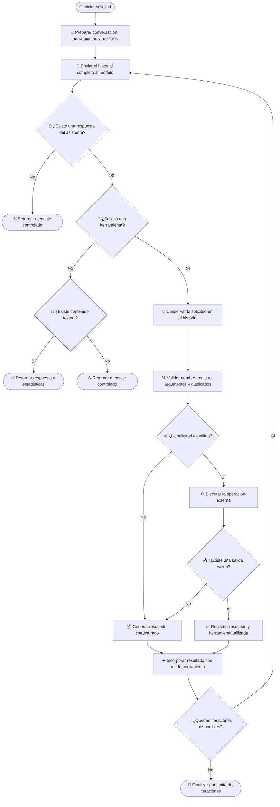

# 🧰 Manejo de herramientas en el cliente Groq

## 📌 Descripción general

Este cliente integra la API de Groq y adapta su funcionamiento al contrato común definido para los clientes LLM del proyecto.

El cliente implementa un ciclo iterativo en el que el modelo puede:

1. Analizar la solicitud del usuario.
2. Decidir si necesita utilizar una herramienta.
3. Solicitar su ejecución.
4. Recibir el resultado.
5. Continuar la conversación hasta generar una respuesta final.

Groq utiliza una estructura compatible con **Chat Completions**, por lo que las herramientas se representan mediante llamadas a funciones y sus resultados se incorporan al historial como mensajes con rol `tool`.

---

## 🤖 Librería LLM utilizada

| Propiedad                 | Valor                                   |
| ------------------------- | --------------------------------------- |
| Proveedor                 | Groq                                    |
| SDK                       | `groq-sdk`                              |
| API utilizada             | Chat Completions                        |
| Cliente                   | `Groq`                                  |
| Modelo                    | Configurado mediante `config.groqModel` |
| Selección de herramientas | Automática                              |
| Ejecución paralela        | Deshabilitada en la solicitud           |
| Control de iteraciones    | Sí                                      |
| Acumulación de tokens     | Sí                                      |

```ts
import Groq from "groq-sdk";
import type { ChatCompletionMessageParam } from "groq-sdk/resources/chat/completions";
```

El SDK se utiliza para enviar el historial al modelo, registrar herramientas, detectar llamadas a funciones y continuar la conversación con sus resultados.

La selección de herramientas se configura como automática:

```ts
tool_choice: "auto";
```

Esto permite que el modelo decida si necesita ejecutar una herramienta o responder directamente.

---

## 🧩 Dependencia de `ToolDefinition`

El manejo de herramientas depende del contrato común `ToolDefinition`.

```ts
ToolDefinition[]
```

Este contrato desacopla las definiciones internas del formato utilizado por Groq.

Una herramienta representa conceptualmente:

- 🏷️ Un nombre único.
- 📝 Una descripción de su propósito.
- 📥 Un esquema de argumentos.
- ✅ Los argumentos obligatorios.

Antes de realizar la solicitud, el cliente convierte las definiciones al formato de herramientas compatible con Chat Completions.

Esta separación permite:

- Definir las herramientas una sola vez.
- Compartirlas entre diferentes clientes LLM.
- Aplicar las mismas reglas de validación.
- Evitar dependencias directas del SDK de Groq en la lógica de negocio.

> [!IMPORTANT]
> Todos los clientes LLM deben recibir `ToolDefinition` como contrato común y convertirlo internamente al formato requerido por su proveedor.

---

## 🔄 Flujo de manejo de herramientas

El cliente mantiene un historial acumulativo durante todo el ciclo.

Este historial puede contener:

- Instrucciones del sistema.
- Mensajes del usuario.
- Respuestas anteriores del asistente.
- Solicitudes de herramientas.
- Resultados de herramientas.

Cada iteración representa una nueva llamada al modelo utilizando la conversación completa generada hasta ese momento.

---

### 1. 📝 Preparación del contexto

La conversación se construye una sola vez utilizando:

- La solicitud actual.
- Las instrucciones del sistema.
- Los mensajes anteriores.

También se inicializan los registros utilizados durante el proceso:

- Tokens de entrada acumulados.
- Tokens de salida acumulados.
- Herramientas ejecutadas.
- Llamadas procesadas previamente.

El historial se modifica después de cada iteración y no se reconstruye desde cero.

> [!IMPORTANT]
> Las solicitudes y los resultados deben conservarse dentro del historial para que el modelo pueda relacionarlos correctamente en la siguiente llamada.

---

### 2. 🧠 Consulta al modelo

En cada iteración se envían:

- El historial completo.
- Las herramientas convertidas al formato de Groq.
- El modelo configurado.
- El máximo de tokens permitido.

El cliente configura el modelo para que decida automáticamente si necesita una herramienta.

También deshabilita las llamadas paralelas:

```ts
parallel_tool_calls: false;
```

Esta configuración favorece la ejecución de una herramienta por turno y hace que el ciclo sea más predecible para modelos que pueden generar solicitudes redundantes.

> [!NOTE]
> Aunque la solicitud deshabilita explícitamente las llamadas paralelas, el cliente procesa mediante una colección todas las llamadas que eventualmente puedan aparecer en la respuesta.

Después de recibir la respuesta se analizan:

- El mensaje generado por el asistente.
- El contenido textual.
- Las solicitudes de herramientas.
- El consumo de tokens.

---

### 3. ✅ Respuesta final

Cuando el mensaje del asistente no contiene solicitudes de herramientas, su contenido se considera la respuesta final.

Si el contenido contiene texto, el cliente finaliza el ciclo y retorna la respuesta junto con las estadísticas acumuladas.

Si Groq no devuelve texto ni llamadas a herramientas, se retorna un mensaje controlado.

También se detiene el proceso si la respuesta no contiene un mensaje del asistente.

---

### 4. 🧰 Solicitud de herramientas

Groq representa las solicitudes mediante llamadas a funciones dentro del mensaje del asistente.

El cliente filtra únicamente las solicitudes cuyo tipo corresponde a una función.

Antes de ejecutar las herramientas, el mensaje completo del asistente se agrega al historial.

Este paso conserva:

- El identificador de la llamada.
- El nombre de la función.
- Los argumentos generados.
- La relación con el resultado posterior.

> [!IMPORTANT]
> El mensaje del asistente con las solicitudes debe agregarse antes de incorporar cualquier resultado con rol `tool`.

---

### 5. 🔍 Validación de solicitudes

Antes de ejecutar una herramienta se valida:

1. Que la solicitud incluya un nombre.
2. Que la herramienta esté registrada en `ToolDefinition`.
3. Que los argumentos puedan convertirse desde una cadena JSON.
4. Que estén presentes los argumentos obligatorios.
5. Que la misma llamada no se haya procesado anteriormente.

A diferencia de otros proveedores, Groq entrega los argumentos de la función como texto:

```ts
toolCall.function.arguments;
```

Por esta razón, el cliente debe interpretar la cadena y comprobar que represente un objeto JSON válido.

Para detectar solicitudes repetidas se genera una firma con el nombre y los argumentos procesados:

```json
{
  "name": "nombre_de_la_herramienta",
  "arguments": {
    "parametro": "valor"
  }
}
```

Cuando la firma ya existe, la herramienta no se ejecuta nuevamente.

> [!NOTE]
> La firma se registra antes de ejecutar la herramienta. Si la operación falla, otra solicitud con el mismo nombre y argumentos será considerada duplicada.

---

### 6. ⚙️ Ejecución de herramientas

Después de superar las validaciones, el cliente ejecuta la operación correspondiente.

Cada resultado mantiene:

- El identificador generado por Groq.
- El nombre de la herramienta.
- La salida de la ejecución.

La herramienta se incorpora al registro de herramientas utilizadas cuando comienza una ejecución válida.

Si la operación no devuelve contenido, su salida se reemplaza por un error estructurado.

Si se produce una excepción, esta también se transforma en un resultado que puede ser interpretado por el modelo.

---

### 7. 📦 Incorporación de resultados

Cada resultado se agrega individualmente al historial mediante un mensaje con rol `tool`.

```ts
{
  role: "tool",
  tool_call_id: "identificador_de_la_llamada",
  content: "resultado_de_la_herramienta"
}
```

El campo `tool_call_id` debe coincidir exactamente con el identificador generado en la solicitud original.

El historial queda organizado conceptualmente de la siguiente forma:

```text
Sistema:
  Instrucciones generales

Usuario:
  Solicitud original

Asistente:
  Solicitud de una herramienta

Herramienta:
  Resultado relacionado mediante el identificador

Asistente:
  Nueva solicitud o respuesta final
```

Cuando existen varios resultados, cada uno se incorpora como un mensaje independiente.

Después de agregarlos, el historial completo vuelve a enviarse al modelo.

---

## 🛡️ Manejo de errores

Los errores de validación y ejecución se serializan como resultados estructurados y se incorporan al historial.

Esto permite que el modelo pueda corregir los argumentos, utilizar otra herramienta o generar una respuesta alternativa.

| Código                       | Descripción                                                   |
| ---------------------------- | ------------------------------------------------------------- |
| `missing_tool_name`          | La solicitud no incluye el nombre de la herramienta.          |
| `tool_not_found`             | La herramienta solicitada no está registrada.                 |
| `invalid_arguments`          | Los argumentos no contienen un objeto JSON válido.            |
| `missing_required_arguments` | Faltan argumentos obligatorios definidos en `ToolDefinition`. |
| `duplicated_tool_call`       | La herramienta ya fue procesada con los mismos argumentos.    |
| `empty_tool_result`          | La herramienta no devolvió contenido.                         |
| `tool_execution_failed`      | Ocurrió una excepción durante la ejecución.                   |

Ejemplo conceptual:

```json
{
  "success": false,
  "error": "invalid_arguments",
  "message": "Los argumentos de la herramienta no contienen un objeto JSON válido."
}
```

Un error individual no detiene automáticamente el ciclo. Su resultado se devuelve al modelo para que decida cómo continuar.

---

## 🛑 Condiciones de finalización

| Condición                           | Resultado                                             |
| ----------------------------------- | ----------------------------------------------------- |
| No existe un mensaje del asistente  | Se retorna un mensaje controlado.                     |
| No existen solicitudes y hay texto  | Se retorna la respuesta final.                        |
| No existen solicitudes ni texto     | Se retorna un mensaje controlado.                     |
| Se alcanza el máximo de iteraciones | Se detiene el ciclo para evitar ejecución indefinida. |

El límite de iteraciones protege al sistema frente a:

- Ciclos prolongados.
- Solicitudes repetitivas.
- Consumo excesivo de tokens.
- Comportamientos inesperados del modelo.

---

## 🗺️ Diagrama del proceso



---

## 🧱 Requisitos para otros clientes LLM

Los demás clientes deben mantener el mismo comportamiento funcional aunque cada proveedor utilice estructuras diferentes.

Cada cliente debe:

1. Convertir `ToolDefinition` al formato nativo del proveedor.
2. Mantener el historial acumulativo.
3. Detectar solicitudes de herramientas.
4. Conservar el mensaje original que contiene las solicitudes.
5. Validar nombres y argumentos.
6. Evitar llamadas duplicadas.
7. Ejecutar las herramientas solicitadas.
8. Relacionar cada resultado con su identificador.
9. Incorporar los resultados al historial.
10. Repetir el ciclo hasta obtener una respuesta final.
11. Controlar el máximo de iteraciones.
12. Acumular tokens y registrar las herramientas utilizadas.

Los siguientes elementos pueden variar entre proveedores:

- Formato de definición de herramientas.
- Representación de los argumentos.
- Estructura de las solicitudes.
- Estructura de los resultados.
- Roles utilizados en el historial.
- Soporte para llamadas paralelas.
- Información de consumo de tokens.

---

## ✅ Resultado del proceso

```txt
╔════════════════════════╗
║    Agentic Loop IA     ║
╚════════════════════════╝

💬 Escribe tu pregunta y presiona Enter.
   Tengo acceso a 4 tools: list_files, find_file, read_file, search_file_content
   Comandos: /clear, /stats, /tools, /exit
```

Tú: /tools
Conversación reiniciada.

```txt
Tools disponibles (4):
   * list_files(path, extension)
     Lista recursivamente los archivos visibles contenidos en un directorio y sus subdirectorios.
   * find_file(file_name, path)
     Busca recursivamente un archivo visible por su nombre completo y exacto.
   * read_file(file_path)
     Lee y devuelve el contenido completo y literal de un archivo visible del proyecto.
   * search_file_content(pattern, path)
     Busca un texto literal dentro del contenido de los archivos visibles de un directorio y sus subdirectorios.
```

Tú: Que archivos TypeScript contiene el directorio ./src/config?

```txt
Asistente:
Pensando... (iteración 1)
Ejecutando tool: list_files ({"extension":".ts","path":"./src/config"})
Herramienta completada: list_files

Pensando... (iteración 2)
Respuesta final generada

Los archivos TypeScript que se encuentran en `./src/config` son:

- `./src/config/env.settings.ts`
- `./src/config/file-reviewer.settings.ts`
- `./src/config/index.ts`

```

Tú: Busca el archivo request.ts y muestrame su contenido

```txt
Asistente:
Pensando... (iteración 1)
Ejecutando tool: find_file ({"file_name":"request.ts"})
Herramienta completada: find_file

Pensando... (iteración 2)
Ejecutando tool: read_file ({"file_path":"./src/types/agent/messages/request.ts"})
Herramienta completada: read_file

Pensando... (iteración 3)
Respuesta final generada
```

El archivo **`request.ts`** se encuentra en la ruta `./src/types/agent/messages/request.ts` y su contenido es:

```ts
import { Message } from "../chat/index.js";
import { ToolDefinition } from "../tools/index.js";

export interface AgentRequest {
  prompt: string;
  systemPrompt?: string;
  messages?: Message[];
  tools?: ToolDefinition[];
}
```

Tú: Busca los archivos que contienen la palabra getListFiles

```txt
Asistente:
Pensando... (iteración 1)
Ejecutando tool: search_file_content ({"path":"./","pattern":"getListFiles"})
Herramienta completada: search_file_content

Pensando... (iteración 2)
Respuesta final generada
```

Los archivos que contienen la palabra **`getListFiles`** son:

| Ruta del archivo                               | Línea donde aparece | Context breve                                                                |
| ---------------------------------------------- | ------------------- | ---------------------------------------------------------------------------- |
| `./src/tools/actions/file-system.actions.ts`   | Línea **87**        | `static async getListFiles(params: {`                                        |
| `./src/tools/executor/files-tools.executor.ts` | Línea **30**        | `return FileSystemToolActions.getListFiles({`                                |
| `./src/llm/prompts/system.prompt.ts`           | Línea **214**       | `* "Busca los archivos que contienen getListFiles" → "search_file_content".` |
| `./src/tools/definitions/tools.definitions.ts` | Línea **111**       | `* "Ejemplos: 'getListFiles', 'class UserService', 'import OpenAI'."`        |

> **Nota**: Los dos primeros archivos (`file-system.actions.ts` y `files-tools.executor.ts`) incluyen la definición o llamada a la función `getListFiles`. Los últimos dos archivos son parte del propio script de búsqueda y documentación del proyecto y simplemente hacen referencia al término.

Tú: /stats

```txt
📊 Estadísticas de la conversación:
   • Turnos: 3
   • Tokens de entrada acumulados: 12843
   • Tokens de salida acumulados: 701
   • Tokens estimados en contexto actual: 412
```

Tú: /exit

Resumen: 3 turnos, 12843 tokens de entrada, 701 tokens de salida.

---

[TOOLS](../tools.md) | [REGRESAR - GEMINI](./gemini-tools.md) | [SIGUIENTE - OLLAMA](./ollama-tools.md)
