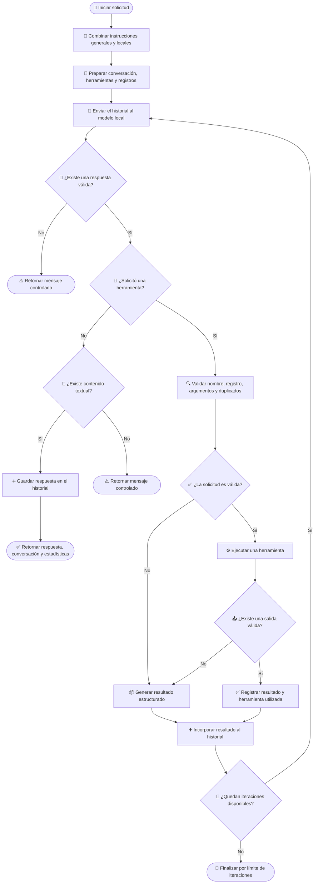

# 🧰 Manejo de herramientas en el cliente Ollama

## 📌 Descripción general

Este cliente integra modelos ejecutados localmente mediante Ollama y adapta su funcionamiento al contrato común definido para los clientes LLM del proyecto.

El cliente implementa un ciclo iterativo en el que el modelo puede:

1. Analizar la solicitud del usuario.
2. Decidir si necesita utilizar una herramienta.
3. Solicitar la ejecución de una operación.
4. Recibir su resultado.
5. Continuar el razonamiento hasta generar una respuesta final.

A diferencia de los proveedores ejecutados en infraestructura externa, Ollama utiliza recursos locales. Por esta razón, el comportamiento esperado del modelo se ajusta mediante instrucciones adicionales incluidas en el prompt del sistema.

---

## 🤖 Librería LLM utilizada

| Propiedad                  | Valor                                     |
| -------------------------- | ----------------------------------------- |
| Proveedor                  | Ollama                                    |
| SDK                        | `ollama`                                  |
| API utilizada              | Chat API                                  |
| Ejecución                  | Local                                     |
| Modelo                     | Configurado mediante `config.ollamaModel` |
| Soporte de herramientas    | Sí                                        |
| Herramientas por iteración | Una, definida mediante el prompt          |
| Control de iteraciones     | Sí                                        |
| Acumulación de tokens      | Sí                                        |
| Ventana de contexto        | `4096` tokens                             |
| Temperatura                | `0`                                       |

```ts
import ollama, { Message as OllamaMessage } from "ollama";
```

El cliente utiliza la API de chat de Ollama para:

- Enviar el historial al modelo local.
- Registrar las herramientas disponibles.
- Detectar solicitudes de herramientas.
- Incorporar los resultados al contexto.
- Continuar la conversación hasta obtener una respuesta final.

La configuración mantiene el modelo cargado durante diez minutos:

```ts
keep_alive: "10m";
```

Esto evita recargar el modelo en cada iteración y reduce el costo de inicialización durante conversaciones consecutivas.

---

## 🖥️ Consideraciones del modelo local

Ollama ejecuta el modelo utilizando los recursos disponibles en la máquina donde se encuentra desplegado.

Para reducir el consumo de memoria, procesamiento y contexto, el cliente incorpora instrucciones adicionales mediante un prompt específico:

```ts
ollamaSystemPrompt;
```

Estas instrucciones se agregan al prompt del sistema recibido por el cliente.

```text
Prompt del proyecto
+
Instrucciones específicas para Ollama
```

Una de estas instrucciones establece que el modelo debe solicitar **una sola herramienta por iteración**.

> [!IMPORTANT]
> La restricción de una herramienta por turno forma parte del contrato definido en el prompt y no de una validación aplicada directamente por el código.

Este comportamiento permite:

- Reducir la carga de procesamiento local.
- Mantener un ciclo más predecible.
- Evitar múltiples operaciones simultáneas.
- Disminuir el tamaño del contexto generado en cada iteración.
- Facilitar el seguimiento de errores y resultados.

> [!NOTE]
> La implementación puede procesar una colección de solicitudes si el modelo devuelve más de una. Sin embargo, el comportamiento esperado es que el modelo respete el prompt y genere únicamente una solicitud por iteración.

---

## 🧩 Dependencia de `ToolDefinition`

El manejo de herramientas depende del contrato común `ToolDefinition`.

```ts
ToolDefinition[]
```

Este contrato desacopla las definiciones internas del formato requerido por Ollama.

Una herramienta representa conceptualmente:

- 🏷️ Un nombre único.
- 📝 Una descripción de su propósito.
- 📥 Un esquema de argumentos.
- ✅ Los argumentos obligatorios.

Antes de enviar la solicitud, el cliente transforma las definiciones al formato de herramientas aceptado por Ollama.

Esta separación permite:

- Definir las herramientas una sola vez.
- Compartirlas entre diferentes clientes LLM.
- Mantener reglas de validación comunes.
- Evitar dependencias directas de Ollama en la lógica de negocio.

> [!IMPORTANT]
> Todos los clientes LLM deben recibir `ToolDefinition` como contrato común y convertirlo internamente al formato requerido por su proveedor.

---

## 🔄 Flujo de manejo de herramientas

El cliente mantiene un historial acumulativo basado en mensajes nativos de Ollama.

Durante el ciclo, la conversación puede contener:

- Instrucciones del sistema.
- Mensajes del usuario.
- Respuestas anteriores del asistente.
- Solicitudes de herramientas.
- Resultados de herramientas.

Cada iteración representa una nueva llamada al modelo utilizando la conversación completa acumulada.

---

### 1. 📝 Preparación del contexto

El cliente combina el prompt del sistema recibido con las instrucciones específicas de Ollama.

Posteriormente construye la conversación utilizando:

- La solicitud actual.
- El prompt del sistema combinado.
- Los mensajes anteriores.

También se inicializan los registros utilizados durante el ciclo:

- Tokens de entrada acumulados.
- Tokens de salida acumulados.
- Herramientas ejecutadas.
- Llamadas procesadas previamente.

El historial se construye una sola vez y se modifica después de cada iteración.

> [!IMPORTANT]
> El historial debe conservar los mensajes de herramientas para que el modelo pueda interpretar sus resultados en las siguientes consultas.

---

### 2. 🧠 Consulta al modelo

En cada iteración se envían:

- El historial completo.
- Las herramientas convertidas al formato de Ollama.
- El modelo local configurado.
- El máximo de tokens permitido.
- Las opciones de ejecución local.

```ts
{
  temperature: 0,
  num_predict: maxTokens,
  num_ctx: 4096
}
```

La temperatura en `0` busca generar respuestas más deterministas y reducir variaciones en la selección de herramientas.

El razonamiento extendido del modelo se encuentra deshabilitado:

```ts
think: false;
```

Después de recibir la respuesta, el cliente obtiene:

- El mensaje generado.
- El contenido textual.
- Las solicitudes de herramientas.
- Los tokens evaluados para la entrada.
- Los tokens generados para la salida.

---

### 3. ✅ Respuesta final

Cuando el mensaje no contiene solicitudes de herramientas, el contenido textual se considera la respuesta final.

Antes de finalizar, el mensaje del asistente se agrega al historial.

El cliente retorna:

- El texto generado.
- Los tokens de entrada acumulados.
- Los tokens de salida acumulados.
- Las herramientas utilizadas.
- La conversación convertida al contrato común del proyecto.

Si Ollama no genera texto ni solicitudes de herramientas, se retorna un mensaje controlado.

También se detiene el proceso cuando no existe un mensaje válido en la respuesta.

---

### 4. 🧰 Solicitud de herramienta

Cuando el modelo solicita una herramienta, el cliente obtiene:

- El nombre de la operación.
- Los argumentos generados.
- La posición de la llamada dentro de la iteración.

Ollama no proporciona en este flujo un identificador equivalente al utilizado por otros proveedores. Por esta razón, el cliente genera un identificador local utilizando:

```text
iteración + posición + nombre de herramienta
```

Ejemplo conceptual:

```text
2-0-read_file
```

Este identificador permite seguir internamente la llamada durante su validación y ejecución.

> [!NOTE]
> Aunque el código contempla varias solicitudes, el prompt específico del cliente instruye al modelo para solicitar una sola herramienta por iteración.

---

### 5. 🔍 Validación de la solicitud

Antes de ejecutar la herramienta se verifica:

1. Que la solicitud incluya un nombre.
2. Que la herramienta esté registrada en `ToolDefinition`.
3. Que los argumentos representen un objeto válido.
4. Que estén presentes los argumentos obligatorios.
5. Que la misma operación no haya sido ejecutada anteriormente.

Para detectar llamadas repetidas se genera una firma con el nombre y los argumentos:

```json
{
  "name": "nombre_de_la_herramienta",
  "arguments": {
    "parametro": "valor"
  }
}
```

Cuando la firma ya existe, la operación no se ejecuta nuevamente.

En este cliente, la firma se registra después de ejecutar correctamente la herramienta.

> [!NOTE]
> Si la ejecución falla mediante una excepción, una nueva solicitud con los mismos argumentos puede volver a intentarse porque la firma todavía no fue registrada.

---

### 6. ⚙️ Ejecución de la herramienta

Después de superar las validaciones, el cliente ejecuta la operación correspondiente.

Cada resultado mantiene:

- El nombre de la herramienta.
- La salida de la ejecución.
- Un identificador local cuando se encuentra disponible.

Cuando la ejecución finaliza correctamente:

- La firma se registra como procesada.
- La herramienta se agrega al conjunto de herramientas utilizadas.
- El resultado se prepara para incorporarse al historial.

Si la herramienta no devuelve contenido, se genera un resultado de error estructurado.

Si ocurre una excepción, esta se convierte en una salida interpretable por el modelo.

---

### 7. 📦 Incorporación del resultado

Cada resultado se agrega al historial mediante un mensaje con rol `tool`.

```ts
{
  role: "tool",
  content: "resultado_de_la_herramienta",
  tool_name: "nombre_de_la_herramienta"
}
```

A diferencia de otros proveedores, la asociación se realiza mediante el nombre de la herramienta y no mediante un identificador de llamada enviado al modelo.

El historial queda organizado conceptualmente de la siguiente manera:

```text
Sistema:
  Instrucciones generales
  Instrucciones específicas para el modelo local

Usuario:
  Solicitud original

Asistente:
  Solicitud de una herramienta

Herramienta:
  Resultado de la operación

Asistente:
  Nueva solicitud o respuesta final
```

Después de incorporar el resultado, la conversación completa vuelve a enviarse al modelo.

---

## 🛡️ Manejo de errores

Los errores de validación y ejecución se serializan como resultados estructurados.

Esto permite que el modelo pueda corregir los argumentos, seleccionar otra herramienta o generar una respuesta alternativa.

| Código                       | Descripción                                                   |
| ---------------------------- | ------------------------------------------------------------- |
| `missing_tool_name`          | La solicitud no incluye el nombre de la herramienta.          |
| `tool_not_found`             | La herramienta solicitada no está registrada.                 |
| `invalid_arguments`          | Los argumentos no representan un objeto válido.               |
| `missing_required_arguments` | Faltan argumentos obligatorios definidos en `ToolDefinition`. |
| `duplicated_tool_call`       | La herramienta ya fue ejecutada con los mismos argumentos.    |
| `empty_tool_result`          | La herramienta no devolvió contenido.                         |
| `tool_execution_failed`      | Ocurrió una excepción durante la ejecución.                   |

Ejemplo conceptual:

```json
{
  "success": false,
  "error": "tool_not_found",
  "message": "La herramienta solicitada no está registrada."
}
```

Un error individual no interrumpe automáticamente el ciclo. El resultado se incorpora al historial para que el modelo decida cómo continuar.

---

## 🛑 Condiciones de finalización

| Condición                           | Resultado                                             |
| ----------------------------------- | ----------------------------------------------------- |
| No existe un mensaje del asistente  | Se retorna un mensaje controlado.                     |
| No existen solicitudes y hay texto  | Se retorna la respuesta final.                        |
| No existen solicitudes ni texto     | Se retorna un mensaje controlado.                     |
| Se alcanza el máximo de iteraciones | Se detiene el ciclo para evitar ejecución indefinida. |

El límite de iteraciones protege al sistema frente a:

- Ciclos prolongados.
- Solicitudes repetitivas.
- Consumo excesivo de recursos locales.
- Crecimiento innecesario del contexto.
- Comportamientos inesperados del modelo.

---

## 🗺️ Diagrama del proceso



---

## 🧱 Requisitos para otros clientes LLM

Los demás clientes deben mantener el mismo comportamiento funcional, aunque cada proveedor utilice estructuras diferentes.

Cada cliente debe:

1. Convertir `ToolDefinition` al formato nativo del proveedor.
2. Mantener el historial acumulativo.
3. Detectar solicitudes de herramientas.
4. Validar nombres y argumentos.
5. Evitar llamadas duplicadas.
6. Ejecutar las herramientas solicitadas.
7. Incorporar los resultados al historial.
8. Repetir el ciclo hasta obtener una respuesta final.
9. Controlar el máximo de iteraciones.
10. Acumular tokens y registrar las herramientas utilizadas.

Los siguientes elementos son específicos del cliente Ollama:

- El modelo se ejecuta localmente.
- El prompt limita el uso a una herramienta por iteración.
- La ventana de contexto se configura explícitamente.
- El modelo se mantiene cargado temporalmente en memoria.
- El razonamiento extendido se encuentra deshabilitado.
- Los identificadores de las llamadas se generan localmente.
- Los resultados se relacionan mediante el nombre de la herramienta.
- La respuesta final incluye la conversación convertida al contrato común.

---

## ✅ Resultado del proceso

```txt
╔════════════════════════╗
║    Agentic Loop IA     ║
╚════════════════════════╝
```

```txt
💬 Escribe tu pregunta y presiona Enter.
   Tengo acceso a 4 tools: list_files, find_file, read_file, search_file_content
   Comandos: /clear, /stats, /tools, /exit
```

Tú: /tools
Conversación reiniciada.

Tools disponibles (4):

- list_files(path, extension)
  Lista recursivamente los archivos visibles contenidos en un directorio y sus subdirectorios.
- find_file(file_name, path)
  Busca recursivamente un archivo visible por su nombre completo y exacto.
- read_file(file_path)
  Lee y devuelve el contenido completo y literal de un archivo visible del proyecto.
- search_file_content(searchText, path)
  Busca un texto literal dentro del contenido de los archivos visibles de un directorio y sus subdirectorios.

Tú: Que archivos TypeScript contiene el directorio ./src/config?

```txt
Asistente:
Pensando... (iteración 1)
Ejecutando tool: list_files ({"extension":".ts","path":"./src/config"})
Herramienta completada: list_files

Pensando... (iteración 2)
Respuesta final generada

El directorio ./src/config contiene los siguientes archivos de tipo TypeScript:

* env.settings.ts
* file-reviewer.settings.ts
* index.ts
```

Tú: Busca el archivo request.ts y muestrame su contenido

```txt
Asistente:
Pensando... (iteración 1)
Ejecutando tool: find_file ({"path":"./src","file_name":"request.ts"})
Herramienta completada: find_file

Pensando... (iteración 2)
Respuesta final generada

Lo siento, pero no puedo mostrar el contenido del archivo request.ts directamente. Sin embargo, puedo decirte que el archivo se encuentra en la ruta ./src/types/agent/messages/request.ts. ¿Quieres que te muestre cómo acceder a ese archivo?
```

Tú: Muestrame el contenido del archivo ./src/types/agent/messages/request.ts

```txt
Asistente:
Pensando... (iteración 1)
Ejecutando tool: read_file ({"file_path":"./src/types/agent/messages/request.ts"})
Herramienta completada: read_file

Pensando... (iteración 2)
Respuesta final generada

El contenido del archivo ./src/types/agent/messages/request.ts es el siguiente:
```

```typescript
import { Message } from "../chat/index.js";
import { ToolDefinition } from "../tools/index.js";

export interface AgentRequest {
  prompt: string;
  systemPrompt?: string;
  messages?: Message[];
  tools?: ToolDefinition[];
}
```

```txt
Este archivo define una interfaz llamada `AgentRequest` que describe la estructura de un objeto que se puede enviar como solicitud para un agente. La interfaz tiene cuatro propiedades: `prompt`, `systemPrompt`, `messages` y `tools`.
```

Tú: Busca los archivos que contienen la palabra getListFiles

```txt
Asistente:
Pensando... (iteración 1)
Ejecutando tool: search_file_content ({"path":".","searchText":"getListFiles"})
Herramienta completada: search_file_content

Pensando... (iteración 2)
Respuesta final generada

Los archivos que contienen la palabra "getListFiles" son:

* ./src/llm/prompts/system.prompt.ts
* ./src/tools/actions/file-system.actions.ts
* ./src/tools/definitions/tools.definitions.ts
* ./src/tools/executor/files-tools.executor.ts

Estos archivos contienen referencias a la función o método `getListFiles` en diferentes partes del código.
```

Tú: /stats

```txt
📊 Estadísticas de la conversación:
   • Turnos: 6
   • Tokens de entrada acumulados: 16371
   • Tokens de salida acumulados: 370
   • Tokens estimados en contexto actual: 1077
```

Tú: /exit

```txt
Resumen: 6 turnos, 16371 tokens de entrada, 370 tokens de salida.
```

---

[TOOLS](../tools.md) | [REGRESAR - GROQ](./groq-tools.md) | [SIGUIENTE - OPENIA](./openai-tools.md)
