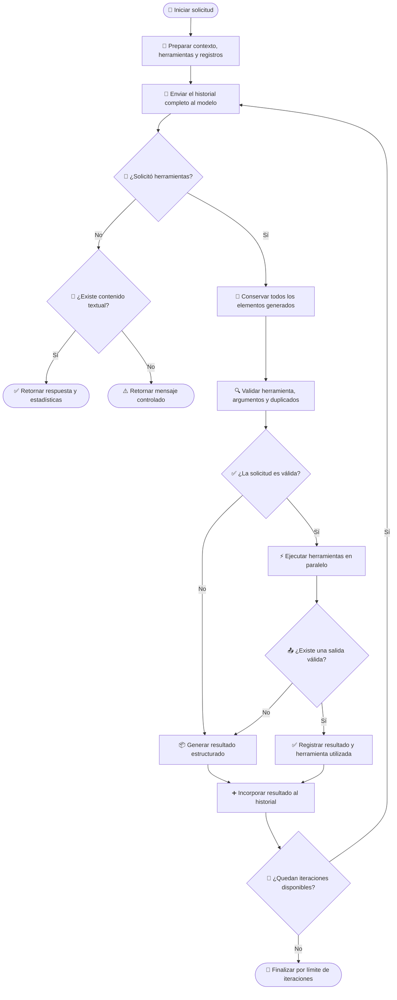

# 🧰 Manejo de herramientas en el cliente OpenAI

## 📌 Descripción general

Este cliente integra la API de OpenAI y adapta su funcionamiento al contrato común definido para los clientes LLM del proyecto.

El cliente implementa un ciclo iterativo en el que el modelo puede:

1. Analizar la solicitud del usuario.
2. Decidir si necesita utilizar una herramienta.
3. Solicitar una o varias ejecuciones.
4. Recibir sus resultados.
5. Continuar el razonamiento hasta generar una respuesta final.

La integración utiliza la **Responses API**, que representa las solicitudes de herramientas mediante elementos `function_call` y sus resultados mediante elementos `function_call_output`.

---

## 🤖 Librería LLM utilizada

| Propiedad               | Valor                                     |
| ----------------------- | ----------------------------------------- |
| Proveedor               | OpenAI                                    |
| SDK                     | `openai`                                  |
| API utilizada           | Responses API                             |
| Cliente                 | `OpenAI`                                  |
| Modelo                  | Configurado mediante `config.openaiModel` |
| Soporte de herramientas | Sí                                        |
| Ejecución paralela      | Sí                                        |
| Control de iteraciones  | Sí                                        |
| Acumulación de tokens   | Sí                                        |

```ts
import OpenAI from "openai";
```

El SDK oficial se utiliza para enviar solicitudes, registrar herramientas, detectar llamadas a funciones y continuar la conversación con sus resultados.

---

## 🧩 Dependencia de `ToolDefinition`

El manejo de herramientas depende del contrato común `ToolDefinition`.

```ts
ToolDefinition[]
```

Este contrato desacopla las definiciones internas del formato específico requerido por OpenAI.

Una herramienta representa conceptualmente:

- 🏷️ Un nombre único.
- 📝 Una descripción de su propósito.
- 📥 Un esquema de argumentos.
- ✅ Los argumentos obligatorios.

Antes de realizar la solicitud, el cliente transforma las definiciones al formato esperado por la Responses API.

Esta separación permite:

- Definir las herramientas una sola vez.
- Compartirlas entre diferentes clientes LLM.
- Mantener reglas de validación comunes.
- Evitar dependencias directas del SDK de OpenAI en la lógica de negocio.

> [!IMPORTANT]
> Todos los clientes LLM deben recibir `ToolDefinition` como contrato común y adaptarlo internamente al formato requerido por su proveedor.

---

## 🔄 Flujo de manejo de herramientas

El cliente mantiene un historial acumulativo utilizando la estructura nativa de entrada de la Responses API.

Durante las iteraciones, este historial puede contener:

- Mensajes del usuario.
- Mensajes previos de la conversación.
- Elementos generados por el modelo.
- Solicitudes de funciones.
- Resultados de funciones.
- Elementos de razonamiento reproducibles.

Cada iteración representa una nueva llamada al modelo utilizando el contexto acumulado hasta ese momento.

---

### 1. 📝 Preparación del contexto

Al iniciar el proceso se construye la entrada con:

- La solicitud actual.
- Los mensajes anteriores.
- Las instrucciones del sistema.
- Las herramientas disponibles.

También se inicializan los registros utilizados durante todo el ciclo:

- Tokens de entrada acumulados.
- Tokens de salida acumulados.
- Herramientas ejecutadas.
- Llamadas procesadas anteriormente.

El historial se construye una sola vez y se amplía después de cada iteración.

> [!IMPORTANT]
> El contexto debe conservarse en el formato nativo de la Responses API para mantener correctamente las llamadas de funciones, sus resultados y los demás elementos generados por el modelo.

---

### 2. 🧠 Consulta al modelo

En cada iteración se envían:

- El historial completo.
- Las instrucciones del sistema.
- Las herramientas convertidas al formato de OpenAI.
- El máximo de tokens configurado para el flujo.

Después de recibir la respuesta, el cliente obtiene:

- El texto generado.
- Los elementos de salida.
- Las solicitudes de funciones.
- El consumo de tokens.

Las solicitudes de herramientas se identifican filtrando los elementos cuyo tipo es:

```ts
"function_call";
```

Los tokens de entrada y salida se acumulan en cada llamada, por lo que las estadísticas finales representan el consumo total del proceso.

---

### 3. ✅ Respuesta final

Cuando la respuesta no contiene solicitudes de funciones, el texto generado se considera definitivo.

Si existe contenido textual, el cliente finaliza el ciclo y retorna la respuesta junto con las estadísticas acumuladas.

Si no existe texto ni llamadas a herramientas, se retorna un mensaje controlado indicando que OpenAI no produjo contenido procesable.

---

### 4. 🧰 Solicitud de herramientas

Una respuesta puede contener una o varias solicitudes de funciones.

Cada solicitud incluye:

- El nombre de la herramienta.
- Los argumentos serializados.
- Un identificador único de llamada.

Antes de ejecutar las herramientas, el cliente conserva todos los elementos generados por OpenAI dentro del historial.

Esto puede incluir:

- Solicitudes de funciones.
- Elementos de razonamiento.
- Texto intermedio.
- Otros elementos reproducibles de la respuesta.

> [!IMPORTANT]
> Deben conservarse todos los elementos de salida compatibles con la entrada de la siguiente iteración, no únicamente las llamadas a herramientas.

---

### 5. 🔍 Validación de solicitudes

Antes de ejecutar una herramienta se valida:

1. Que la herramienta esté registrada en `ToolDefinition`.
2. Que los argumentos puedan convertirse desde una cadena JSON.
3. Que los parámetros representen un objeto válido.
4. Que estén presentes los argumentos obligatorios.
5. Que la misma llamada no haya sido procesada anteriormente.

OpenAI entrega los argumentos como texto:

```ts
toolCall.arguments;
```

Por esta razón, el cliente debe interpretar la cadena antes de ejecutar la herramienta.

Para detectar llamadas repetidas se construye una firma utilizando el nombre y los argumentos procesados:

```json
{
  "name": "nombre_de_la_herramienta",
  "arguments": {
    "parametro": "valor"
  }
}
```

Si la firma ya existe, la herramienta no se ejecuta nuevamente.

> [!NOTE]
> La firma se registra antes de ejecutar la herramienta. Si la ejecución falla, otra solicitud con el mismo nombre y argumentos será considerada duplicada.

---

### 6. ⚙️ Ejecución de herramientas

Cuando el modelo solicita varias herramientas, estas se ejecutan en paralelo:

```ts
await Promise.all(/* herramientas solicitadas */);
```

Cada resultado mantiene:

- El identificador de la llamada.
- El nombre de la herramienta.
- La salida de la ejecución.

Si la herramienta no devuelve contenido, la salida se reemplaza por un error estructurado.

Si ocurre una excepción, esta también se transforma en un resultado serializado para que el modelo pueda interpretarlo.

> [!NOTE]
> Las herramientas solicitadas dentro de una misma iteración deben ser independientes, ya que se procesan simultáneamente.

---

### 7. 📦 Incorporación de resultados

Cada resultado se incorpora al historial mediante un elemento `function_call_output`.

```ts
{
  type: "function_call_output",
  call_id: "identificador_de_la_llamada",
  output: "resultado_de_la_herramienta"
}
```

El campo `call_id` debe coincidir exactamente con el identificador generado en la solicitud original.

El historial queda organizado conceptualmente de la siguiente manera:

```text
Usuario:
  Solicitud original

Modelo:
  Elementos de razonamiento
  Solicitud de una o varias funciones

Aplicación:
  Resultado de la función A
  Resultado de la función B

Modelo:
  Nueva solicitud o respuesta final
```

Después de incorporar todos los resultados, el historial completo vuelve a enviarse al modelo.

---

## 🛡️ Manejo de errores

Los errores de validación o ejecución se serializan como resultados estructurados.

Estos resultados se incorporan al historial para que el modelo pueda corregir los argumentos, seleccionar otra herramienta o generar una respuesta alternativa.

| Código                       | Descripción                                                   |
| ---------------------------- | ------------------------------------------------------------- |
| `tool_not_found`             | La herramienta solicitada no está registrada.                 |
| `invalid_arguments`          | Los argumentos no contienen un objeto JSON válido.            |
| `missing_required_arguments` | Faltan argumentos obligatorios definidos en `ToolDefinition`. |
| `duplicated_tool_call`       | La herramienta ya fue procesada con los mismos argumentos.    |
| `empty_tool_result`          | La herramienta no devolvió contenido.                         |
| `tool_execution_failed`      | Ocurrió una excepción durante la ejecución.                   |

Ejemplo conceptual:

```json
{
  "success": false,
  "error": "missing_required_arguments",
  "message": "Faltan argumentos requeridos para la herramienta.",
  "missing": ["path"]
}
```

Un error individual no interrumpe automáticamente el ciclo. El resultado se devuelve al modelo para que decida cómo continuar.

---

## 🛑 Condiciones de finalización

| Condición                           | Resultado                                             |
| ----------------------------------- | ----------------------------------------------------- |
| No existen llamadas y hay texto     | Se retorna la respuesta final.                        |
| No existen llamadas ni texto        | Se retorna un mensaje controlado.                     |
| Se alcanza el máximo de iteraciones | Se detiene el ciclo para evitar ejecución indefinida. |

El límite de iteraciones protege al sistema frente a:

- Ciclos prolongados.
- Solicitudes repetitivas.
- Consumo excesivo de tokens.
- Comportamientos inesperados del modelo.

---

## 🗺️ Diagrama del proceso



---

## 🧱 Requisitos para otros clientes LLM

Los demás clientes deben mantener el mismo comportamiento funcional aunque cada proveedor utilice estructuras diferentes.

Cada cliente debe:

1. Convertir `ToolDefinition` al formato nativo del proveedor.
2. Mantener el historial acumulativo.
3. Detectar solicitudes de herramientas.
4. Conservar los elementos necesarios de la respuesta original.
5. Validar herramientas y argumentos.
6. Evitar llamadas duplicadas.
7. Ejecutar varias herramientas cuando sean solicitadas.
8. Relacionar cada resultado con su identificador.
9. Incorporar los resultados al historial.
10. Repetir el ciclo hasta obtener una respuesta final.
11. Controlar el máximo de iteraciones.
12. Acumular tokens y registrar las herramientas utilizadas.

Los siguientes elementos pueden variar entre proveedores:

- Formato de definición de herramientas.
- Estructura de entrada y salida.
- Representación de los argumentos.
- Estructura de los resultados.
- Roles o tipos utilizados en el historial.
- Elementos de razonamiento reproducibles.
- Información de consumo de tokens.

---

## ✅ Resultado del proceso

```txt
╔═════════════════╗
║ Agentic Loop IA ║
╚═════════════════╝
```

```txt
💬 Escribe tu pregunta y presiona Enter.
Tengo acceso a 4 tools: list_files, find_files, read_file, search_code
Comandos: /clear, /stats, /tools, /exit
```

**Tú:** /tools
Conversación reiniciada.

Tools disponibles (4):

- list_files(path, extension)
  Lista recursivamente los archivos existentes dentro de un directorio del proyecto.
- find_files(file_name, path, exact_match)
  Busca recursivamente archivos por nombre dentro de un directorio y sus subdirectorios.
- read_file(file_path)
  Lee y devuelve el contenido completo y literal de un archivo del proyecto.
- search_code(pattern, path, file_extension)
  Busca un patrón de texto dentro del contenido de los archivos del proyecto y retorna las líneas coincidentes con dos líneas de contexto antes y después.

**Tú:** Que archivos TypeScript contiene el directorio ./src/config

```txt
Asistente:
Pensando... (iteración 1)
Ejecutando tool: list_files ({"path":"src/config","extension":".ts"})
Herramienta completada: list_files

Pensando... (iteración 2)
Respuesta final generada
```

El directorio `./src/config` contiene los siguientes archivos TypeScript:

1. `env.settings.ts`
2. `file-reviewer.settings.ts`
3. `index.ts`

**Tú:** Busca el archivo request.ts y muestrame su contenido

```txt
Asistente:
Pensando... (iteración 1)
Ejecutando tool: find_files ({"file_name":"request.ts"})
Herramienta completada: find_files

Pensando... (iteración 2)
Ejecutando tool: read_file ({"file_path":"./src/types/agent/messages/request.ts"})
Herramienta completada: read_file

Pensando... (iteración 3)
Respuesta final generada

Aquí tienes el contenido del archivo `request.ts`:
```

```typescript
import { Message } from "../chat/index.js";
import { ToolDefinition } from "../tools/index.js";

export interface AgentRequest {
  prompt: string;
  systemPrompt?: string;
  messages?: Message[];
  tools?: ToolDefinition[];
}
```

### Descripción

Este archivo define una interfaz `AgentRequest` que incluye las siguientes propiedades:

- `prompt`: una cadena de texto obligatoria.
- `systemPrompt`: una cadena de texto opcional.
- `messages`: un arreglo de objetos `Message` opcional.
- `tools`: un arreglo de objetos `ToolDefinition` opcional.

**Tú:** Busca los archivos que contienen la palabra getListFiles

```txt
Asistente:
Pensando... (iteración 1)
Ejecutando tool: search_code ({"pattern":"getListFiles"})
Herramienta completada: search_code

Pensando... (iteración 2)
Respuesta final generada
```

Se encontraron tres archivos que contienen la palabra `getListFiles`:

1. **Archivo:** `src/tools/actions/file-system.actions.ts`
   - **Línea 85:** `static async getListFiles(params: {`

2. **Archivo:** `src/tools/definitions/tools.definitions.ts`
   - **Línea 121:** `\"Ejemplos: 'getListFiles', 'export const MODEL_PROVIDERS', \" +`

3. **Archivo:** `src/tools/executor/files-tools.executor.ts`
   - **Línea 17:** `return FileSystemToolActions.getListFiles({`

Si necesitas más detalles sobre algún archivo en específico, házmelo saber.

**Tú:** /stats

```txt
📊 Estadísticas de la conversación:
• Turnos: 3
• Tokens de entrada acumulados: 10088
• Tokens de salida acumulados: 397
• Tokens estimados en contexto actual: 363
```

**Tú:** /exit

---

[TOOLS](../tools.md) | [REGRESAR - OLLAMA](./ollama-tools.md)
