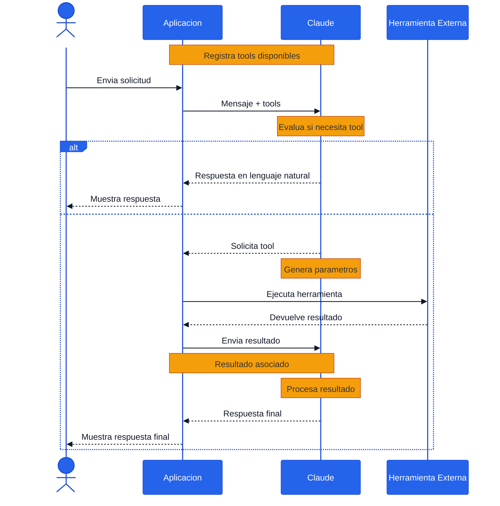

# 🛠️ FLUJO DE EJECUCIÓN DE HERRAMIENTAS (TOOL USE)

El flujo comienza cuando el `usuario` envía una solicitud a la aplicación. Antes de procesar cualquier petición, la aplicación registra y pone a disposición de `Claude` el catálogo de herramientas (`tools`) que puede utilizar.

Cada herramienta se describe mediante una definición (`ToolDefinition`) que incluye:

- 🏷️ Nombre de la herramienta.
- 📖 Descripción funcional.
- ✅ Esquema de entrada (`input_schema`) utilizado para validar los parámetros recibidos.
- 🔒 Restricciones y estructura de datos esperadas.

Gracias a estas definiciones, Claude puede comprender qué herramientas tiene disponibles, cuándo utilizarlas y cómo construir correctamente los parámetros necesarios para invocarlas.



Una vez recibida la solicitud, la aplicación envía a Claude tanto el mensaje del usuario como la lista de herramientas disponibles.

Claude analiza la petición y decide si puede responder directamente utilizando únicamente sus capacidades de razonamiento o si necesita utilizar alguna herramienta externa para obtener información adicional o ejecutar una acción.

---

## 🧠 Escenario 1: Respuesta sin herramientas

En algunos casos, la solicitud del usuario puede resolverse únicamente con el conocimiento y capacidades del modelo.

### Flujo

1. 📩 El usuario envía una consulta.
2. 🤖 Claude analiza la solicitud.
3. ✅ Claude determina que no necesita ninguna herramienta.
4. 💬 Claude genera una respuesta en lenguaje natural.
5. 📤 La aplicación devuelve la respuesta al usuario.

### Ejemplo

**Usuario**

```text
¿Qué es TypeScript?
```

**Claude**

```text
TypeScript es un superconjunto de JavaScript que agrega tipado estático y otras características para mejorar la mantenibilidad del código.
```

En este escenario no existe comunicación con servicios externos ni ejecución de herramientas.

---

## 🔧 Escenario 2: Uso de una herramienta

Cuando Claude identifica que necesita información adicional o debe ejecutar una acción específica, solicita el uso de una herramienta.

Este proceso ocurre mediante una invocación especial denominada `tool_use`.

### Generación de la solicitud

Claude genera una solicitud que contiene:

- 🛠️ El nombre de la herramienta (`toolName`).
- 🆔 Un identificador único (`toolUseId`).
- 📥 Los parámetros de entrada (`input`).
- ✅ Datos validados según el `input_schema`.

#### Ejemplo conceptual

```json
{
  "toolName": "get_weather",
  "toolUseId": "toolu_123456",
  "input": {
    "city": "Madrid"
  }
}
```

---

### Ejecución de la herramienta

La aplicación recibe la solicitud y:

1. Localiza la herramienta correspondiente.
2. Ejecuta la función o servicio externo.
3. Obtiene el resultado.
4. Construye un objeto `ToolResult`.

---

### Construcción del ToolResult

Una vez terminada la ejecución, la aplicación genera una respuesta estructurada para Claude.

El objeto incluye:

- 🛠️ Herramienta ejecutada (`tool`).
- 🆔 Identificador (`toolUseId`).
- 📦 Resultado obtenido.
- ⚠️ Indicador opcional de error (`isError`).

#### Ejemplo conceptual

```json
{
  "tool": "get_weather",
  "toolUseId": "toolu_123456",
  "result": {
    "temperature": 24,
    "condition": "Soleado"
  },
  "isError": false
}
```

---

### Importancia del toolUseId

> ⚠️ El campo `toolUseId` es uno de los elementos más importantes del flujo.

Permite a Claude asociar correctamente:

- La solicitud original.
- La ejecución realizada.
- El resultado recibido.

Sin este identificador sería imposible determinar a qué llamada corresponde cada resultado cuando existen múltiples herramientas o varias ejecuciones simultáneas.

---

### Procesamiento del resultado

Una vez recibido el `ToolResult`:

1. 📥 Claude incorpora el resultado a su contexto.
2. 🧠 Claude analiza la nueva información.
3. 🔍 Claude combina el resultado con la solicitud original.
4. 💬 Claude genera una respuesta enriquecida.
5. 📤 La aplicación muestra la respuesta final al usuario.

#### Ejemplo

**Usuario**

```text
¿Cuál es la temperatura actual en Madrid?
```

**Claude**

```text
Necesito consultar una herramienta de clima.
```

**Herramienta**

```json
{
  "temperature": 24,
  "condition": "Soleado"
}
```

**Claude**

```text
Actualmente la temperatura en Madrid es de 24°C y el clima está soleado.
```

---

## 🔄 Resumen del Flujo

```text
Usuario
    ↓
Aplicacion
    ↓
Claude
    ↓
¿Necesita una herramienta?
    │
    ├── No
    │     ↓
    │  Respuesta directa
    │
    └── Si
          ↓
      Tool Use
          ↓
     Herramienta
          ↓
     Tool Result
          ↓
        Claude
          ↓
    Respuesta final
```

---

## ✅ Beneficios del Enfoque

### 🚀 Extensibilidad

Permite ampliar las capacidades del modelo mediante servicios y sistemas externos.

### 🧩 Separación de responsabilidades

Mantiene una división clara entre:

- 🧠 Razonamiento (`Claude`)
- ⚙️ Ejecución (`Herramientas`)

### 🔒 Validación de datos

El uso de `input_schema` garantiza que las entradas tengan una estructura conocida y validada antes de ejecutar cualquier herramienta.

### 🔍 Trazabilidad

El identificador `toolUseId` facilita el seguimiento de cada llamada realizada.

### 🤝 Orquestación de múltiples herramientas

Permite combinar varias herramientas (`tools`) para resolver tareas complejas manteniendo una interfaz simple para el usuario.

### 📈 Escalabilidad

La aplicación puede incorporar nuevas capacidades agregando herramientas adicionales sin necesidad de modificar el comportamiento fundamental del modelo.

---

## 🎯 Conclusión

El mecanismo de **Tool Use** permite que Claude vaya más allá de su conocimiento interno y pueda interactuar con sistemas externos de forma controlada y estructurada.

Gracias a este enfoque, es posible construir asistentes capaces de:

- 🔎 Consultar información en tiempo real.
- 📊 Acceder a bases de datos.
- 🌐 Consumir APIs externas.
- ⚙️ Ejecutar procesos automatizados.
- 🤖 Resolver tareas complejas mediante la combinación de razonamiento e integración con herramientas especializadas.

---

[REGRESAR](./README.md)
