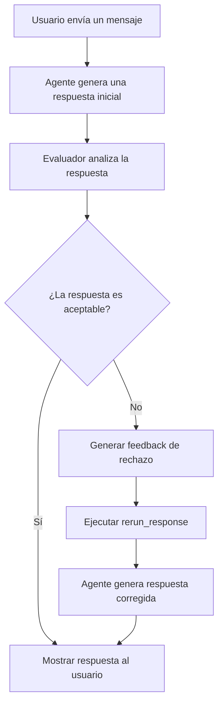

```mermaid
flowchart TD
    A[Usuario envía un mensaje] --> B[Agente genera una respuesta inicial]
    B --> C[Evaluador analiza la respuesta]
    C --> D{¿La respuesta es aceptable?}

    D -- Sí --> E[Mostrar respuesta al usuario]
    D -- No --> F[Generar feedback de rechazo]
    F --> G[Ejecutar rerun_response]
    G --> H[Agente genera respuesta corregida]
    H --> E
```
