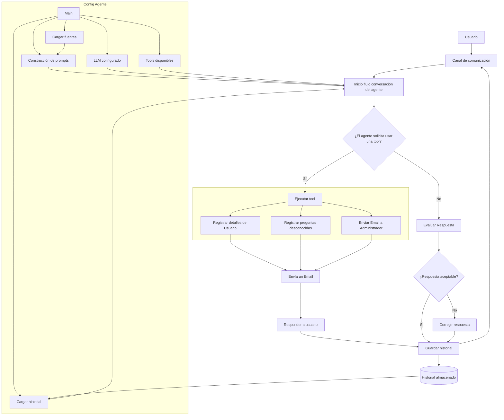

## 🧰 Agente con Tools y Evaluación de Respuestas

Este laboratorio implementa un agente conversacional basado en un LLM, diseñado para responder preguntas a partir de fuentes locales, ejecutar herramientas cuando la conversación lo requiere y validar la calidad de sus respuestas antes de entregarlas al usuario.

El objetivo principal es explorar dos capacidades importantes en la construcción de agentes de IA:

### 🛠️ Uso de tools dentro del agente

El agente puede decidir cuándo necesita utilizar una herramienta para completar una acción específica.

En este laboratorio, las tools disponibles permiten:

- Registrar detalles del usuario.
- Registrar preguntas desconocidas o que no pudieron ser respondidas con la información disponible.
- Enviar un email al administrador.

Estas tools permiten que el agente no se limite únicamente a generar texto, sino que también pueda ejecutar acciones concretas dentro del flujo de conversación.

### ✅ Evaluación automática de respuestas

El laboratorio incorpora un evaluador de respuestas encargado de revisar si la respuesta generada por el agente cumple con los criterios esperados.

Si la respuesta es aceptable, se entrega al usuario.

Si la respuesta no es aceptable, el flujo permite corregirla y generar una versión mejorada antes de responder.

### 🧠 Flujo general del laboratorio

El laboratorio integra:

- Carga de contexto desde fuentes locales.
- Construcción de prompts para el agente.
- Configuración del LLM.
- Uso opcional de tools.
- Evaluación automática de respuestas.
- Corrección de respuestas cuando no cumplen los criterios definidos.
- Manejo del historial de conversación.

Este enfoque permite simular una arquitectura más cercana a un agente real, donde el modelo puede razonar, decidir si necesita usar herramientas, ejecutar acciones y validar la calidad de sus respuestas antes de interactuar finalmente con el usuario.

[REGRESAR](../../../fundamentos/README.md) | [VER EJEMPLO](./main.py)
